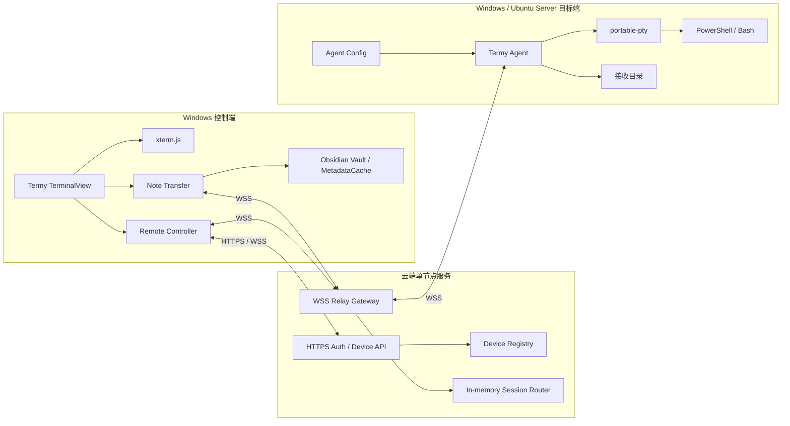
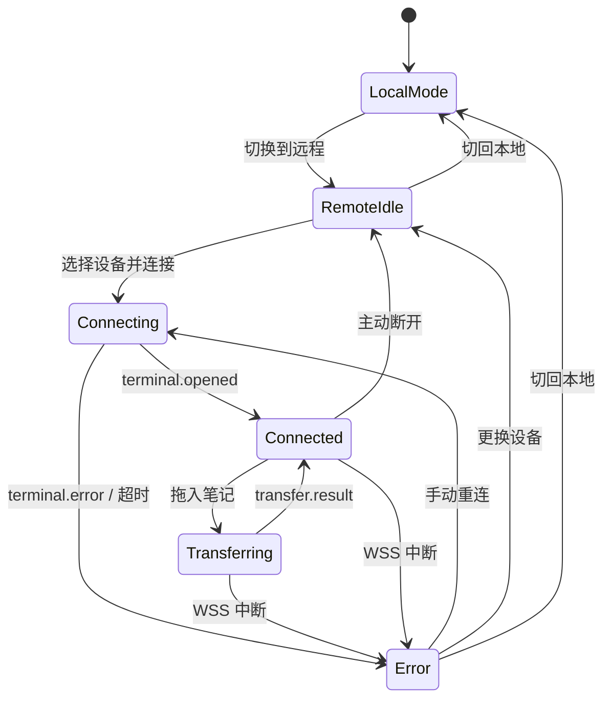
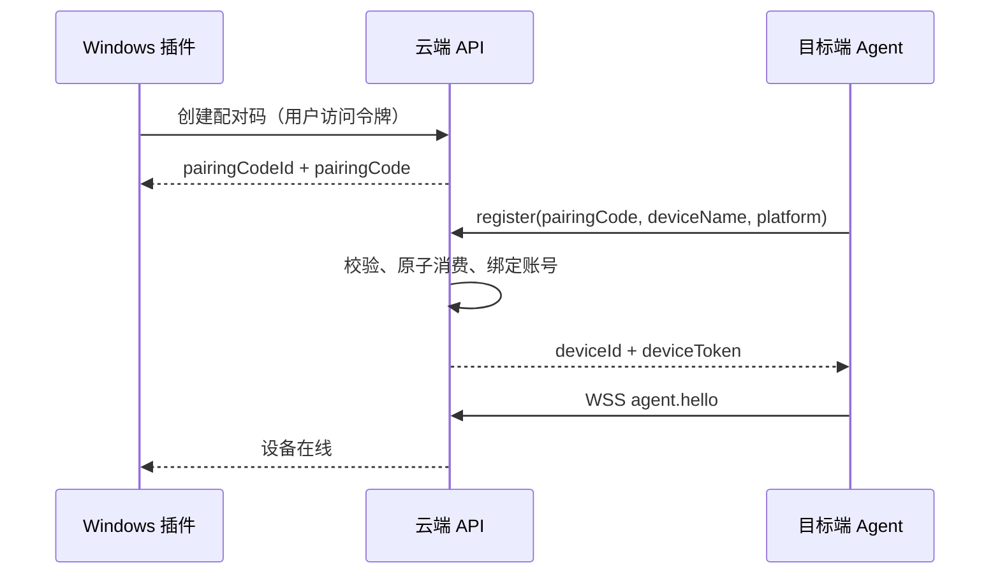
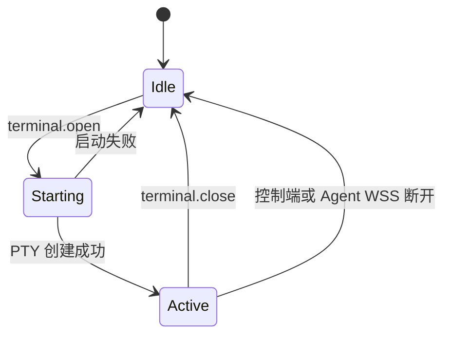
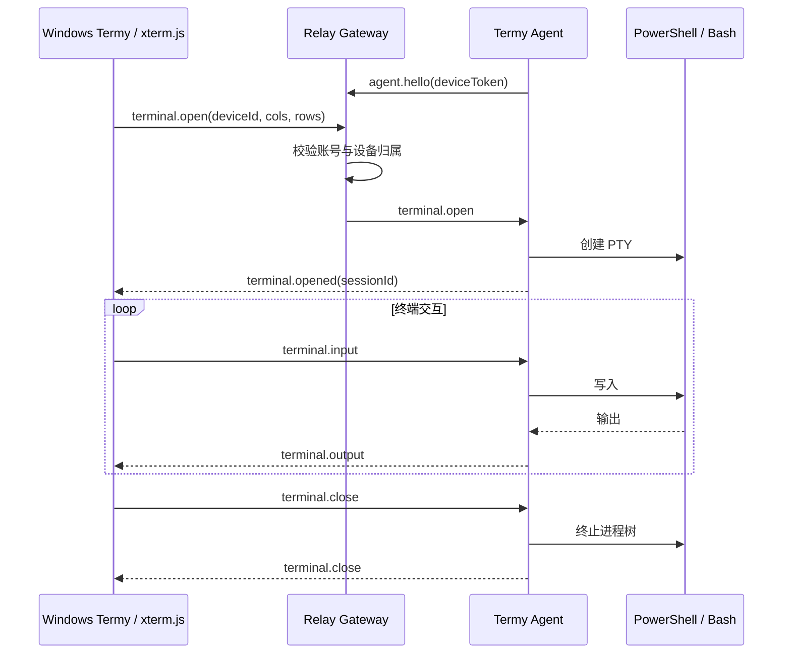

# Termy 远程终端增强 MVP 技术方案

## 1. 文档定位

| 项目 | 内容 |
| --- | --- |
| 输入依据 | [用户需求采集](1.用户需求采集.md)、[用户版需求文档](Termy远程增强-用户版.md) |
| 实现目标 | 只实现 MVP 核心闭环 |
| 控制端 | Windows + Obsidian Desktop + 增强版 Termy |
| 目标端 | Windows Agent 或无桌面 Ubuntu Server Agent |
| 文档日期 | 2026-07-28 |

本文档是 MVP 的唯一技术实现口径，不描述后续版本路线。

### 1.1 版本口径

本文中的版本分为两类：

- **Termy 已验证基线**：来自 `ZyphrZero/Termy` 的 `master` 分支，校验提交为 `b1d44505fd8a7ba7433ca3e92fe9fad30e5af10e`（2026-06-15，已于 2026-07-28 实测核对，见第 14 节阶段 A）；
- **MVP 选定基线**：本项目新增云端、Agent 和协议模块必须采用的首版版本，首次可复现构建后由 lockfile 锁定，不自动浮动升级。

版本号未写 `^`、`~` 或通配符的依赖必须精确锁定。发布构建必须提交 `pnpm-lock.yaml` 和 `Cargo.lock`。

### 1.2 按端技术总表

| 端 | 语言与运行环境 | 框架 / 核心库 | MVP 版本基线 | 产物 |
| --- | --- | --- | --- | --- |
| Windows Obsidian 插件端 | TypeScript 5.9.3；Windows 10 22H2 / Windows 11；Obsidian Desktop >= 1.8.7；CI Node.js 22 | Obsidian API、xterm.js、`ws`、esbuild | Termy 1.4.1；Obsidian API 1.12.3；`@xterm/xterm` 6.0.0；`ws` 8.20.1；esbuild 0.28.0；pnpm 10.33.4 | `main.js`、`styles.css`、`manifest.json` |
| 云端 Relay/API | Rust 2021；Linux x86_64 | Axum、Tokio、SQLx + SQLite、Serde、Rustls、Argon2、JWT | Rust 1.85.0；Axum 0.8.4；Tokio 1.49.0；SQLx 0.8.6；SQLite 3.49.x；tower-http 0.6.6；rustls 0.23.31 | 单节点 `termy-relay` 容器 / 二进制 |
| Windows / Ubuntu Agent | Rust 2021；Windows 10 22H2 / 11 x64；Ubuntu Server 22.04 / 24.04 LTS x64 | Tokio、tokio-tungstenite、portable-pty、Serde、Clap、Rustls | Rust 1.85.0；portable-pty 0.9.0；Tokio 1.49.0；tokio-tungstenite 0.28.0；Serde 1.0.228；Clap 4.5.40 | `termy-agent.exe` / `termy-agent` |
| 共享协议 | JSON Schema Draft 2020-12 + OpenAPI 3.1；WSS 文本/二进制帧 | TypeScript 类型生成、Rust `serde` 类型生成 | 协议 `1`；Schema 包 `1.0.0` | `protocol/schema/*.json`、生成的 TS/Rust 类型 |

说明：Termy 仓库没有固定本地 Node.js 和 Rust 编译器版本；本方案将 Node.js 22 和 Rust 1.85.0 固定为 MVP 构建环境。SQLite 仅用于单节点持久化，不改变“云端单节点”的 MVP 边界。

## 2. MVP 范围

### 2.1 必须实现

1. Windows 插件登录账号并生成长期有效的一次性配对码。
2. Windows 或 Ubuntu Agent 通过 CLI 消费配对码完成设备绑定。
3. Agent 主动连接云端，控制端查看同账号设备在线状态。
4. 控制端连接一台在线设备，创建一个远端 PTY。
5. 转发终端输入、输出和窗口尺寸，支持主动断开。
6. 远程会话向控制端上报 shell 集成事件，使 cwd 跟踪与命令边界在远程模式下可用。
7. 从 Obsidian 文件列表拖入一篇 Markdown 笔记。
8. 收集根笔记和其直接引用的 Vault 内本地非 Markdown 附件。
9. 文件按 Vault 相对路径写入目标端接收目录，同名文件覆盖。
10. 页面展示连接状态和整次传输成功或失败。
11. 公网链路使用 TLS，并校验账号与目标设备归属。
12. 本地终端和本地拖拽行为不变。
13. Ubuntu Agent 退出 SSH 后继续运行，Agent 与 Shell 不使用 root。

### 2.2 明确不实现

- 控制端会话恢复、离线输入缓存和多远程会话（Agent 侧的出站退避重连属于必须实现，见 7.6）；
- 临时区、哈希校验、原子覆盖、自动重试和断点续传；
- 文件回传、双向同步、云端文件历史和逐文件进度；
- 多篇笔记、目录传输、递归关联笔记和附件选择；
- Windows 控制端以外的控制端；
- Windows、Ubuntu Server 以外的目标端；
- 多人共享、协作控制、系统提权和端到端加密；
- 高可用、多节点路由、完整审计和容量治理。

## 3. 总体架构



### 3.1 进程边界

| 进程 | 职责 |
| --- | --- |
| Obsidian 插件 | 登录、设备列表、远程 UI、xterm.js 绑定、笔记收集和发送 |
| 云端服务 | 鉴权、设备归属、在线状态、终端和文件实时转发 |
| Termy Agent | 设备上线、PTY 生命周期、输入输出、文件落盘 |

Agent 是独立进程：Windows 制品名为 `termy-agent.exe`，Ubuntu 制品名为 `termy-agent`。目标端不依赖 Obsidian 或桌面环境。

## 4. 核心技术决策

1. 复用 Termy 现有 xterm.js 和本地终端，不实现新的终端模拟器。
2. 新增独立 Agent，不改变现有本地 Rust PTY server 的协议和生命周期。
3. Agent 主动建立 WSS，不监听公网端口。
4. 终端会话只通过 WSS `terminal.open` / `terminal.close` 创建和关闭，不提供第二套 HTTP 会话入口。
5. MVP 每个 Agent 同时只允许一个远程 PTY。
6. 终端和文件为两条逻辑通道，复用一条物理 WSS。文件通道由应用层信用窗口限流，Relay 永不因队列积压而暂停读取上游，因此文件传输不会阻塞终端输入输出。
7. 文件正文只实时转发，不写入云端业务数据库或历史文件列表。
8. MVP 文件直接写入正式目录。传输失败允许留下已完成或不完整文件，UI 必须提示风险。
9. 协议中的 Vault 相对路径统一使用 `/`，Agent 按目标平台安全转换。
10. 每个账号同时只保留一条控制端 WSS 连接，新连接顶掉旧连接。Relay 因此不需要维护 `requestId` 到控制连接的路由表，按 `userId` 即可定位唯一控制连接。
11. 设备在线状态由插件轮询 HTTPS `GET /v1/devices` 获取，Relay 不推送设备状态事件。
12. 插件通过 Obsidian Vault API 整读整发文件，MVP 不做流式读取；单文件上限相应收紧到 64 MiB，整次传输上限 256 MiB。

## 5. 插件实现

### 5.1 技术栈与代码边界

插件端沿用 Termy 1.4.1，不另建前端框架：

| 类别 | 选型与版本 | 用途 |
| --- | --- | --- |
| 语言 / 构建 | TypeScript 5.9.3、esbuild 0.28.0、pnpm 10.33.4 | 类型检查、打包和依赖锁定 |
| 宿主 API | Obsidian API 1.12.3，最低宿主 1.8.7 | Vault、MetadataCache、TFile、设置和视图 |
| 终端 UI | `@xterm/xterm` 6.0.0；fit 0.11.0；search 0.16.0；web-links 0.12.0；canvas 0.7.0；webgl 0.19.0 | 复用现有终端显示、输入、搜索和 resize |
| 网络 | `ws` 8.20.1 | HTTPS 登录之外的 WSS 控制、终端和文件通道 |
| 测试 | Node.js 22 内建 test runner + 现有 Termy 测试脚本 | Transport、状态机、拖拽和 Schema 契约测试 |

新增代码放入 Termy 现有边界：远程连接逻辑进入 `src/services/remote/`，共享生成类型进入 `src/protocol/generated/`；`TerminalView` 只负责模式和交互，`TerminalInstance` 通过 Transport 收发字节。现有 `src/services/server/` 与本地 `termy-server` 协议保持不变。

### 5.2 传输层隔离

必须增加统一传输接口，使 xterm.js 不感知本地或远程后端：

```ts
interface TerminalTransport {
    open(options: TerminalOpenOptions): Promise<TerminalSessionInfo>;
    write(data: Uint8Array): void;
    resize(cols: number, rows: number): void;
    close(reason?: string): Promise<void>;
    onData(handler: (data: Uint8Array) => void): Disposable;
    onExit(handler: (event: TerminalExitEvent) => void): Disposable;
    onError(handler: (code: ErrorCode, message: string) => void): Disposable;
    onShellEvent(handler: (event: ShellEvent) => void): Disposable;
}
```

接口必须覆盖**四条**事件通道，这是照 `TerminalInstance` 的实际消费面定的，少一条就会在改造时卡住：

| Transport 成员 | 现有 `PtyClient`（`src/services/server/ptyClient.ts`） | 远程实现 |
| --- | --- | --- |
| `open` | `init(config)` 返回 sessionId | `terminal.open` -> `terminal.opened` |
| `write` | `write` / `writeBinary(sessionId, ...)` | 二进制帧 `kind=0x01` |
| `resize` | `resize(sessionId, cols, rows)` | `terminal.resize` |
| `close` | `destroySession(sessionId)` | `terminal.close` |
| `onData` | `onSessionOutput` | 二进制帧 `kind=0x02` |
| `onExit` | `onSessionExit` | `terminal.close`（`reason=shell_exited`） |
| `onError` | `onSessionError` | `terminal.error` |
| `onShellEvent` | `onSessionShellEvent` | `terminal.shellEvent` |

现有 `PtyClient` 的方法都带 `sessionId` 参数（一个 client 管多个会话），而 Transport 是**每会话一个实例**。因此 `LocalTerminalTransport` 是"绑定了某个 sessionId 的 PtyClient 包装"，`open` 返回的 `TerminalSessionInfo` 携带 sessionId 供 `TerminalInstance` 继续使用。

- `LocalTerminalTransport`：包装现有本地终端实现，不修改行为。
- `RemoteTerminalTransport`：包装 Relay WSS 和远端会话。
- `TerminalView`：只绑定当前 Transport。

改造范围提示：`TerminalInstance`（约 2287 行）有 15 处以上直接调用 `this.ptyClient.*`，分布在输入合并、resize、销毁、中断和清屏等路径上。把这些收敛到 Transport 是一次对核心类的侵入式重构，不是薄封装，排期需按此估算。

切回本地模式或关闭插件时，必须关闭远程会话和正在进行的文件传输。

### 5.3 UI 状态



| 状态 | 输入 | 拖入笔记 | 设备选择 |
| --- | --- | --- | --- |
| `LocalMode` | 本地可用 | 现有行为 | 隐藏 |
| `RemoteIdle` | 禁用 | 禁用 | 可用 |
| `Connecting` | 禁用 | 禁用 | 禁用 |
| `Connected` | 可用 | 可用 | 禁用 |
| `Transferring` | 可用 | 禁止再次拖入 | 禁用 |
| `Error` | 禁用 | 禁用 | 可用 |

### 5.4 拖拽分流

拖拽入口必须先判断模式：

```text
本地模式       -> 现有 buildDroppedInput
远程且已连接   -> 校验单个 Markdown TFile -> 收集附件 -> 预检清单 -> Note Transfer
其他远程状态   -> 拒绝并显示原因
```

禁止先生成本地绝对路径再判断远程模式。

预检在发出 `transfer.start` 之前完成，任一项不通过即整次拒绝并给出原因：文件数 <= 256；单文件 <= 64 MiB；累计 <= 256 MiB；全部路径通过 10.3 校验。

## 6. 云端 Relay/API 实现

### 6.1 技术栈与部署边界

| 类别 | 选型与版本 | 用途 |
| --- | --- | --- |
| 语言 / Web | Rust 1.85.0（edition 2021）、Axum 0.8.4、Tokio 1.49.0 | HTTPS API、WSS upgrade 和异步路由 |
| 协议 | Serde 1.0.228、serde_json 1.0.149、UUID 1.20.0 | 严格反序列化协议对象 |
| 数据库 | SQLite 3.49.x、SQLx 0.8.6，WAL 模式 | 用户、配对码、设备持久化和原子消费 |
| 安全 | Argon2 0.5.3、HMAC-SHA-256、jsonwebtoken 9.3.1、rustls 0.23.31 | 密码摘要、配对码/设备令牌摘要、访问令牌、TLS |
| HTTP 中间件 | tower-http 0.6.6、tracing 0.1.41 | 请求 ID、限流接入、脱敏结构化日志 |
| 交付 | Debian slim 容器，单进程、单副本 | MVP 单节点部署 |

云端只暴露 `443/tcp`。反向代理可以终止 TLS，但 Relay 进程与代理之间必须位于同一受控主机网络；公网不得开放 SQLite、管理端口或 Agent 入站端口。在线连接、会话和传输路由放内存，正文只做有界转发。

部署硬性要求：

- SQLite 数据文件必须挂载到容器外的持久卷，否则重启即丢失全部用户、配对码和设备；
- 表结构由 `sqlx migrate` 管理，迁移文件进版本库，进程启动时自动执行；
- 证书必须是公网可信证书（如 Let's Encrypt），因为 Agent 使用 `webpki-roots` 校验，自签证书连不上；
- 反向代理必须透传 WebSocket upgrade、关闭响应缓冲，且 `proxy_read_timeout` 不小于 60 s（大于 Agent 50 s 离线判定窗口）。

MVP 不开放注册接口。开户由运维在服务端执行 `termy-relay useradd <login>`，密码从 stdin 读取、以 Argon2id 摘要落库；同时提供 `termy-relay passwd <login>` 和 `termy-relay device-list <login>` 用于排障。

### 6.2 HTTPS API

| 方法 | 路径 | 调用方 | 用途 |
| --- | --- | --- | --- |
| `POST` | `/v1/auth/login` | 插件 | 登录并获取访问令牌 |
| `POST` | `/v1/devices/pairing-codes` | 插件 | 创建长期有效的一次性配对码 |
| `DELETE` | `/v1/devices/pairing-codes/{id}` | 插件 | 撤销未使用配对码 |
| `POST` | `/v1/devices/register` | Agent | 消费配对码并换取设备令牌 |
| `GET` | `/v1/devices` | 插件 | 查询当前账号设备及在线状态 |
| `DELETE` | `/v1/devices/{id}` | 插件 | 解绑设备，使其设备令牌立即失效 |

除登录外，插件请求使用 `Authorization: Bearer <userAccessToken>`；Agent 注册使用配对码正文，不能同时接受用户令牌或设备令牌替代。JSON 请求和响应使用 `Content-Type: application/json; charset=utf-8`；时间为 UTC RFC 3339；ID 为小写连字符 UUID。成功状态仅使用 `200`、`201`、`204`，业务失败使用统一错误对象：

```json
{
    "error": {
        "code": "PAIRING_CODE_INVALID",
        "message": "Pairing code is invalid",
        "requestId": "0198..."
    }
}
```

接口字段冻结如下，所有对象 `additionalProperties: false`：

| 接口 | 请求 JSON | 成功响应 JSON |
| --- | --- | --- |
| `POST /v1/auth/login` | `{ "login": "string(1..254)", "password": "string(8..1024)" }` | `200 { "accessToken": "string", "tokenType": "Bearer", "expiresIn": 43200, "user": { "id": "uuid", "login": "string" } }` |
| `POST /v1/devices/pairing-codes` | `{}` | `201 { "pairingCodeId": "uuid", "pairingCode": "base64url-secret", "createdAt": "date-time", "revoked": false }` |
| `DELETE /v1/devices/pairing-codes/{id}` | 无正文 | `204` 无正文；不存在返回 `404`，已消费返回 `409` |
| `POST /v1/devices/register` | `{ "pairingCode": "string", "deviceName": "string(1..64)", "platform": "windows-x64|ubuntu-x64", "agentVersion": "semver" }` | `201 { "deviceId": "uuid", "deviceToken": "base64url-secret", "relayUrl": "wss-url" }` |
| `GET /v1/devices` | 无正文 | `200 { "devices": [{ "id": "uuid", "name": "string", "platform": "windows-x64|ubuntu-x64", "agentVersion": "semver", "online": true, "lastSeenAt": "date-time|null" }] }` |
| `DELETE /v1/devices/{id}` | 无正文 | `204` 无正文；不属于当前账号返回 `403`，不存在返回 `404` |

用户访问令牌为 15 分钟 JWT；MVP 不定义 refresh token，过期后插件重新登录。设备令牌为 256 bit 随机 Base64URL 字符串，只在注册成功时返回；Agent WSS 断线重连继续使用配置中的设备令牌。

访问令牌与长连接的关系固定为：**控制端 WSS 只在 HTTP Upgrade 时校验一次访问令牌，连接存活期内不再重新校验，令牌过期不影响已建立的连接**；过期只影响后续 HTTPS 调用和新建连接。因此一次远程终端会话可以超过 15 分钟，但设备列表轮询会先失败并触发重新登录。该取舍的安全含义见第 13 节。

HTTP 状态映射固定为：Schema 错误 `400`，认证失败 `401`，越权 `403`，对象不存在/配对码不可用 `404`，状态冲突 `409`，限流 `429`，服务内部错误 `500`。`429` 必须返回 `Retry-After`。

### 6.3 配对规则

1. 配对码没有自动过期时间。
2. 首次成功注册时由服务端原子消费，之后不可重复使用。
3. 失败尝试不消费配对码，但服务端按来源和配对码限速，阈值见 6.5。
4. 用户可以主动撤销未使用配对码。
5. 配对码由密码学安全随机数生成，熵固定 160 bit，编码为 27 字符无填充 Base64URL；插件 UI 提供一键复制，不要求人工转抄。正文只在创建时返回。
6. 服务端以服务器 pepper 的 HMAC-SHA-256 保存配对码和设备令牌摘要，不保存明文；用户密码使用 Argon2id。
7. 日志不得记录配对码、用户令牌或设备令牌。
8. 解绑设备立即使该设备令牌失效：删除 `Device` 行、断开其在线连接、结束进行中的 PTY 与传输。被解绑设备需要新配对码才能重新注册。

### 6.4 配对流程



### 6.5 限流与配额

阈值固定如下，超限一律返回 `429` 并带 `Retry-After`（秒）：

| 端点 | 限流键 | 阈值 | `Retry-After` |
| --- | --- | --- | --- |
| `POST /v1/auth/login` | `login` + 源 IP | 5 次 / 分钟 | `60` |
| `POST /v1/devices/pairing-codes` | `userId` | 10 次 / 小时 | `300` |
| `POST /v1/devices/register` | 源 IP | 10 次 / 分钟 | `60` |
| `POST /v1/devices/register` | `codeDigest` | 5 次 / 小时 | `3600` |
| `GET /v1/devices` | `userId` | 60 次 / 分钟 | `10` |
| WSS upgrade（两类入口） | 源 IP | 30 次 / 分钟 | `60` |

配额：每账号最多 32 台设备、最多 16 个未消费配对码，超出返回 `409`。插件轮询 `GET /v1/devices` 的固定间隔为 15 s，仅在远程模式且未连接时轮询。限流计数放内存，单节点重启后清零，MVP 接受该行为。

## 7. Agent 实现

### 7.1 技术栈与代码边界

| 类别 | 选型与版本 | 用途 |
| --- | --- | --- |
| 语言 / 异步 | Rust 1.85.0（edition 2021）、Tokio 1.49.0 | 单进程事件循环、心跳和任务取消 |
| WSS | tokio-tungstenite 0.28.0、rustls 0.23.31、webpki-roots 0.26.11 | 主动连接云端并校验证书 |
| PTY | portable-pty 0.9.0 | Windows ConPTY / Ubuntu Unix PTY |
| 数据 | Serde 1.0.228、serde_json 1.0.149、UUID 1.20.0 | 配置与协议消息 |
| CLI | Clap 4.5.40 | `bind`、`config`、`run`、`status` |
| 错误 / 日志 | thiserror 2.0.18、tracing 0.1.41 | 稳定错误码和脱敏日志 |

Agent 复用 Termy Rust PTY 的 `portable-pty` 使用方式和 Shell 探测经验，但不复用其本机 `127.0.0.1` WebSocket server。Agent 是新的出站 WSS 客户端，远程协议只来自共享 Schema 包。

明确可以原样复用的模块（来自 `rust-servers/`，两边都是 edition 2021、`portable-pty 0.9`、`tokio-tungstenite 0.28`，依赖口径一致）：

| 模块 | 规模 | 复用方式 |
| --- | --- | --- |
| `src/pty/osc_scanner.rs` | 199 行 | 原样搬运。接口是纯函数式的 `scan(&mut self, data: &[u8]) -> Vec<OscEvent>`，Agent 在 PTY 输出路径上调用它产生 `terminal.shellEvent`，远程模式因此与本地拥有同一套 shell 集成语义 |
| `src/pty/shell.rs` | 313 行 | 参考其 Shell 探测与默认参数逻辑，按 7.3 的配置项裁剪 |
| `src/pty/session.rs`、`src/pty/mod.rs` | 647 行 | 只参考 PTY 读写循环与尺寸处理，不复用其会话管理（Agent 只有单会话） |

注意 `termy-server` 的 `tokio-tungstenite` 启用的是 `native-tls`，而 Agent 按 7.1 使用 `rustls` + `webpki-roots`；两个 crate 的 TLS 栈不同是有意为之，本地 server 走 `127.0.0.1` 并不实际使用 TLS。

### 7.2 CLI

MVP 至少提供：

```text
termy-agent bind --code <pairing-code>
termy-agent config set-name <name>
termy-agent config set-receive-root <absolute-path>
termy-agent config set-shell <program> [args...]
termy-agent run
termy-agent status
```

Windows 使用相同子命令的 `termy-agent.exe`。

`status` 不与 `run` 进程通信，只读取 7.3 定义的状态文件并打印：是否有存活的 `run` 进程、当前连接状态、最近一次连接/断开时间、是否有活动会话。`bind` 成功后写入配置，不自动启动 `run`。

### 7.3 配置

| 平台 | 配置文件 |
| --- | --- |
| Windows | `%APPDATA%\TermyAgent\config.json` |
| Ubuntu | `$XDG_CONFIG_HOME/termy-agent/config.json`，未设置时为 `~/.config/termy-agent/config.json` |

最小配置：

```json
{
    "deviceId": "uuid",
    "deviceToken": "secret",
    "deviceName": "build-server",
    "relayUrl": "wss://relay.example.com/v1/agent",
    "receiveRoot": "/home/user/TermyReceive",
    "shell": {
        "program": "/bin/bash",
        "args": []
    }
}
```

约束：

- Ubuntu 配置目录权限不宽于 `0700`，配置文件不宽于 `0600`；
- Windows 配置仅当前用户可读写；
- 设备令牌不得通过命令行参数传入；
- Windows 默认 Shell 为 `powershell.exe`，Ubuntu 默认 Shell 为 `/bin/bash`；
- `receiveRoot` 必须是已存在或可创建的绝对目录，并可由当前用户写入。

除配置文件外，`run` 维护一个状态文件，与配置文件同目录、权限同为 `0600`（Windows 仅当前用户可读写）：

| 平台 | 状态文件 |
| --- | --- |
| Windows | `%APPDATA%\TermyAgent\agent.state.json` |
| Ubuntu | 配置目录下的 `agent.state.json` |

```json
{
    "pid": 4321,
    "connection": "connected",
    "lastConnectedAt": "2026-07-28T09:00:00Z",
    "lastDisconnectedAt": null,
    "sessionActive": false
}
```

`connection` 取 `connecting|connected|disconnected`。该文件由 `run` 原子写入（写临时文件后 rename），进程退出时把 `connection` 置为 `disconnected`。状态文件不包含设备令牌。

### 7.4 Ubuntu 后台运行

使用用户级 `systemd` 单元启动 Agent，并为该用户启用 lingering，使退出 SSH 后继续运行。

要求：

- Agent 和远端 Shell 以绑定设备的普通用户运行；
- 不使用 root，不安装系统级守护进程；
- `systemd` 单元从受限配置文件读取凭据，不把令牌写入参数或环境日志；
- 单元使用 `Restart=always`、`RestartSec=5`，作为 7.6 进程内重连之外的兜底；
- Agent 退出或 WSS 断开时终止当前 PTY。

关于特权：`loginctl enable-linger <user>` 在多数发行版需要一次 root 或 polkit 认证。口径固定为**安装时一次性 sudo 执行 enable-linger，运行时 Agent 与 Shell 全程非 root**，安装文档必须写明这一点，验收按此判定 2.1.13。

### 7.5 PTY 生命周期



Agent 同时只允许一个 `Active` 会话，第二个请求返回 `DEVICE_BUSY`。

终止会话必须终止整棵进程树，`portable-pty` 的 `Child::kill()` 只作用于 Shell 自身，不覆盖其子孙进程，因此各平台手段固定为：

| 平台 | 手段 |
| --- | --- |
| Windows | 创建 Job Object 并设置 `JOB_OBJECT_LIMIT_KILL_ON_JOB_CLOSE`，Shell 启动后立即加入；关闭 Job 句柄即回收整棵树。依赖 `windows-sys` |
| Ubuntu | Shell 以 `setsid()` 启动为独立进程组，终止时先 `kill(-pgid, SIGHUP)`，2 s 后仍存活则 `kill(-pgid, SIGKILL)` |

关闭 PTY master 不足以保证子孙进程退出，实现和测试都以上表为准。

### 7.6 重连与单实例

Agent 是长期后台进程，云端为单节点单副本，重启和网络抖动都会断开 WSS。因此：

- Agent 必须在进程内做指数退避重连：初始 1 s，每次翻倍，上限 30 s，加 ±20% 抖动，永久重试不放弃；
- 重连使用配置中的设备令牌，不需要重新配对；令牌被服务端判为无效（close `4401`）时停止重连并在状态文件与日志中标注需要重新 `bind`；
- 断开瞬间立即终止当前 PTY（见 7.5），重连成功后不恢复会话，控制端需重新 `terminal.open`；
- Agent 必须持单实例锁，Ubuntu 用 `flock` 锁 `$XDG_RUNTIME_DIR/termy-agent.lock`（未设置时用配置目录），Windows 用当前用户命名互斥量。获取失败即退出并提示已有实例运行。

单实例锁是必需项：`systemd` 的 `Restart=always` 与 8.2「新连接顶掉旧连接」组合，在出现第二个实例时会形成两进程无限互踢。

## 8. 共享协议与 Schema

### 8.1 协议源码和生成规则

协议仓库目录是三端唯一真相源：

```text
protocol/
  openapi.yaml
  schema/common.schema.json
  schema/control-envelope.schema.json
  schema/messages/*.schema.json
  generated/typescript/
  generated/rust/
  fixtures/valid/
  fixtures/invalid/
  fixtures/frames/
```

仓库形态固定为**单仓库**：`protocol/`、插件、Relay、Agent 同处一个 Git 仓库，避免 MVP 阶段跨仓发版。插件通过构建脚本把 `protocol/generated/typescript/` 复制到 `src/protocol/generated/`，Rust 侧通过路径依赖引用 `protocol/generated/rust/`，两者都不手工编辑、不进 lint。

生成器选型固定为：TypeScript 用 `json-schema-to-typescript`，Rust 用 `typify`（由 JSON Schema 生成 Rust 类型）。不使用 `schemars`，它的方向是 Rust 类型反推 Schema，与"Schema 为唯一真相源"相反。

- OpenAPI 3.1 引用 JSON Schema Draft 2020-12；Schema 包版本为 `1.0.0`，线协议 `protocolVersion` 为整数 `1`；
- CI 先校验 Schema 和示例，再生成 TypeScript 与 Rust 类型；生成文件禁止手工修改；
- 三端契约测试必须对同一组 valid/invalid fixtures 得到一致结果；
- 二进制帧不在 JSON Schema 覆盖范围内，`fixtures/frames/` 用十六进制文本给出帧级测试向量，至少覆盖：合法终端帧、合法文件帧、魔数错误、版本错误、保留位非零、`payloadLength` 与实际长度不符、帧头被截断、偏移跳跃。三端必须对同一组向量得到一致的接受/拒绝结论；
- MVP 的 Schema 一律 `additionalProperties: false`。增加、删除或重命名字段，改变字段类型、约束或语义，均必须提升 `protocolVersion` 并同步发布三端；
- 只修改说明文字、测试样例或生成器且不改变线上字节格式时，只提升 Schema 包版本，不提升 `protocolVersion`。

### 8.2 WSS 入口与认证

| 调用方 | URL | HTTP Upgrade 认证 | 子协议 |
| --- | --- | --- | --- |
| 插件 | `wss://relay.example.com/v1/control/ws` | `Authorization: Bearer <userAccessToken>` | `termy.v1` |
| Agent | `wss://relay.example.com/v1/agent/ws` | `Authorization: Device <deviceId>.<deviceToken>` | `termy.v1` |

服务端必须验证 TLS、认证头和子协议后才返回 `101`。令牌不得放入 URL query。

`Origin` 只记录不校验：插件使用 Node `ws` 客户端，可以任意设置或省略 `Origin`，它不构成任何安全边界，把它做成硬校验只会在 Obsidian 或 Electron 变更时造成连不上。安全依赖认证头。

连接唯一性规则对称：**每个 Agent 只保留一条在线连接，每个账号也只保留一条控制端连接**，新连接鉴权成功后以 close `4409` 关闭旧连接。因此 Relay 用 `userId` 即可定位唯一控制连接，不需要维护 `requestId` 到连接的映射；同一账号在第二个 Obsidian 窗口连接会顶掉第一个，该行为写入已知限制。

### 8.3 控制消息信封

```json
{
    "protocolVersion": 1,
    "type": "terminal.open",
    "requestId": "uuid-or-null",
    "deviceId": "uuid",
    "sessionId": null,
    "payload": {}
}
```

字段规则：

| 字段 | 类型 | 规则 |
| --- | --- | --- |
| `protocolVersion` | integer | 必须等于 `1` |
| `type` | string enum | 必须是第 8.4 节消息类型 |
| `requestId` | UUID 或 `null` | 请求及其直接响应相同；事件为 `null` |
| `deviceId` | UUID | 目标或来源设备；Relay 必须按连接身份覆盖校验，不信任客户端声明 |
| `sessionId` | UUID 或 `null` | `terminal.open` 前为 `null`；终端会话消息必填 |
| `payload` | object | 由 `type` 选择对应 Schema |

控制帧必须是 UTF-8 WebSocket Text，整个消息不超过 65,536 bytes。JSON 中禁止携带终端字节或文件正文。

### 8.4 控制消息 Schema

| `type` | 方向 | `payload` 必填字段 |
| --- | --- | --- |
| `agent.hello` | Agent -> Relay | `agentVersion: semver`、`platform: windows-x64|ubuntu-x64`、`capabilities: ["terminal","file-transfer"]`；信封 `deviceId` 必须等于认证 ID |
| `agent.helloAck` | Relay -> Agent | `serverTime: date-time`、`heartbeatIntervalMs: 20000` |
| `agent.heartbeat` | Agent -> Relay | `timestamp: date-time`；`requestId=null` |
| `terminal.open` | 插件 -> Agent | `cols: integer(1..1000)`、`rows: integer(1..500)`；`sessionId=null` |
| `terminal.opened` | Agent -> 插件 | `shell: string(1..260)`；信封 `sessionId` 必填 |
| `terminal.resize` | 插件 -> Agent | `cols: integer(1..1000)`、`rows: integer(1..500)` |
| `terminal.close` | 双向 | `reason: user|peer_disconnected|shell_exited|error`、`exitCode: integer|null` |
| `terminal.error` | Agent/Relay -> 插件 | `code: ErrorCode`、`message: string(1..512)` |
| `terminal.shellEvent` | Agent -> 插件 | `event: prompt_start\|command_start\|command_executed\|command_end`、`source: string(1..32)`、`exitCode: integer\|null`、`cwd: string(0..4096)\|null`；信封 `sessionId` 必填，`requestId=null` |
| `transfer.start` | 插件 -> Agent | `transferId: uuid`、`rootNote: SafeRelativePath`、`entries: FileEntry[1..256]` |
| `transfer.accepted` | Agent -> 插件 | `transferId: uuid`、`grantedBytes: integer(262144..4194304)` 初始信用 |
| `transfer.credit` | Agent -> 插件 | `transferId: uuid`、`grantedBytes: integer` 累计授权字节数，单调递增 |
| `transfer.fileEnd` | 插件 -> Agent | `transferId: uuid`、`fileIndex: integer(0..255)`、`sentSize: integer(0..67108864)` |
| `transfer.complete` | 插件 -> Agent | `transferId: uuid` |
| `transfer.abort` | 插件 -> Agent | `transferId: uuid`、`code: ErrorCode` |
| `transfer.result` | Agent -> 插件 | `transferId: uuid`、`success: boolean`、`code: ErrorCode|null`、`message: string(0..512)` |

`FileEntry` 的严格定义为：

```json
{
    "index": 0,
    "relativePath": "projects/demo/readme.md",
    "size": 2048
}
```

`index` 必须从 `0` 连续递增；`relativePath` 为 1..1024 UTF-8 bytes；单文件上限 64 MiB，整次传输上限 256 MiB；一批最多 256 个文件。Relay 和 Agent 都必须在 `transfer.accepted` 前验证清单限制。

`transfer.abort` 用于插件侧主动中止（读文件失败、用户取消、切回本地模式）。Agent 收到后停止接收该 `transferId` 的帧、关闭当前文件句柄并回 `transfer.result{success:false}`，不再等待 idle 超时。中止同样可能留下部分文件。

### 8.5 二进制数据帧

终端输入、终端输出和文件 chunk 使用 WebSocket Binary。多字节整数统一为网络字节序（big-endian），固定帧头为 38 bytes：

| 偏移 | 长度 | 字段 | 说明 |
| --- | --- | --- | --- |
| `0` | 2 | magic | 固定 `0x54 0x4D`，ASCII `TM` |
| `2` | 1 | version | 固定 `0x01` |
| `3` | 1 | kind | `0x01` terminal input；`0x02` terminal output；`0x03` file chunk |
| `4` | 1 | flags | MVP 固定 `0` |
| `5` | 1 | reserved | 固定 `0` |
| `6` | 4 | payloadLength | 后续正文长度，`u32` |
| `10` | 16 | streamId | UUID 原始 16 bytes；终端为 `sessionId`，文件为 `transferId` |
| `26` | 4 | fileIndex | 文件序号；终端帧固定 `0xFFFFFFFF` |
| `30` | 8 | offset | 本帧 payload 在其所属计数域内的起始字节偏移，`u64`；计数域定义见下 |
| `38` | N | payload | 原始 PTY bytes 或文件 bytes |

终端单帧 payload 上限 32 KiB，文件单帧 payload 上限 256 KiB，最大 Binary WebSocket 消息为 262,182 bytes。`payloadLength` 必须等于实际剩余字节数。

`offset` 的计数域按 `kind` 分别定义，三端实现必须一致：

| `kind` | 计数域 | 起点 |
| --- | --- | --- |
| `0x01` terminal input | `(sessionId, 0x01)` | 会话建立后从 `0` 开始 |
| `0x02` terminal output | `(sessionId, 0x02)` | 会话建立后从 `0` 开始 |
| `0x03` file chunk | `(transferId, fileIndex)` | 每个文件各自从 `0` 开始 |

即终端的输入与输出各自独立计数，互不影响；文件按 `fileIndex` 逐个文件独立计数，同一次传输的多个文件不共用偏移。

校验强度分两级：**文件帧的偏移必须严格连续**，不连续即 `PROTOCOL_ERROR` 并终止该次传输，因为它直接决定落盘正确性；**终端帧的偏移只做记录与告警**，不连续时记日志但不中断会话——WSS 之上顺序本就有保障，为此杀掉用户正在使用的终端得不偿失。未知 kind、非零保留位、魔数或版本错误、`payloadLength` 与实际长度不符，一律 `PROTOCOL_ERROR` 并关闭相关会话或传输。

### 8.6 时序、背压和超时

| 常量 | 值 | 行为 |
| --- | --- | --- |
| WSS connect timeout | 10 s | 超时视为 `RELAY_DISCONNECTED` |
| `terminal.open` timeout | 15 s | Relay/Agent 未响应则关闭请求 |
| Agent heartbeat interval | 20 s | Agent 发送 `agent.heartbeat`，并响应 WebSocket Ping |
| Agent offline timeout | 50 s | 未收到 heartbeat/Pong 即判离线并结束 PTY |
| Transfer idle timeout | 30 s | 无控制帧或 chunk 则失败，可能留下部分文件 |
| 文件初始信用 | 4 MiB | `transfer.accepted.grantedBytes` |
| 信用补发阈值 | 每落盘 1 MiB | Agent 发 `transfer.credit`，把累计授权推高 1 MiB |
| 下行终端输出水位 | 4 MiB / 2 MiB | 仅下行：积压超 4 MiB 暂停读取 Agent，降到 2 MiB 恢复 |
| Relay hard queue limit | 16 MiB | 关闭连接，错误 `BACKPRESSURE_LIMIT` |

文件通道的流控由**应用层信用窗口**承担，这是本方案不让文件传输拖慢终端的关键：

1. 插件收到 `transfer.accepted` 后才可发送文件帧，且任意时刻 `已发送字节数 <= grantedBytes`；
2. Agent 每成功落盘 1 MiB 就发一条 `transfer.credit`，把累计授权推高，插件据此继续发送；
3. 信用耗尽时插件停止发送文件帧，但**终端帧不受影响，照常发送**；
4. 因为发送方受信用约束，Relay 的转发队列天然有界。

暂停读取的规则**按方向区分**，两个方向的载荷构成不同：

| 方向 | 载荷 | 规则 |
| --- | --- | --- |
| 上行 插件 -> Agent | 文件 chunk + 终端输入，混载 | **不得暂停读取**。一旦暂停，同一条 TCP 上的终端输入会被文件一起卡住，与 4.6 冲突；有界性由信用窗口保证 |
| 下行 Agent -> 插件 | 终端输出 + 控制消息，MVP 无文件回传 | **应当在积压超过 4 MiB 时暂停读取 Agent**，降到 2 MiB 恢复 |

下行必须有水位，否则远端一条 `cat` 大文件就能让 Relay 无界积压直到撞上 16 MiB 硬限并断连。暂停读取会自然反压传导：Agent 写 WSS 阻塞 -> 停止读 PTY -> PTY 缓冲写满 -> 远端进程被阻塞，这正是终端应有的行为，且因为下行没有文件正文，不会误伤文件传输。

`Relay hard queue limit` 只是防御性兜底：正常情况下信用窗口与下行水位保证队列远低于该值，一旦触发说明实现有 bug 或对端异常，直接关闭连接并报 `BACKPRESSURE_LIMIT`。

发送侧优先级：同一轮发送先排空不超过 64 KiB 终端数据，再发送一个文件 chunk。Relay 为每条连接维护终端与文件两个发送队列以实现该优先级。

### 8.7 WebSocket Close Code

| Close code | 含义 |
| --- | --- |
| `1000` | 正常关闭 |
| `1001` | 服务退出或页面离开 |
| `4400` | Schema、帧格式或协议版本错误 |
| `4401` | 认证缺失、无效或过期 |
| `4403` | 设备归属或权限校验失败 |
| `4408` | 心跳、打开会话或传输超时 |
| `4409` | Agent 或控制端重复连接，旧连接被顶掉；或设备忙 |
| `4413` | JSON、帧、文件或整次传输超过限制 |
| `4500` | Relay 内部错误 |

Close reason 只允许稳定错误码，最长 123 UTF-8 bytes，不包含令牌、用户输入或正文。

### 8.8 协议约束

1. 控制端 WSS 使用用户访问令牌；Agent WSS 使用设备令牌。
2. 云端每次转发前校验目标设备属于控制端账号。
3. `requestId` 关联请求结果；`sessionId` 由 Agent 创建 PTY 成功后生成。
4. 未知协议版本、消息类型、会话或文件索引必须返回 `PROTOCOL_ERROR`。
5. WSS 断开后不缓存输入，插件立即禁用输入，Agent 终止 PTY。
6. 错误消息必须脱敏，不包含令牌、命令正文或文件正文。

## 9. 远程终端数据流



云端只转发图中逻辑消息，实际网络流量全部经过 Relay Gateway。

图中的 `terminal.input` 和 `terminal.output` **不是 8.4 的控制消息类型**，它们是 8.5 的二进制帧 `kind=0x01` 与 `kind=0x02`，此处只为表达时序。实现时不得为其新建 JSON 控制消息。

## 10. 笔记与附件传输

### 10.1 收集规则

文件集包含：

1. 从 Obsidian 文件列表拖入的单个 `.md` `TFile`；
2. 通过 `MetadataCache` 解析到的 Vault 内直接非 Markdown 文件。

规则：

- Wiki 链接、Wiki 嵌入、Markdown 链接和嵌入，只要解析到 Vault 内非 Markdown 文件，都作为直接附件；
- 指向其他 Markdown 的链接不递归；
- `http://`、`https://`、`data:` 等外部资源不发送；
- **指向不存在笔记的未解析链接直接忽略，不报错**；只有当链接目标带已知附件扩展名（图片、音视频、PDF、压缩包、`.md` 以外的常见文件后缀）却无法在 Vault 内解析时，才使整次预检失败，不能静默遗漏；
- 按规范化 Vault 相对路径去重，根笔记为第一项；
- 空文件合法。

关于未解析链接的说明：Obsidian 中指向"尚未创建的笔记"的 Wiki 链接是正常且常见的状态，`metadataCache.unresolvedLinks` 通常非空。若把任何未解析链接都判为失败，绝大多数真实笔记都无法传输，因此失败范围必须限定在**看起来是附件**的链接上。

### 10.2 文件清单

```json
{
    "transferId": "uuid",
    "targetDeviceId": "uuid",
    "rootNote": "projects/demo/readme.md",
    "entries": [
        { "index": 0, "relativePath": "projects/demo/readme.md", "size": 2048 },
        { "index": 1, "relativePath": "assets/diagram.png", "size": 16384 }
    ]
}
```

### 10.3 路径安全

插件预检、Agent 最终校验：

1. 协议路径使用 `/`，必须是非空相对路径；
2. 拒绝盘符、UNC 根、Unix 根、NUL、空路径段和 `..`；
3. 规范化目标路径后必须仍在 `receiveRoot` 内；
4. 防止现有符号链接使目标逃逸出接收根；
5. Windows 拒绝非法字符、保留设备名、尾随点或空格及大小写冲突；
6. Ubuntu 保留大小写，Vault 路径中的 `/` 只作为目录分隔符；
7. 无法原样安全落盘时整次拒绝，不自动改名。

### 10.4 MVP 成功语义

Agent 只有同时满足以下条件才返回成功：

- 每个文件的实际落盘字节数等于该文件 `transfer.fileEnd.sentSize`；
- chunk 偏移在 `(transferId, fileIndex)` 域内连续，且累计未超出清单 `size`；
- 每个文件成功刷新并关闭；
- 所有清单文件完成且收到 `transfer.complete`。

`size` 与 `sentSize` 的分工固定为：清单 `size` 取自 `TFile.stat.size`，**只用于预检配额**（单文件 64 MiB、整次 256 MiB、Relay 与 Agent 的清单校验）；落盘成功判据以 `sentSize` 为准。这样处理是因为预检到实际读取之间笔记可能被编辑，若强行要求等于清单 `size`，正常编辑就会导致整次失败。实际字节数超出清单 `size` 时仍然失败，避免绕过配额。

空文件（`sentSize = 0`）不产生任何 chunk，Agent 必须在收到该文件的 `transfer.fileEnd` 时创建并关闭一个 0 字节文件，不能跳过。

MVP 不做哈希校验和原子替换。中途失败允许已完成文件保留，也可能留下当前文件的部分内容，返回 `TRANSFER_FAILED` 并提示“部分文件可能已写入”。

## 11. 云端数据与路由

### 11.1 数据模型

| 实体 | 最小字段 |
| --- | --- |
| User | `id UUID PK`、`login TEXT UNIQUE`、`passwordDigest TEXT`、`createdAt DATETIME` |
| PairingCode | `id UUID PK`、`userId UUID FK`、`codeDigest BLOB UNIQUE`、`createdAt DATETIME`、`consumedAt DATETIME NULL`、`revokedAt DATETIME NULL` |
| Device | `id UUID PK`、`userId UUID FK`、`name TEXT`、`platform TEXT`、`agentVersion TEXT`、`tokenDigest BLOB UNIQUE`、`createdAt DATETIME`、`lastSeenAt DATETIME NULL` |
| OnlineConnection | `deviceId`、WSS connection handle、`connectedAt` |
| TerminalSession | `sessionId`、`userId`、`deviceId`、控制端和 Agent connection handle、`openedAt` |
| TransferRoute | `transferId`、`userId`、`deviceId`、控制端和 Agent connection handle、`startedAt` |

`OnlineConnection`、`TerminalSession` 和 `TransferRoute` 只保存在单节点内存中。用户、配对码和设备存入 SQLite。配对码消费使用单个数据库事务和条件更新：仅当 `consumedAt IS NULL AND revokedAt IS NULL` 时写入 `consumedAt` 并创建设备，受影响行数必须为 `1`。

`lastSeenAt` 在内存中随心跳更新，落库按每 60 s 或连接断开时写一次，避免 20 s 心跳造成 SQLite 写放大。`agent.heartbeat.timestamp` 由 Agent 上报，**服务端不信任它**，在线与离线判定一律基于服务端单调时钟；该字段仅用于诊断时钟偏移。

### 11.2 路由规则

1. Agent 鉴权成功后登记在线连接；断开后立即移除。
2. 插件只能查询当前账号的设备。
3. 打开终端和开始传输前再次校验设备归属与在线状态。
4. 控制端、Agent 或会话任一方断开时清理路由，并通知另一方关闭。
5. 不记录终端命令、输出、笔记正文或附件正文。
6. 每个 `userId` 只有一条控制连接（见 8.2），因此 `terminal.opened`、`terminal.error`、`transfer.*` 等来自 Agent 的响应按 `userId` 直接投递到该连接，不需要 `requestId` 路由表；`requestId` 只用于插件侧关联请求与响应。
7. 解绑设备时按 `deviceId` 清理在线连接、会话与传输路由，并向该 Agent 发 close `4403`。

## 12. 错误码

每个错误码必须写明由哪条消息、哪个 HTTP 状态或哪个 close code 承载，否则三端会各自实现。承载方式固定如下：

| 错误码 | 触发条件 | 承载方式 | UI 行为 |
| --- | --- | --- | --- |
| `AUTH_EXPIRED` | 用户令牌失效 | HTTP `401`；WSS 握手阶段 close `4401` | 进入登录设置 |
| `PAIRING_CODE_INVALID` | 配对码不存在、已消费或已撤销 | HTTP `404`，由 Agent CLI 显示 | 要求重新生成或检查配对码 |
| `DEVICE_FORBIDDEN` | 设备不属于当前账号，或设备已被解绑 | HTTP `403`；会话内 `terminal.error`；已建连接 close `4403` | 清除设备选择 |
| `DEVICE_OFFLINE` | Agent 不在线 | `terminal.error` 或 `transfer.result` | 返回未连接 |
| `DEVICE_BUSY` | 已有远程 PTY | `terminal.error` | 保持未连接 |
| `SHELL_START_FAILED` | PTY 创建失败 | `terminal.error` | 显示脱敏原因 |
| `RELAY_DISCONNECTED` | WSS 中断或连接超时 | 插件本地判定，无线上载荷 | 禁用输入，允许手动重连 |
| `INVALID_DROP` | 不是单个 Markdown | 插件本地，不发线上消息 | 不发起传输 |
| `INVALID_PATH` | 路径不安全或无法落盘 | 插件预检本地；Agent 侧 `transfer.result` | 拒绝整次传输 |
| `WRITE_FAILED` | 接收目录不可写 | `transfer.result` | 显示 Agent CLI 修复提示 |
| `TRANSFER_FAILED` | 传输中断、超时、被 `transfer.abort` 中止或字节超限 | `transfer.result` | 提示可能存在部分文件 |
| `QUOTA_EXCEEDED` | 文件数、单文件或整次大小超限，账号设备/配对码配额超限 | 插件预检本地；HTTP `409`；Relay 侧 close `4413` | 拒绝并显示具体限额 |
| `RATE_LIMITED` | 触发 6.5 的限流阈值 | HTTP `429` + `Retry-After` | 显示可重试时间 |
| `BACKPRESSURE_LIMIT` | Relay 队列超过 16 MiB | close `4413` | 关闭连接并提示稍后手动重连 |
| `SESSION_TIMEOUT` | `terminal.open`、心跳或传输空闲超时 | close `4408`，传输场景用 `transfer.result` | 按超时类型提示 |
| `PROTOCOL_ERROR` | 控制消息或二进制帧不符合协议 | 文件帧场景 `transfer.result`；其余 close `4400` | 关闭当前逻辑通道 |

## 13. 安全底线

1. 公网 HTTPS 和 WSS 只允许 TLS。
2. 用户令牌、设备令牌和配对码不得进入普通日志。
3. 服务端使用 Argon2id 保存用户密码，使用带服务器 pepper 的 HMAC-SHA-256 保存高熵令牌和配对码，不保存明文。
4. 每次设备查询、终端连接和文件传输都校验账号与设备归属。
5. Agent 不以管理员或 root 身份运行，不提供远程提权。
6. 云端不持久化终端正文和文件正文。
7. 插件与 Agent 都执行路径校验，Agent 校验结果为最终依据。
8. 隐私说明必须披露服务端可访问被实时转发的内容，MVP 不是端到端加密。
9. 已知并接受的取舍，必须写入隐私与限制说明：
   - 控制端 WSS 只在握手时校验访问令牌，连接存活期内不再校验，因此一条已建立的连接可以存活超过令牌的 15 分钟有效期；
   - 配对码没有过期时间，属于长期有效凭据，靠 160 bit 熵、一次性消费、可撤销和 6.5 限流控制风险；用户应在配对完成后撤销未使用的配对码。

## 14. 实施顺序

### 阶段 A：协议与设备在线

- 固定协议 Schema、帧格式、超时、信用窗口和 chunk 常量，产出 `fixtures/frames/` 帧向量；
- 搭好单仓库 `protocol/` 目录与两个生成器的 CI 流水线；
- 实现 `termy-relay useradd` 与 `sqlx migrate`，确认持久卷挂载；
- 实现账号登录、长期一次性配对码、设备注册与解绑；
- 实现 Agent CLI、配置、状态文件、单实例锁、退避重连和 WSS 上线；
- 实现 Windows 启动方式和 Ubuntu `systemd --user` + lingering。

开工前实测状态：

- **已完成（2026-07-28）**：clone `ZyphrZero/Termy@b1d4450` 核验通过。该提交存在且为 `master` HEAD，`manifest.json` 为 `version 1.4.1` / `minAppVersion 1.8.7`，`package.json` 的 xterm、五个 addon、esbuild、typescript、`ws`、pnpm 版本与 1.2 逐项吻合；`src/services/server/`、`TerminalView`、`TerminalInstance`、`TerminalView.buildDroppedInput` 均存在；`rust-servers/` 的 `portable-pty 0.9`、`tokio-tungstenite 0.28`、`thiserror 2.0`、edition 2021 与 7.1 一致。同时确认了 5.2 的四条事件通道和 7.1 的可复用模块。
- **待办**：在目标 Ubuntu 上实测 `loginctl enable-linger` 所需权限；`cargo add` 实测 1.2 全部 crate 版本可解析（本机无 Rust 工具链，未执行）。

退出条件：Windows 插件可以配对 Windows/Ubuntu Agent，正确显示在线、离线；断网恢复后 Agent 自动重新上线；重启云端容器后账号与设备数据不丢失。

### 阶段 B：远程终端

- 实现插件 Transport 隔离（四条事件通道）和远程 UI 状态；
- 实现 Relay 会话路由；
- 实现 Agent PTY `open/input/output/resize/close`；
- Agent 移植 `osc_scanner.rs` 并产出 `terminal.shellEvent`；
- 覆盖主动断开、WSS 断开、设备忙和启动失败。

退出条件：Windows 控制端可操作 Windows PowerShell 和 Ubuntu Bash，断开后进程树结束；远程模式下 cwd 跟踪与命令边界与本地表现一致。

### 阶段 C：笔记传输

- 实现拖拽模式分流和附件解析（含未解析链接的忽略与失败边界）；
- 实现文件清单、chunk、信用窗口和中止；
- 实现 Agent 路径安全和覆盖写入；
- 实现整次成功或失败反馈。

退出条件：含直接附件的笔记可以传到两类目标端，路径和引用有效。

### 阶段 D：MVP 收口

- 完成错误处理、安全检查和日志脱敏；
- 完成本地 Termy 回归；
- 完成非同一局域网的双路径验收；
- 更新安装、CLI、隐私和已知限制说明。

退出条件：第 16 节完成定义全部满足。

## 15. 测试矩阵

| 层级 | MVP 必测内容 |
| --- | --- |
| 插件单元测试 | 状态转换、拖拽分流、附件解析、未解析链接的忽略与失败边界、去重、路径预检、配额预检、信用窗口不超发 |
| Agent 单元测试 | CLI 配置、状态文件、单实例锁、退避重连、PTY 生命周期与进程树终止、单会话、路径逃逸、覆盖、空文件、字节校验 |
| 云端测试 | 配对码消费/撤销、设备解绑、账号隔离、设备归属、在线状态、限流阈值、断开清理、控制端顶号 |
| 协议集成测试 | 终端全消息链、文件全消息链、`terminal.shellEvent` 与本地 OSC 事件语义一致、`fixtures/frames/` 帧向量三端一致、中止与超时、错误和未知协议版本 |
| 背压专项 | 传输 256 MiB 期间终端输入输出保持可用且延迟无明显上升；Relay 全程不暂停读取上游 |
| 本地回归 | 本地 Shell、输入输出、复制粘贴、搜索和本地拖拽 |
| Windows -> Windows | 配对、在线、PowerShell、尺寸、断开、文件覆盖 |
| Windows -> Ubuntu | 配对、SSH 退出后在线、Bash、尺寸、断开、文件覆盖 |
| 安全检查 | TLS、越权、配对码猜测限制、路径穿越、符号链接逃逸、日志脱敏 |

## 16. MVP 完成定义

MVP 只有同时满足以下条件才完成：

1. Windows -> Windows 与 Windows -> Ubuntu Server 在非同一局域网完成终端和文件闭环。
2. Ubuntu 退出 SSH 后 Agent 继续在线，Agent 与 Shell 以普通用户运行。
3. 其他账号无法发现、连接或传输文件到目标设备。
4. 用户可以主动断开，WSS 异常时输入立即禁用，目标端 PTY 被终止。
5. 笔记和直接附件按 Vault 相对路径落盘，成功时远端可读取。
6. 文件失败时 UI 明确提示可能留下部分文件。
7. 本地终端和本地拖拽无行为回归。
8. TLS、日志脱敏、路径防逃逸和归属校验通过安全测试。
9. Agent 安装、CLI、Ubuntu 后台运行、隐私和 MVP 限制文档齐全。
10. 断网或云端重启后 Agent 自动重新上线，云端重启后账号与设备数据不丢失。
11. 传输 256 MiB 期间终端保持可用，输入输出无明显卡顿。

## 17. 已知限制

以下行为是 MVP 有意接受的取舍，必须写入用户文档，验收时不作为缺陷：

1. 同一账号同时只能有一个 Obsidian 窗口连接，第二个窗口连接会顶掉第一个。
2. 终端会话不恢复：网络抖动、云端重启或 Agent 重连后，远端 PTY 已被终止，需要重新连接。
3. 传输失败或中止可能在目标端留下已完成文件和一个不完整文件，MVP 不清理。
4. 传输期间编辑待传笔记可能导致该次传输失败，需重新拖入。
5. 单文件上限 64 MiB、整次上限 256 MiB、最多 256 个文件。
6. 只传根笔记及其直接引用的非 Markdown 附件，不递归其他笔记。
7. 指向不存在笔记的链接会被忽略，不会中断传输，也不会提示。
8. 配对码长期有效，用完应主动撤销。
9. 访问令牌 15 分钟过期，长时间使用远程终端时设备列表会先失效并要求重新登录，但当前连接不断。
10. 云端为单节点单副本，发版期间所有连接会断开。
