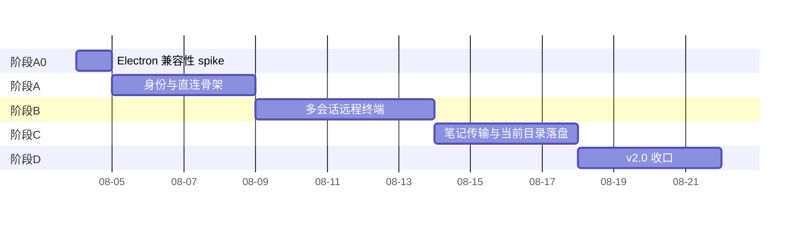

# Termy 远程终端增强 v2.0 开发计划

## 1. 文档信息

| 项目 | 内容 |
| --- | --- |
| 输入依据 | [需求文档 v2.0](需求文档 v2.0.md)、[需求文档 - 用户版 v2.0](需求文档 - 用户版 v2.0.md)、[实现方案 - 开发版 v2.0](实现方案 - 开发版 v2.0.md) |
| 计划性质 | 面向开发执行的任务分解、排期与验收对齐，不重复展开架构与协议细节，均以链接引用实现方案 |
| 假设团队配置 | 1 名 Rust 工程师（Agent 侧）+ 1 名 TS/前端工程师（插件侧），可并行；若为单人开发，总工期按 1.6~1.8 倍估算 |
| 工期单位 | 人天（工作日），未计入需求评审、环境准备等前置时间 |
| 文档日期 | 2026-07-31 |

本计划的阶段划分与退出条件直接对应实现方案第 14 节"实施顺序"，本文档补充：具体任务拆分、产出物、任务级依赖关系、风险登记、测试与文档交付的落地时间点。若本计划与实现方案冲突，以实现方案的架构结论为准，计划应随之更新。

## 2. 阶段总览

| 阶段 | 目标 | 预计工期 | 强依赖 | 对应实现方案章节 |
| --- | --- | --- | --- | --- |
| A0 | 确定控制端 iroh 集成路径（直接嵌入 vs `termy-bridge`） | 0.5~1 天 | 无 | §6.2、§14 |
| A | 身份生成、连接码、点对点连接最小闭环 | 3~5 天 | A0 结论 | §5、§7.2、§7.3、§7.7、§14 |
| B | 多设备多终端会话模型 | 4~6 天 | A 完成 | §6.3、§6.4、§7.5、§14 |
| C | 笔记传输 + cwd 落盘 | 3~5 天 | B 完成（依赖会话与流基础设施） | §7.6、§8.3、§10、§14 |
| D | 安全、回归、验收收口 | 3~4 天 | A/B/C 全部完成 | §12、§13、§15、§16、§14 |

总工期估算：**14.5~19 天**（约 3~4 周，按上述双人并行假设）。A0 为阻塞性节点，其结论决定 A~D 阶段中"直接嵌入"与"`termy-bridge` 兜底"两条实现路径，两条路径的任务清单在下文分别标注，不需要重新排期。

## 3. 阶段任务分解

### 3.1 阶段 A0：Electron 兼容性 spike

| 任务 | 产出物 | 负责 |
| --- | --- | --- |
| 在插件开发环境引入 `@number0/iroh`，编写最小示例：创建 Endpoint、与本地测试节点建连 | 可运行 demo 脚本 + 结论记录 | 插件侧 |
| 分别验证 `pnpm dev`（开发态）与 esbuild 打包态下模块加载 | 验证记录（含 Obsidian 重启后是否仍可加载） | 插件侧 |
| 输出 A0 结论：采用"直接嵌入"或回退"`termy-bridge`" | 更新实现方案 §6.2 状态、通知 Agent 侧工程师 | 双方 |

**退出条件**：见实现方案 §14 通过/不通过条件；不通过时按 `termy-bridge` 兜底路径继续，不阻塞总排期。

**风险**：若在阶段中途才发现不通过，需要把此前按"直接嵌入"假设写的插件网络层代码改为经 `termy-bridge` 转发；因此建议 A0 必须在 A 阶段任何网络层代码开工前跑完，不与 A 阶段并行。

### 3.2 阶段 A：身份与直连骨架

| 任务 | 产出物 | 负责 | 依赖 |
| --- | --- | --- | --- |
| Agent：首次运行生成 Ed25519 身份，持久化到配置目录，权限校验（Ubuntu ≤0600 / Windows 仅当前用户） | `identity.rs` 或等价模块 + 单测 | Rust | A0 |
| Agent：`termy-agent run` 打印连接码（`EndpointTicket`，`@number0/iroh` 1.1.0 实测命名，原文档写作 `NodeTicket`）；`status` 展示 `EndpointId` 摘要与连接码 | CLI 命令 | Rust | 身份模块 |
| Agent：`rotate-identity` 命令，含活跃会话时的二次确认与终止逻辑 | CLI 命令 + 单测 | Rust | 身份模块、会话表雏形 |
| Agent：单实例锁（复用 V1 `flock`/命名互斥量） | 实现 + 单测 | Rust | — |
| Agent：单控制端连接限制，第二个连接返回 `CONTROLLER_ALREADY_CONNECTED`（§7.7） | 实现 + 单测 | Rust | iroh Endpoint 接入 |
| 控制端：iroh Endpoint 持久化身份（直接嵌入路径）或 `termy-bridge` 进程骨架 + 回环通道身份校验（兜底路径） | `irohClient.ts` 或 `termy-bridge` 骨架 | TS/Rust | A0 结论 |
| 控制端：连接码解析（`EndpointTicket` 反序列化）、"添加设备"最小 UI（无设备列表 UI，仅粘贴校验） | 解析模块 + 单测 | TS | — |
| 控制端 ↔ Agent：完成一次真实点对点连接（无终端、无文件），验证成功/失败两条路径 | 联调记录 | 双方 | 以上全部 |
| 移除/标记废弃 V1 遗留模块 `authClient.ts`、`deviceClient.ts`、`relayClient.ts` | 代码清理 PR | TS | 连接码解析完成后 |

**退出条件**（对齐实现方案 §14）：目标端打印连接码，控制端粘贴后能建立 iroh 连接并保持在线；`rotate-identity` 后旧码确认失效；`CONTROLLER_ALREADY_CONNECTED` 生效。

### 3.3 阶段 B：多会话远程终端

| 任务 | 产出物 | 负责 | 依赖 |
| --- | --- | --- | --- |
| Agent：`termy/terminal/1` 流协议实现（open/data/resize/shellEvent/close 帧，§8.2） | 协议编解码模块 + 单测 | Rust | 阶段 A |
| Agent：会话表 `HashMap<SessionId, SessionHandle>`，多会话 PTY 生命周期（§7.5） | 会话管理模块 + 单测 | Rust | 协议模块、复用 V1 `portable-pty` |
| Agent：进程树终止按会话逐个执行（复用 V1 Job Object / 进程组信号手段） | 复用 + 回归验证 | Rust | 会话管理模块 |
| 控制端：`RemoteSessionHandle` 池，按 `(deviceId, sessionId)` 索引（§6.3） | 状态管理模块 + 单测 | TS | 阶段 A 的连接基础 |
| 控制端：`TerminalView` 改造为"会话列表 + 当前激活会话"，接入 Termy 现有多标签基础设施 | UI 改造 | TS | 会话管理模块 |
| 控制端：设备列表 UI（本地持久化 JSON，展示在线状态、每设备终端标签、"新建终端"入口） | UI + 本地存储模块 | TS | 会话管理模块 |
| 控制端：UI 状态机落地（§6.4：RemoteIdle/DeviceList/Connecting/Connected/Error） | 状态机实现 | TS | 设备列表 UI |
| 联调：同设备双终端互不影响；两台设备并发连接互不影响 | 联调记录 | 双方 | 以上全部 |
| 达到 `maxConcurrentSessions` 时的拒绝与提示（`SESSION_LIMIT_REACHED`） | 实现 + 单测 | Rust/TS | 会话管理模块 |

**退出条件**：控制端可同时对两台设备建立连接，其中一台同时开两个终端，均可正常输入输出、独立关闭。

### 3.4 阶段 C：笔记传输与当前目录落盘

| 任务 | 产出物 | 负责 | 依赖 |
| --- | --- | --- | --- |
| Agent：为每个 `SessionHandle` 维护 `lastKnownCwd`，接入既有 `osc_scanner.rs` shell 事件（§7.6） | 实现 + 单测 | Rust | 阶段 B 会话表 |
| Agent：落盘目标解析规则（会话 cwd 优先，回退 `receiveRoot`）+ 路径安全校验（沿用 V1 §10.3，基准目录改为动态解析结果） | 实现 + 单测（含逃逸检测用例） | Rust | cwd 跟踪 |
| Agent：`termy/transfer/1` 握手接收、清单校验（数量/大小/路径）、经 `iroh-blobs` 拉取内容并边校验边落盘 | 实现 + 单测 | Rust | iroh-blobs 集成 |
| 控制端：拖拽笔记收集逻辑复用 V1 附件收集规则（§10.1），新增分流判断（本地/远程且已连接/其他状态，§6.5） | 实现 + 单测 | TS | 阶段 B UI |
| 控制端：BLAKE3 blob 计算/导入、`termy/transfer/1` 清单发送（含 `sessionId`） | 实现 + 单测 | TS | iroh-blobs（或绑定）集成 |
| 联调：已知 cwd 落盘路径验证；未知 cwd 回退默认目录路径验证；含图片附件的笔记引用有效性验证 | 联调记录 | 双方 | 以上全部 |
| 传输结果 UI：成功展示落盘目录，失败展示原因（`INVALID_DROP`/`INVALID_PATH`/`WRITE_FAILED`/`HASH_MISMATCH`/`TRANSFER_FAILED`） | UI + 错误映射 | TS | 传输联调 |

**退出条件**：含图片附件的笔记可以正确落到目标终端当前目录，Markdown 引用路径保持有效；回退路径行为符合预期。

### 3.5 阶段 D：v2.0 收口

| 任务 | 产出物 | 负责 | 依赖 |
| --- | --- | --- | --- |
| 安全检查：端到端加密生效验证、已配对设备列表/身份密钥文件权限核查、日志脱敏审查（终端正文、笔记正文不落日志） | 检查清单 + 修复 PR | 双方 | 阶段 A~C 完成 |
| 若采用 `termy-bridge` 兜底：回环通道身份校验专项测试 | 测试记录 | 双方 | A0 结论为兜底路径时适用 |
| 本地 Termy 回归：本地 Shell、复制粘贴、搜索、本地拖拽 | 回归测试记录 | 双方 | 全功能完成 |
| 非同一局域网条件下的双机、多设备验收（依赖公共中继/发现网络路径） | 验收记录 | 双方 | 全功能完成 |
| 网络穿透专项：直连成功、直连失败降级中继、直连和中继都失败、设备换网后重连 | 测试记录 | 双方 | 全功能完成 |
| 文档更新：Agent 安装说明、CLI 说明、连接码使用说明、隐私披露（能力凭证模型、公共发现网络元数据可见性）、v2.0 已知限制 | 文档 PR | 双方 | 全功能完成 |
| 对照实现方案第 16 节完成定义逐条验收 | 验收记录 | 双方 | 以上全部 |

**退出条件**：实现方案第 16 节全部条件满足（见本计划第 5 节验收对照表）。

## 4. 任务级依赖与并行建议

1. Rust（Agent）与 TS（插件）两条线在阶段 A 起可基本并行开发，但阶段末尾的"点对点连接联调"是硬同步点，需要双方代码都达到可联调状态。
2. 阶段 B 的会话协议（Rust）与 UI 状态机（TS）可并行，联调点在"同设备双终端互不影响"验证。
3. 阶段 C 强依赖阶段 B 的会话与流基础设施，不建议提前开工，但 `iroh-blobs` 集成本身（内容寻址、BLAKE3 计算）可在阶段 B 后期预研，降低阶段 C 前期风险。
4. 阶段 D 的文档与安全检查任务可在阶段 C 收尾阶段提前起草，无需等全部代码冻结。
5. 若阶段 A0 判定为 `termy-bridge` 兜底路径，需要在阶段 A 任务清单中额外插入"`termy-bridge` 进程骨架搭建 + 回环通道协议设计"（约增加 1~2 天），后续阶段任务名称不变，仅执行路径由"插件直接调用"改为"经 `termy-bridge` 转发"。

## 5. 里程碑与验收对照

| 里程碑 | 对应完成定义（实现方案 §16） |
| --- | --- |
| A 完成 | 条件 1（免账号配对）、条件 5（rotate 后旧码失效）、条件 9（单控制端限制）的骨架具备但未联调 UI |
| B 完成 | 条件 2（多设备多终端独立工作） |
| C 完成 | 条件 4（cwd 落盘与回退） |
| D 完成 | 条件 3（端到端加密与降级）、条件 6（本地无回归）、条件 7（安全检查）、条件 8（文档齐全），并对条件 1/2/4/5/9 做最终联合验收 |

用户侧验收口径见[需求文档 - 用户版 v2.0 第 8 节](需求文档 - 用户版 v2.0.md#8-用户验收清单)，D 阶段末尾应按该清单走一遍完整用户视角验收，不能只依赖内部单测/联调记录。

## 6. 风险登记

| 风险 | 影响阶段 | 应对 |
| --- | --- | --- |
| `@number0/iroh` 在 Electron 中加载失败或不稳定 | A0，波及 A~D 的实现路径 | A0 设时间盒（0.5~1 天），不通过立即切换 `termy-bridge` 兜底，不允许延长 A0 阻塞整体排期 |
| iroh/iroh-blobs 实际 API 与文档核实时的版本存在差异 | A、C | 已部分证实：2026-07-31 用真实 `@number0/iroh` 1.1.0 包在纯 Node（非 Electron）环境验证，核心类型已改名 `NodeId`/`NodeTicket`/`NodeAddr` → `EndpointId`/`EndpointTicket`/`EndpointAddr`（本文档已按新命名更新），双端 QUIC 连接+连接码解析+身份复现均实测通过。Electron 内加载与 esbuild 打包排除原生 `.node` 文件仍未验证，是 A0 剩余的唯一未知项 |
| ALPN 在 iroh 中按 `Connection` 协商，而非按流 | A、C | 实测确认：多终端会话作为同一 `Connection` 上的多条 `openBi()` 流没问题（符合 §8.2 设计），但 `termy/transfer/1` 作为独立 ALPN 意味着传输握手需要单独一条 `Connection`。需要在阶段 A 设计评审时明确：§7.7"单控制端连接"限制的是"一条 Connection"还是"一个逻辑控制端身份"（后者允许并行的传输连接） |
| 多控制端并发连接的边界条件（`CONTROLLER_ALREADY_CONNECTED`）未覆盖全 | A、D | A 阶段即补充单测，D 阶段安全检查中复测 |
| 非同一局域网环境难以在开发阶段本地复现 | D | 提前准备两个物理网络环境（如手机热点 + 公司网络）用于 D 阶段验收，避免验收当天才发现环境不具备 |
| `termy-bridge` 兜底路径导致的额外排期未预留 | A0 判定后的全部阶段 | 一旦 A0 判定为兜底路径，立即更新本计划工期（预计 +2~3 天），不要求隐性压缩后续阶段时间 |

## 7. 测试与交付节奏

测试矩阵定义见[实现方案 §15](实现方案 - 开发版 v2.0.md#15-测试矩阵)，落地节奏：

- 单元测试（Agent/插件）：随各阶段任务同步编写，不单独占用工期。
- 协议集成测试、多设备/多终端专项：阶段 B、C 联调节点执行。
- 网络穿透专项、安全检查：阶段 D 集中执行。
- 本地回归：阶段 D 起跑一次完整回归，确保全周期无本地能力退化。

## 8. 待跟踪事项

以下事项不阻塞本计划开工，但需要在对应阶段前有结论，跟踪口径见[需求文档 v2.0 第 12 节](需求文档 v2.0.md#12-后续待确认事项)：

1. A0 结论（直接嵌入 vs `termy-bridge`）——**已判定：直接嵌入可行**。2026-07-31 在 Windows 真实 Obsidian 的 Electron 渲染进程中验证：`require('@number0/iroh')` 加载成功（25 个导出符号），且绑定 loopback Endpoint 并生成连接码（EndpointTicket）成功；此前纯 Node 基线在 Linux/Windows 均通过，假控制端已对真实 agent 走通全链路。尚余打包态验证（esbuild external + 插件目录携带 node_modules，交接清单步骤 5），只影响打包脚本、不影响代码路径。
1b. ALPN-per-Connection 的设计取舍（见第 6 节风险登记新增行）——阶段 A 设计评审时需给出结论，影响 §7.7 单控制端连接限制与 `termy/transfer/1` 是否需要独立连接。
2. 多设备/多终端软上限具体数值——阶段 B 开工前需确认默认值（当前默认参考 `maxConcurrentSessions: 8`，控制端设备数不设上限）。
3. 自建中继运维归属——不阻塞 v2.0，列入 v2.1 待办，D 阶段文档中需注明当前默认使用官方托管中继。
4. 连接码分发产品化（二维码等）——不阻塞 v2.0 开发，列入 v2.1。
