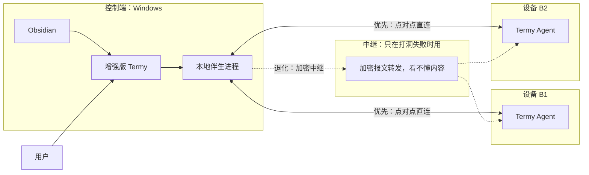
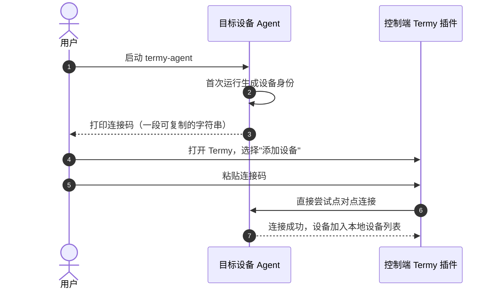
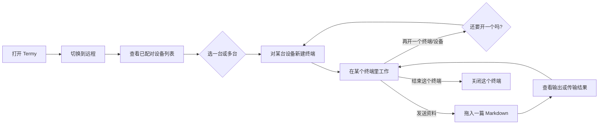
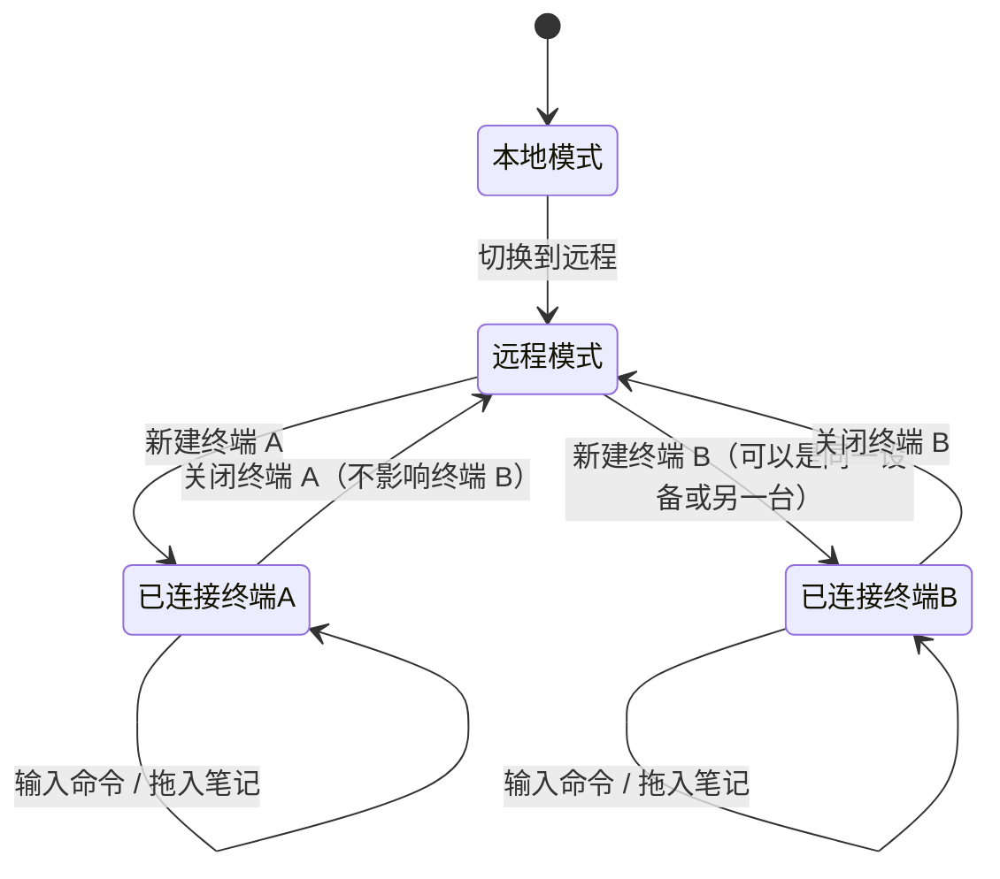
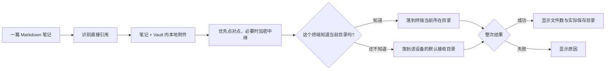
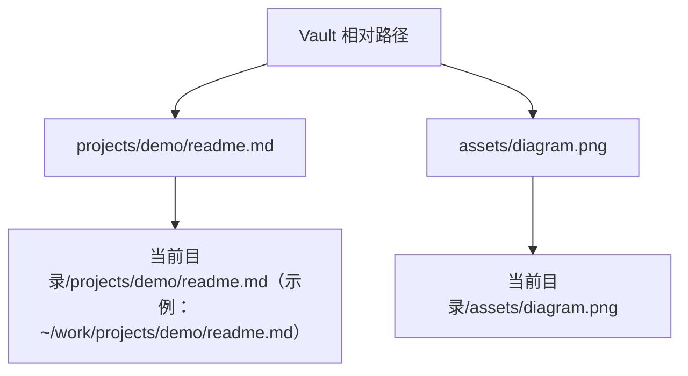
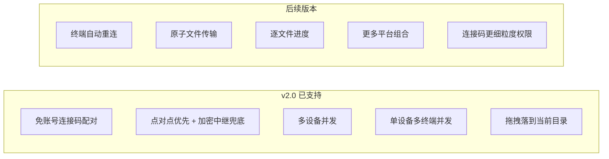
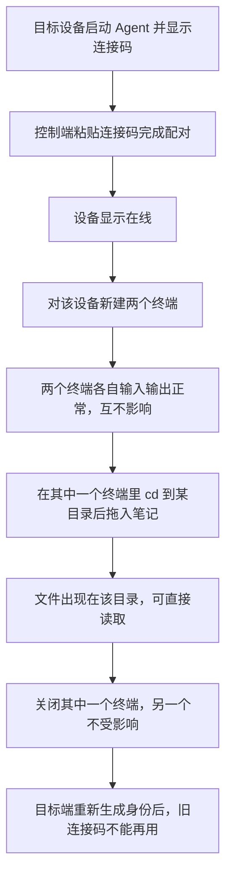

# Termy 远程终端增强需求文档（用户版 v2.0）

> **v2.0 一句话说明**：目标设备启动后自己生成一个连接码，Obsidian 插件复制该码即可直连；同时可以连着好几台设备、每台设备开好几个终端；拖进去的笔记落在你当前所在的目录。

| 控制端 | 目标端 | 当前版本 |
| --- | --- | --- |
| Windows + Obsidian Desktop + 增强版 Termy | Windows Agent 或无桌面 Ubuntu Agent | v2.0 |

[[需求文档 v2.0|需求文档]] · [[实现方案 - 开发版 v2.0|实现方案]] · 上一版：[[需求文档 - 用户版|V1 用户版]]

## 1. 一眼看懂



要点：

- **不用注册账号、不用记密码**。
- 控制端可以**同时连着多台设备**，每台设备也可以**同时开多个终端**。
- 数据优先走点对点直连；连不上时才走中继，但中继始终只看到加密内容。
- 设备 B **不需要安装或打开 Obsidian**，也不需要公网 IP 或开放入站端口。

## 2. 首次配对（不再需要账号）



目标端只需：**安装 Agent → 启动 → 复制连接码 → 粘贴到插件**。没有登录页，没有密码，没有云端账号。

连接码在设备身份不变的情况下长期有效；怀疑连接码泄露时，可以在目标设备上执行"重新生成身份”，旧码立即失效，需要用新码重新配对。

Ubuntu Agent 通过用户级 `systemd` 运行，退出 SSH 后仍保持在线；Agent 和远端 Shell 都以普通用户身份运行，不使用 root。

## 3. 日常使用（可以同时连好几台、开好几个）





| 场景 | 是否互相影响 |
| --- | --- |
| 同一设备上的两个终端 | 互不影响，各自独立输入输出 |
| 两台不同设备 | 互不影响，可同时操作 |
| 其中一个终端断线 | 只有它自己显示中断，其余照常 |
| 关闭其中一个终端 | 只结束它对应的远端进程，其余不受影响 |

v2.0 单个终端断线后不会自动重连，也不会缓存断线期间的输入；每台设备、每台设备下可同时开的终端数有一个软上限，超过会提示上限而不是无限叠加。

## 4. 笔记怎样发送（落在你当前所在的目录）



| 会发送 | 不会发送 |
| --- | --- |
| 一篇从文件列表拖入的 `.md` 笔记 | 被链接 Markdown 的下一层附件 |
| 该笔记直接引用的 Vault 内图片、PDF、音频等 | 外部网络资源、整个目录、多篇笔记 |

对比 V1：V1 固定落在一个预设的接收目录；v2.0 优先落在**你正在这个终端里工作的目录**（比如你刚 `cd` 进了 `~/projects/demo`，文件就落在这里），只有这个终端还没汇报过当前目录时，才退回到该设备设置里的默认接收目录。远程模式依旧不会把控制端的本地绝对路径粘贴进远端 Shell。

## 5. 文件保存在哪里



| 情况 | 落盘位置 |
| --- | --- |
| 终端已经 `cd` 到某个目录，且曾经上报过 | 该目录下，按 Vault 相对路径 |
| 终端刚连接、还没有任何目录信息 | 该设备设置中配置的默认接收目录 |
| 当前目录不可写 | 传输失败并提示，不自动切换目录 |

目录结构保持不变，笔记中的相对附件引用仍可使用；同名文件会直接覆盖，不再逐项确认。文件传输过程中会做分块校验，收到的数据和发出的数据必须一致才算成功。

## 6. 用户会看到什么

```text
┌────────────────────────────────────────────────────────────┐
│ [本地 | 远程]                                              │
├────────────────────────────────────────────────────────────┤
│  已配对设备                                                 │
│   ● 设备 B1  [已连接: 终端①  终端②]      [+ 新建终端]      │
│   ● 设备 B2  [已连接: 终端①]              [+ 新建终端]      │
│   ○ 设备 B3（离线）                                         │
│   [+ 添加设备（粘贴连接码）]                                │
├────────────────────────────────────────────────────────────┤
│  当前终端：设备 B1 · 终端①                                  │
│  原有 xterm.js 终端区域                                     │
└────────────────────────────────────────────────────────────┘
```

| 情况 | 页面反馈 | 用户下一步 |
| --- | --- | --- |
| Agent 未运行 | 设备离线 | 在目标端启动 Agent |
| 连接码错误或已失效 | 连接码无效 | 检查是否被 rotate，向对方索要新码 |
| 点对点连不上 | 自动尝试中继 | 无需操作，仅耗时略增 |
| 直连和中继都不通 | 网络不可达 | 检查双方网络后重试 |
| 某设备/终端数超过软上限 | 已达上限 | 先关闭一些不用的终端 |
| Shell 无法启动 | 终端启动失败 | 检查目标端 Shell 配置 |
| 当前目录不可写 | 无法写入 | 检查该目录权限，或改用默认接收目录 |
| 某终端网络中断 | 该终端显示已中断 | 手动重新连接该终端，其余不受影响 |
| 传输中断 | 失败，部分文件可能已写入 | 检查后重新发送 |

## 7. v2.0 边界



用户需要知道的限制：

1. 连接码等同于"能连上这台设备"的钥匙，请像对待密码一样谨慎分发；怀疑泄露就去目标端重新生成身份。
2. 单个终端断线不会自动恢复，需要手动重新连接。
3. 文件传输失败时可能已经写入了部分文件，v2.0 不做自动清理。
4. 每台设备可开的终端数、可同时连接的设备数存在软上限，超过会被提示而不是无限叠加。

## 8. 用户验收清单



v2.0 通过需同时满足：

- 全程不涉及任何账号注册或登录；
- 至少两台设备可同时连接，其中一台可同时开两个以上终端且互不影响；
- 点对点连接优先建立，必要时能自动降级到加密中继，且中继无法读取正文；
- 拖入笔记落在该终端当前所在目录，找不到当前目录时才落到默认接收目录；
- 重新生成设备身份后旧连接码立即失效；
- 本地终端及本地拖拽行为没有变化。
