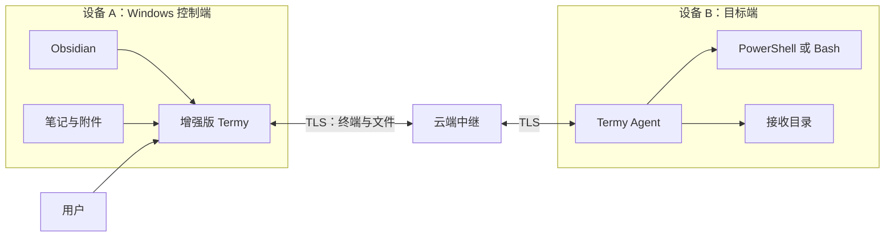
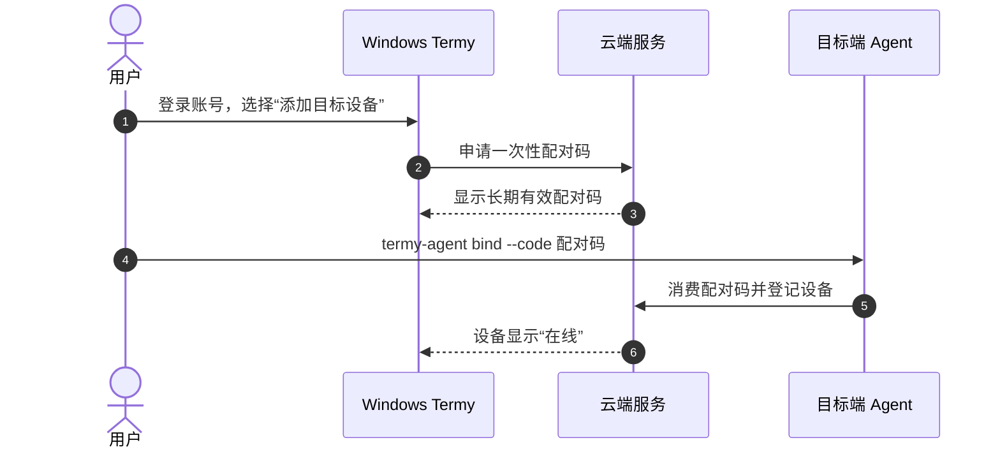
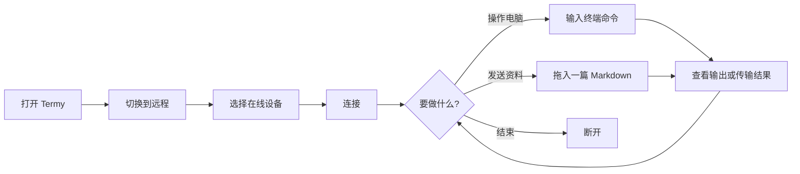
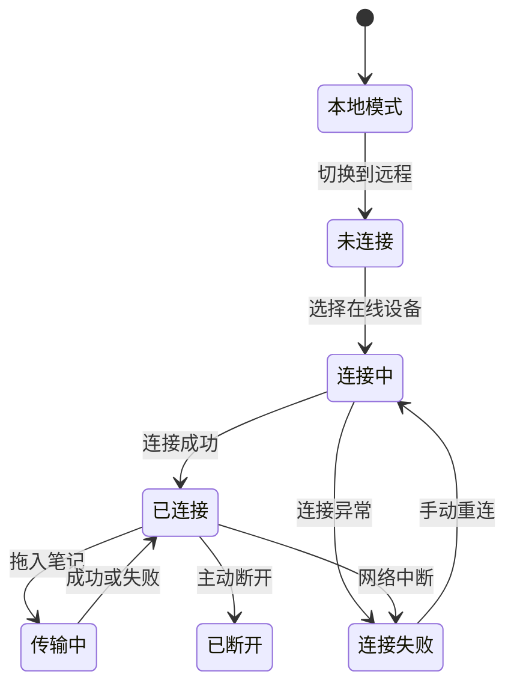
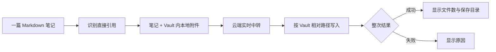
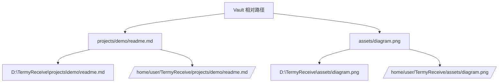
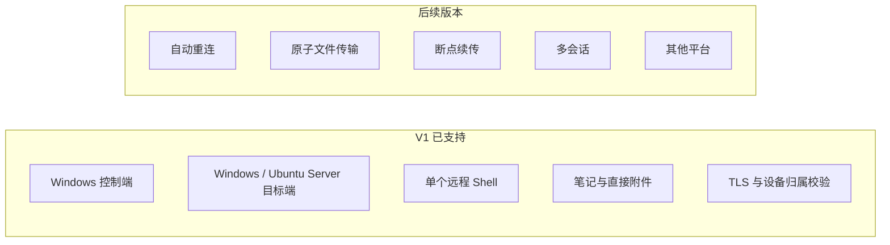
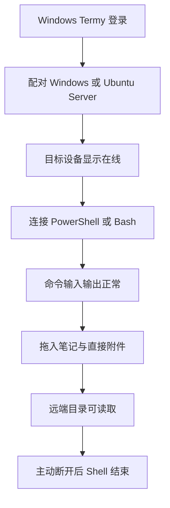

# Termy 远程终端增强需求文档（用户版）

  

> **V1 一句话说明**：在 Windows 的 Obsidian Termy 中，连接本人另一台 Windows 电脑或无桌面的 Ubuntu 服务器，并把当前笔记及直接附件发送过去。

  

| 控制端 | 目标端 | 当前版本 |

| --- | --- | --- |

| Windows + Obsidian Desktop + 增强版 Termy | Windows Agent 或无桌面 Ubuntu Agent | V1 |

  

 [[终端插件/需求文档|需求文档]] · [[实现方案 - 开发版]]

  

## 1. 一眼看懂

  



  

设备 B 可以是：

  

- Windows 电脑，运行 `termy-agent.exe`；

- 没有桌面环境的 Ubuntu 服务器，运行命令行程序 `termy-agent`。

  

设备 B **不需要安装或打开 Obsidian**，也不需要公网 IP 或开放入站端口。

  

## 2. 首次配对

  



  

目标端只需：**安装 Agent → 输入配对码 → 设置接收目录 → 启动 Agent**。

  

配对码生成后长期有效，首次成功绑定后立即生效；用户也可以在设备 A 主动撤销尚未使用的配对码。

  

Ubuntu Agent 通过用户级 `systemd` 运行。退出 SSH 后仍保持在线，但 Agent 和远端 Shell 都以普通用户身份运行，不使用 root。

  

## 3. 日常使用

  



  



  

| 当前状态 | 命令输入 | 拖入笔记 | 用户操作 |

| --- | --- | --- | --- |

| 本地模式 | 可用 | 保持原有行为 | 使用本机终端 |

| 未连接 / 连接中 | 禁用 | 禁用 | 选择设备或等待 |

| 已连接 | 可用 | 可用 | 操作远端或断开 |

| 传输中 | 可用 | 不可重复拖入 | 等待整次结果 |

| 连接失败 / 已断开 | 禁用 | 禁用 | 手动重新连接 |

  

V1 断线后不会自动重连，也不会缓存断线期间的输入。

  

## 4. 笔记怎样发送

  



  

| 会发送 | 不会发送 |

| --- | --- |

| 一篇从文件列表拖入的 `.md` 笔记 | 被链接 Markdown 的下一层附件 |

| 该笔记直接引用的 Vault 内图片、PDF、音频等 | 外部网络资源、整个目录、多篇笔记 |

  

远程模式不会把设备 A 的本地绝对路径粘贴进远端 Shell。

  

## 5. 文件保存在哪里

  



  

| 目标系统 | 默认 Shell | 接收目录示例 |

| --- | --- | --- |

| Windows | PowerShell | `D:\TermyReceive` |

| Ubuntu Server | Bash | `/home/user/TermyReceive` |

  

目录结构保持不变，笔记中的相对附件引用仍可使用。同名文件会直接覆盖，不再逐项确认。

  

## 6. 用户会看到什么

  

```text

┌────────────────────────────────────────────────────────────┐

│ [本地 | 远程]  [目标设备 ▾]  ● 已连接     [断开]          │

├────────────────────────────────────────────────────────────┤

│                                                            │

│  原有 xterm.js 终端区域                                    │

│                                                            │

└────────────────────────────────────────────────────────────┘

```

  

| 情况 | 页面反馈 | 用户下一步 |

| --- | --- | --- |

| Agent 未运行 | 设备离线 | 在目标端启动 Agent |

| 登录失效 | 请重新登录 | 打开账号设置 |

| 设备已有会话 | 设备忙 | 结束旧会话后重试 |

| Shell 无法启动 | 终端启动失败 | 检查目标端 Shell 配置 |

| 接收目录不可写 | 无法写入 | 使用 Agent CLI 修改目录 |

| 网络中断 | 连接已中断 | 手动重新连接 |

| 传输中断 | 失败，部分文件可能已写入 | 检查后重新发送 |

  

## 7. V1 边界

  



  

用户需要知道的限制：

  

1. 文件由云端实时中转，服务端能够接触转发内容；当前不是端到端加密。

2. 文件直接写入正式目录，传输失败时可能留下已完成或不完整文件。

3. 同名文件直接覆盖，不能自动恢复旧版本。

4. Agent 使用目标端普通用户权限，不提权。

  

## 8. 用户验收清单

  



  

V1 通过需同时满足：

  

- Windows -> Windows 与 Windows -> Ubuntu Server 两条路径均完成上述闭环；

- Ubuntu 退出 SSH 后 Agent 仍在线；

- 其他账号无法发现或连接该设备；

- 本地终端及本地拖拽行为没有变化；

- 页面能明确显示连接和传输的成功或失败。