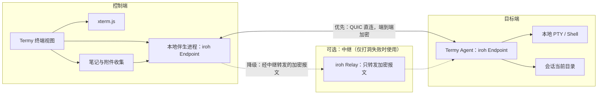

# Termy 远程终端增强功能用户需求采集 v2.0

> [!IMPORTANT]
> 本文件是 v2.0 需求采集与方案形成阶段的合并基线，保留用于追溯，不作为开发和验收的唯一执行口径。当前维护文档已按受众拆分：
>
> - [Termy 远程终端增强需求文档（用户版 v2.0）](需求文档 - 用户版 v2.0.md)
> - [Termy 远程终端增强实现方案（开发版 v2.0）](实现方案 - 开发版 v2.0.md)
>
> 用户可见行为以用户版为准，工程实现以开发版为准。若三者存在冲突，应先完成变更评审并同步修订，不能回退到本合并文档自行选择口径。
>
> **版本变更记录（2026-07-30）**：v2.0 相对 [V1/MVP 基线](需求文档.md) 的四项核心变更：
> 1. 取消账号、密码登录；目标端 Agent 启动后自行生成一次性"连接码"，控制端插件复制该码即可配对，不再有云端用户体系。
> 2. 引入 [iroh](https://github.com/n0-computer/iroh)（基于 QUIC 的点对点直连库）：控制端与目标端优先建立直连，无法打洞时才经加密中继转发，中继无法解密终端或文件正文。原有"云端中继服务承担账号鉴权 + 设备发现 + 明文业务层转发"的架构不再是 v2.0 的默认路径。
> 3. 拖拽笔记的落盘目标从固定的"接收目录"改为该远程终端**当前所在目录**；无法得知当前目录时才回退到设备设置中配置的默认接收目录。
> 4. 支持控制端同时连接多台目标设备，并对同一台设备开多个终端会话，互不影响。
>
> V1 文档中的账号登录、配对码由控制端签发、云端设备注册、单会话单设备等描述，属于 v2.0 之前的历史口径，不再适用。

## 1. 文档信息

| 项目 | 内容 |
| --- | --- |
| 功能名称 | Termy 远程终端与 Obsidian 笔记传输增强 v2.0 |
| 需求阶段 | v2.0 需求变更采集与方案形成（在 V1 MVP 基线上迭代） |
| 采集方法 | 用户故事地图、5W2H、场景穿越 |
| 采集日期 | 2026-07-30 |
| 参考项目 | https://github.com/ZyphrZero/Termy ；https://github.com/n0-computer/iroh |
| 前序基线 | [需求文档.md（V1）](需求文档.md) |

## 2. 背景与核心价值

V1 已经跑通"账号登录 + 云端配对码 + 云端中继"的远程终端与笔记传输闭环，但用户在实际使用中发现三类门槛和一类能力缺口：

1. **入门门槛**：注册/登录账号、记密码，对个人在自己多台设备间使用的场景显得过重；即便 V1 已经把设备侧简化为"一次性配对码"，仍然保留了一套账号体系。
2. **信任门槛**：云端中继在业务层可以访问被转发的终端和文件内容，用户希望能有更接近点对点的方案，减少必须信任云端服务的范围。
3. **使用习惯错位**：用户在远端终端里通常已经 `cd` 到某个具体工作目录，笔记拖进去却总是落在一个固定的接收目录，还要手动挪动或建立软链接才能被当前命令行使用。
4. **并发能力不足**：V1 每个账号只保留一条控制连接、每个 Agent 只允许一个远程 PTY，用户没法同时对多台设备、或同一台设备的多个任务分别开终端。

v2.0 的核心价值：**用最低门槛（复制一个连接码）建立尽量点对点的远程终端连接，把资料直接送到用户正在操作的目录，并允许用户像使用本地多标签终端一样，同时驾驭多台设备、多个会话。**

## 3. 第一步：用户故事地图

### 3.1 用户目标

1. 不注册、不登录、不用云端账号，只凭一个由目标设备自己生成的码，就能在 Obsidian 里连接并操作它。
2. 同时管理多台自己的设备，并在其中任意一台上按需开多个终端，分头处理不同任务。
3. 把当前笔记及其直接引用的附件拖进某个远程终端后，文件出现在该终端**当前所在的目录**，不必再手动挪动。
4. 尽量让终端和文件走点对点直连；即使因网络原因退化为经第三方转发，内容也应该是端到端加密、对转发方不可读的。

### 3.2 用户任务与用户活动

| 用户任务 | 用户活动 | 页面反馈/结果 |
| --- | --- | --- |
| 准备目标设备 | 安装 Agent；首次运行自动生成设备身份并展示连接码；设置默认接收目录（作为 cwd 未知时的兜底） | 终端打印连接码，并提示"等待配对" |
| 添加设备 | 在 Obsidian 插件中选择"添加设备"，粘贴连接码 | 插件尝试直连，成功后设备出现在本地设备列表并显示在线 |
| 进入远程模式 | 打开 Termy 面板；从本地/远程模式控件切换到远程 | 面板显示本地已保存的设备列表及各自在线状态 |
| 建立终端连接 | 选择一台或多台在线设备；对某台设备点击"新建终端” | 每个终端独立显示连接中、已连接或失败，可为同一设备开多个终端标签 |
| 操作远程终端 | 在某个已连接的终端标签中输入命令；接收实时输出；使用 Termy 常规复制、粘贴、搜索能力 | 正常网络下命令反馈目标约 1 秒内 |
| 传输笔记 | 把一篇笔记拖到某个已连接的终端标签 | 插件识别笔记并准备文件，不把本地路径粘贴到远端 Shell |
| 收集附件 | 解析该笔记直接引用的本地附件；校验数量、大小与路径 | 校验不通过时不上传并列出原因 |
| 落盘 | 文件经点对点通道（或加密中继兜底）送达，落到目标终端当前所在目录；无法得知当前目录时落到该设备默认接收目录 | 只反馈整次成功或失败，不展示逐文件进度 |
| 读取远端文件 | 在该远程终端中直接用相对路径访问刚落地的笔记和附件 | 保持 Vault 相对目录结构，原 Markdown 引用可继续使用 |
| 管理多任务 | 在多个终端标签、多台设备之间切换 | 各终端状态互不影响，断开其一不影响其余 |
| 结束连接 | 关闭某个终端标签，或断开某台设备的全部终端 | 对应远端 PTY 随之结束并释放资源，其余会话不受影响 |
| 管理设备身份 | 需要让旧连接码失效时，在目标设备执行"重新生成身份” | 旧连接码立即失效，需要重新分发新码 |

### 3.3 核心用户故事

1. 作为拥有多台电脑的用户，我希望目标设备启动后自己生成一个连接码，我在 Obsidian 插件里粘贴该码就能连接，不必注册账号、不必记密码。
2. 作为经常需要同时在多台设备上排查问题的用户，我希望能同时连接好几台设备，并在同一台设备上开多个终端，分别处理不同任务，而不必反复断开重连。
3. 作为正在远端命令行里处理某个项目目录的用户，我希望把笔记拖进那个终端后，文件直接落到我当前所在的目录，而不是每次都要去一个固定的接收目录找文件。
4. 作为关注隐私的用户，我希望终端和文件尽量走点对点直连；即使因网络原因经过第三方转发，转发方也不应该能读懂内容。

## 4. 第二步：5W2H

### 4.1 What：做什么

1. 目标端 Agent 首次运行时生成本机设备身份，并在每次启动时展示一个可复制的连接码；控制端插件粘贴该码即可发起配对与连接，不经过任何账号注册/登录接口。
2. 引入 iroh：控制端与目标端各自维护一个网络端点，优先建立点对点 QUIC 连接（含 NAT 穿透）；打洞失败时经过公共或自建中继转发，但转发的是端到端加密报文，中继无法还原终端或文件正文。
3. 控制端插件本地维护"已配对设备"列表（名称、连接码来源、最近在线状态），不依赖任何云端账号数据。
4. 控制端可同时连接多台设备；对同一台设备可创建多个独立终端会话，各自输入输出、各自断开，互不影响。
5. 从 Obsidian 文件列表拖拽单篇 Markdown 笔记到某个已连接终端时，自动收集其直接引用的本地附件，并把整个文件集发送到该终端当前所在目录；终端尚未报告过当前目录时，回退到该设备设置中配置的默认接收目录。
6. 目标端保持 Vault 相对目录结构，使 Markdown 中的附件引用继续有效；文件传输采用内容寻址与分块校验，接收端边收边校验完整性。

### 4.2 Why：为什么需要

1. 账号密码和"云端签发配对码"对个人在自己设备间使用而言仍是不必要的中间环节；由设备自己生成、用户直接复制粘贴的连接码更符合"越简单越好用"的直觉，也更贴近用户已经熟悉的同类工具（如 Tailscale、Syncthing）的配对体验。
2. 点对点直连能显著缩小必须信任云端服务的范围，回应"服务端在业务层可访问转发内容"这一在 V1 中被明确记录、但用户并不满意的取舍；即便退化为中继，也应该保持加密而不可读。
3. 用户在远端终端里工作时几乎总是已经进入某个具体目录；文件如果固定落在一个与当前工作无关的目录，用户还要手动搬运，违背"拖进去就能读"的初衷。
4. 多设备、多终端并发已经是用户真实的日常使用方式（一台编译、一台看日志、一台跑测试），V1 的单会话限制已经成为使用瓶颈。

### 4.3 Who：谁使用及权限

1. 仍然面向同一用户拥有的多台个人设备，不引入多人共享控制或协作授权。
2. 安全模型从"账号 + 设备归属校验"变为"持有连接码即可连接"的能力凭证模型：任何拿到某设备当前连接码的人都可以连接并操作它的终端。用户需要自行控制连接码的分发范围；Agent 必须提供"重新生成设备身份"的手段，执行后旧连接码立即失效。
3. 目标端 Shell 仍然继承 Agent 运行账号的系统权限，v2.0 不引入系统提权。
4. 不属于当前已知连接（即从未配对过、或已被 rotate 失效）的连接尝试必须被拒绝；插件本地设备列表是用户判断"这是不是我认识的设备"的唯一依据，产品需要在 UI 上清楚展示设备名称与最近连接信息，降低误连风险。

### 4.4 When：何时触发

1. 用户在目标设备上启动 Agent 时（或主动查看时）生成/展示连接码；连接码在设备身份不变的前提下保持可用，直到用户主动执行"重新生成身份”。
2. 用户在控制端插件粘贴连接码后立即尝试建立连接，不需要额外的服务端"设备注册"往返。
3. 用户可以随时对某台已配对且在线的设备新开一个终端；也可以同时对多台设备发起连接，互不阻塞。
4. 用户把笔记拖入某个已连接终端时，立即以该终端最近一次报告的当前目录为落盘目标发起传输。
5. 网络条件变化时：优先尝试的直连失败会自动退化为中继转发；某个终端或某台设备的连接中断只影响自身，不影响其他并发的终端/设备。

### 4.5 Where：页面与位置

1. 核心入口仍是 Termy 终端面板，不新增独立的远程终端主页面。
2. 面板从 V1 的"单一设备下拉框"演进为"设备列表（可同时多选/多连接）+ 每台设备下的终端标签”，风格与 Termy 现有本地多会话/分屏能力保持一致。
3. 新增"添加设备"入口（粘贴连接码），替代原先的"登录账号 + 绑定设备"设置项。
4. 每台设备的默认接收目录（cwd 未知时的兜底）仍在插件设置中配置；新增"重新生成设备身份"入口，位于目标端 Agent 一侧（CLI 或其状态面板）。

### 4.6 How：交互与实现边界

1. 正常流程：目标端启动 Agent 并展示连接码 → 用户在插件里粘贴该码添加设备 → 插件本地记住该设备 → 选择在线设备并新建一个或多个终端 → 输入命令或把笔记拖到具体某个终端 → 查看结果 → 按需断开某个终端或某台设备，其余不受影响。
2. 连接链路优先直连（iroh QUIC，含 NAT 打洞）；直连不可用时退化为经中继转发，但转发内容始终端到端加密，中继不可解密。
3. 文件传输采用内容寻址、分块校验的方式（而非整包传输后再校验），接收端可以边接收边校验完整性。
4. 同名文件由本次传输自动覆盖，不逐项询问，与 V1 保持一致。
5. 用户反馈依旧轻量：每个终端、每台设备的连接状态独立可见；文件传输只反馈"处理中"及最终成功/失败，不提供逐文件进度面板。

### 4.7 How much：规模与性能

1. 单个控制端可同时连接的设备数量、单台设备可同时打开的终端数量暂不设强制上限，但需要一个可配置的软上限防止资源耗尽（起始建议：单设备并发终端 ≤ 8，单控制端同时连接设备 ≤ 16，具体数字在开发版中确认并可调整）。
2. 单次传输的文件数量与总大小限制维持与 V1 相当的量级，具体数值在开发版给出，不因去中心化而放开无限制。
3. 正常网络下，终端输入到可见反馈的目标时间仍约为 1 秒内。
4. 不要求高可用集群或水平扩展；点对点架构本身弱化了对自建云端服务规模的依赖。

## 5. 第三步：场景穿越验证

### 5.1 正常终端流程（多设备多终端）

**前置条件**：目标设备已安装并启动 Agent，展示出当前连接码；控制端插件已粘贴该码完成设备添加。

1. 用户在插件中打开 Termy，切换到远程模式，看到本地保存的设备列表及在线状态。
2. 用户对设备 B 点击"新建终端”，页面显示该终端"连接中”。
3. 控制端与 Agent 尝试直连；成功后页面显示"已连接”，终端获得输入焦点。
4. 用户在设备 B 上新建第二个终端，同时对设备 C 发起连接；三者互不影响。
5. 用户在设备 B 的某个终端输入命令，实时看到输出；随后关闭该终端，设备 B 的另一个终端和设备 C 的终端不受影响。

**验收结果**：用户可以不离开 Obsidian，同时驾驭多台设备、多个终端；关闭其中之一不影响其余会话；本地终端能力不受影响。

### 5.2 正常笔记传输流程（落到当前目录）

1. 用户在某个已连接的远程终端里先执行 `cd` 进入一个工作目录，Shell 集成事件把该目录上报给控制端。
2. 用户把一篇笔记从 Obsidian 文件列表拖到这个终端。
3. 插件解析笔记直接引用的本地附件，保留 Vault 相对路径，并校验文件数量、总大小与路径合法性。
4. 文件经点对点通道（或加密中继兜底）分块发送并校验完整性。
5. Agent 以该终端最近上报的当前目录为根，按 Vault 相对路径落盘，同名文件覆盖。
6. 传输完成，页面显示成功以及落盘的实际目录；用户在该终端里用相对路径即可读到笔记和附件。

**验收结果**：文件出现在用户实际工作的目录而非固定接收目录；Markdown 引用保持有效；远程模式不会把控制端本地绝对路径粘贴进远端 Shell。

### 5.3 网络错误

#### 直连失败与降级

1. 控制端优先尝试与目标设备直连；打洞失败时自动改为经加密中继转发，用户侧只感知连接建立耗时略增，不需要手动切换模式。
2. 若中继也不可达，该终端/设备显示连接失败，允许用户手动重试。

#### 终端会话中断

1. 某个终端的连接中断只影响该终端，页面显示"连接中断”，其余终端和设备不受影响。
2. v2.0 暂不做该终端的自动恢复，用户需手动重新连接；断线期间不缓存用户输入。

#### 文件传输中断

1. 本次传输标记为失败，不自动断点续传。
2. Agent 清理本次传输的未完成数据；已完整落盘的文件保留（与 V1 一致的取舍）。
3. 提示用户网络恢复后重新拖拽。

### 5.4 信任与身份场景（替代 V1 的"账号或设备权限不足”）

1. 用户粘贴了错误或已失效（已被 rotate）的连接码：插件提示"连接码无效或已失效”，不建立任何连接，不展示任何设备信息。
2. 用户怀疑某个连接码已泄露：在目标设备执行"重新生成身份”，旧码立即失效；用户需要用新码重新配对所有希望保留的控制端。
3. 目标端 Shell 权限不足（如接收目录不可写）：不自动切换目录、不提权，本次传输失败并提示原因。

### 5.5 极端数据与边界情况

| 场景 | 预期处理 |
| --- | --- |
| 同时连接的设备数或某设备并发终端数超过软上限 | 拒绝新建并提示当前上限，不影响已有连接 |
| 终端从未报告过当前目录（例如刚连接就立即拖拽） | 回退到该设备配置的默认接收目录 |
| 当前目录不可写或不存在 | 本次传输失败并提示原因，不自动切换目录 |
| 目标系统存在路径穿越或大小写冲突 | 上传前整体拦截并列出问题路径 |
| 连接码被多个控制端同时使用 | 允许多个控制端各自独立连接同一设备（见 4.3），但每个控制端看到的是自己独立发起的会话 |
| 设备离线或 Agent 未启动 | 设备显示离线，不可发起新终端，也不可发起传输 |
| 直连与中继都不可用 | 明确提示网络不可达，不误报为"设备离线” |

## 6. 前端需求

### 6.1 用户看到什么

1. 本地/远程分段模式控件，默认行为不改变现有本地模式。
2. 远程模式下显示"已配对设备"列表（本地保存），每台设备可展开其下的多个终端标签；新增"添加设备"（粘贴连接码）入口。
3. 连接状态按终端/设备分别展示，至少包括：未连接、连接中、已连接（直连/中继两种子状态可选展示）、连接失败、已断开。
4. 终端区域继续使用 Termy 现有 xterm.js 交互和视觉风格，支持多个远程终端标签与本地标签并存的切换体验。
5. 拖拽提示与模式一致：远程模式下明确提示"将传输到当前终端所在目录”。

### 6.2 用户如何操作

1. 在模式控件中切换本地或远程。
2. 粘贴连接码添加设备；对某台在线设备点击"新建终端”，可重复操作以获得多个终端。
3. 在具体某个终端区域输入命令。
4. 从 Obsidian 文件列表拖动笔记到某个终端标签发起传输。
5. 关闭单个终端标签结束该会话；需要时对整台设备执行"全部断开”。

### 6.3 交互反馈

1. 每个终端、每台设备的连接状态必须独立可见，不能仅依赖终端日志或聚合状态掩盖单个会话的问题。
2. 断线期间该终端禁用输入，其余终端不受影响。
3. 文件传输仅显示处理中状态及最终成功/失败通知，成功时明确展示落盘的实际目录（当前目录或回退的默认目录）。
4. 失败通知说明主要原因：连接码无效、目录不可写、路径超限等分别给出不同提示。
5. 连接码相关操作（复制、添加、失效提示）需要清晰的一次性反馈，不使用户误以为码可以反复分发而不失效。

### 6.4 页面跳转逻辑

1. 本地/远程切换、设备与终端管理均在同一 Termy 面板内完成，不离开当前工作区。
2. 连接码无效或已失效时停留在"添加设备"输入框并提示原因，不跳转到其他设置页。
3. 默认接收目录无效时跳转到对应设备的目录设置。
4. 其他网络错误留在当前终端标签，提供重试或重新连接操作，不影响其他标签。

### 6.5 数据展示和更新

1. 设备列表由插件本地维护，在线状态通过与该设备的实际连接状态推断，不依赖云端账号数据源。
2. 每个终端标签持续显示所属设备、连接状态，避免用户在多终端场景下误操作到错误的设备。
3. 传输结果显示文件数量、总大小、落盘的实际目录（终端当前目录或回退目录）及成功/失败状态。
4. 不提供云端历史文件列表；点对点或中继链路都不做正文的长期留存。

## 7. 迭代计划

### 7.1 迭代原则

1. v2.0 只验证四个新增核心价值：免账号连接码配对；点对点优先的加密链路；拖拽落到当前目录；多设备多终端并发。
2. 优先完成端到端闭环，再完善弱网降级细节、文件事务、性能与监控等能力。
3. 安全底线不能后移：连接必须端到端加密（无论直连还是经中继），必须有可撤销的设备身份机制，不允许匿名明文终端。
4. 在 V1 可用能力基础上增量交付，不得破坏 Termy 现有本地终端，也不得破坏 V1 已验证的单会话闭环体验（作为过渡期兼容参考，非强制并行维护）。

### 7.2 v2.0：核心闭环

**版本目标**：用连接码替代账号登录，尽量点对点直连，拖拽落到当前目录，并支持多设备多终端并发。

**范围内**：

1. 目标端 Agent 首次运行生成设备身份，每次启动展示连接码；提供"重新生成身份"使旧码失效。
2. 控制端插件粘贴连接码即可添加设备并发起连接，不经过任何账号注册/登录接口。
3. 控制端与目标端基于 iroh 建立 QUIC 连接，优先直连，失败时经中继转发，全程端到端加密。
4. 控制端可同时连接多台设备，单台设备可创建多个独立终端会话。
5. 拖拽笔记按目标终端最近上报的当前目录落盘；无已知目录时回退到设备默认接收目录。
6. 页面按终端/设备独立展示连接状态与传输结果。
7. 本地终端和本地拖拽行为不变。

**v2.0 明确不做**：

1. 多人协作、共享控制、账号级授权。
2. 会话恢复、离线输入缓存（某终端断开后仍需手动重连）。
3. 逐文件进度、传输任务中心。
4. 大规模并发压测、正式的高可用部署（点对点架构下影响范围本就有限）。
5. 移动端支持、系统提权。

### 7.3 v2.1：可靠性与体验完善

1. 终端断线自动重连（沿用/补齐 V1.1 目标），按终端粒度而非全局粒度处理。
2. 文件传输失败后的清理与部分文件提示更完善；评估是否需要临时区 + 原子替换。
3. 多设备/多终端的 UI 体验打磨：分组、排序、快速切换、批量断开。
4. 连接码的展示与分发体验优化（如二维码、有效期可选策略）。

### 7.4 v2.2：跨平台与高级能力

1. 视 Termy 本身跨平台进展，评估 macOS 控制端与目标端支持。
2. 评估自建中继（供无法访问公共中继的网络环境使用）。
3. 评估更细粒度的连接码权限（例如只读终端、只允许传输不允许终端等）。

## 8. 与 Termy 现有功能及 V1 的冲突及约束

1. **拖拽语义**：与 V1 相同，远程模式下拖拽必须传输笔记与附件，不得粘贴本地路径；本地模式行为不变。
2. **落盘目标变化**：V1 文件固定落到"预设接收目录”；v2.0 改为"终端当前目录优先，找不到才回退默认目录”，涉及 Agent 对每个会话 cwd 的持续跟踪，属于对 V1 shell 集成能力的复用而非新建。
3. **账号体系废弃**：V1 的登录、访问令牌、云端设备归属校验在 v2.0 中不再是默认路径；如果现有服务器账号体系仍需保留用于其他用途，需要在开发版中明确二者共存或替换的边界，避免文案和实现互相矛盾。
4. **服务命名冲突**：新增 iroh Endpoint、可能的自建中继与控制端本地伴生进程，命名上必须与现有 `ServerManager`（本机 Rust PTY server）、V1 遗留的"云端中继"清晰区分。
5. **本地能力兼容**：现有本地 Shell、多会话、分屏、复制粘贴、搜索等能力不得因远程功能发生行为回归。
6. **单会话假设的解除**：V1 开发版中"每账号一条控制连接”“每 Agent 一个远程 PTY”等约束在 v2.0 中被取消，相关实现需要整体重做而非增量修补。

当前没有已知的历史否决方案。后续若补充历史决策文档，应在技术方案冻结前重新执行冲突检查。

## 9. 非功能需求

### 9.1 安全与隐私

1. 控制端与目标端之间的所有终端与文件流量必须端到端加密，无论是直连还是经中继转发；中继不得具备解密能力。
2. 连接码本身作为高熵、可撤销的凭证：必须有足够的熵防止猜测，必须支持"重新生成身份"使旧码失效。
3. 连接码不得写入终端输出或普通日志。
4. 日志不得记录终端命令正文、终端输出正文、笔记正文或附件内容。
5. 因为不再有账号体系，产品说明必须清晰披露"持有连接码即可连接"的能力凭证模型，并给出用户自我保护的操作建议（谨慎分发、按需 rotate）。

### 9.2 可靠性

1. 文件传输采用分块校验，任一环节校验失败视为整次传输失败。
2. 某个终端或某台设备的连接中断只影响自身，不得级联影响其他并发会话。
3. 网络中断、进程退出或权限错误时必须清理本次传输的临时数据。

### 9.3 兼容性

1. v2.0 起始阶段沿用 V1 已支持的平台组合（控制端 Windows，目标端 Windows/Ubuntu Server），后续平台扩展见 7.4。
2. 本地模式保持当前 Termy 行为及配置兼容性。

## 10. v2.0 验收标准

1. 目标设备启动 Agent 后自动展示连接码；控制端插件粘贴该码即可完成配对，全程不涉及账号注册或登录接口。
2. 控制端可同时连接至少两台设备，并对其中一台设备同时打开至少两个终端，各终端可独立输入输出、独立断开，互不影响。
3. 控制端与目标端之间优先建立点对点连接；在需要中继的网络条件下可自动降级，且全程数据端到端加密，中继无法读取正文。
4. 用户从文件列表拖入一篇笔记后，文件落在目标终端当前所在目录（已 `cd` 到某目录后可验证）；终端未报告过当前目录时落到设备默认接收目录。
5. 文件保存后保留 Vault 相对目录结构，远端终端命令能够读取笔记和附件；同名文件可被本次传输覆盖。
6. 目标设备执行"重新生成身份"后，旧连接码必须立即失效，无法再用于新建连接。
7. 本地模式与远程模式的拖拽处理相互隔离，本地模式保持 Termy 原有行为。
8. 本地终端及 V1 已验证的核心闭环能力（若并行保留）无回归。

以下事项不纳入 v2.0 验收：终端自动重连、原子文件覆盖、逐文件进度、跨平台组合的全面验证、大规模并发与高可用指标。

## 11. v2.0 核心闭环实现方案（概览）

详细协议、字段与实施顺序见 [实现方案 - 开发版 v2.0](实现方案 - 开发版 v2.0.md)，本节只给出架构级别的共识，避免与开发版重复维护同一份细节。

### 11.1 方案目标与关键决策

1. 用 iroh 提供的 QUIC 端点替代 V1 的"账号 + 云端 Relay/API”，控制端与目标端各自持有一个网络身份（NodeId），点对点直连优先，打洞失败自动退化为中继转发，转发内容始终端到端加密。
2. 目标端 Agent（本身是 Rust）直接内嵌 iroh 端点；控制端因 iroh 官方 JS/TS 绑定尚不成熟，新增一个本地伴生进程（沿用插件已有的"管理本机 Rust 进程"模式）承担 iroh 端点职责，插件通过本机回环通道与之通信。
3. 连接码即 iroh 的节点票据（NodeTicket）：包含目标设备的 NodeId、已知直连地址与中继地址，用户复制粘贴后控制端据此直接发起连接，无需任何服务端注册往返。
4. 每台设备与控制端之间的一条连接可承载任意数量的并发终端会话（依赖 QUIC 原生多路复用，互不阻塞），从架构上天然支持多终端；控制端也可同时对多个不同设备建立连接，从架构上天然支持多设备。
5. 文件与附件通过内容寻址、分块校验的方式传输，落盘目标由目标端按会话最近上报的当前目录决定。

### 11.2 整体架构图

### 11.3 与 V1 架构的对照

| 维度 | V1/MVP | v2.0 |
| --- | --- | --- |
| 身份与配对 | 账号密码登录 + 云端签发一次性配对码 | 目标端自生成设备身份 + 展示连接码（NodeTicket），无账号 |
| 连接路径 | 恒定经云端 Relay 转发 | 优先点对点直连，失败降级为加密中继转发 |
| 内容可见性 | 云端在业务层可访问转发内容 | 全程端到端加密，中继不可解密 |
| 并发模型 | 每账号一条控制连接，每 Agent 一个 PTY | 多设备并发连接，单设备多终端并发 |
| 文件落盘目标 | 固定接收目录 | 终端当前目录优先，回退默认目录 |
| 文件完整性 | V1 不校验，V1.1 计划补齐 | 分块内容校验，v2.0 起默认具备 |

## 12. 后续待确认事项

以下事项不阻塞本方案进入原型开发，但必须在对应迭代开始前确认：

1. 控制端伴生进程与 iroh 官方 JS/TS 绑定的长期取舍：待绑定成熟度改善后是否收敛为插件直接调用，而非维护一个本地伴生进程。
2. 是否需要自建 iroh 中继（用于无法访问公共中继的网络环境），以及自建中继的运维归属。
3. 多设备/多终端的具体软上限数值，需要结合首批真实使用数据确认（起始建议见 4.7）。
4. 连接码分发方式的产品化（是否需要二维码、是否需要可选的有效期/使用次数限制）。
5. V1 遗留账号体系是否彻底下线，或作为可选的企业/团队场景保留，与 v2.0 免账号模式如何共存。
6. Obsidian 社区插件审查对"新增本地伴生进程 + 点对点网络连接"的具体材料要求。
