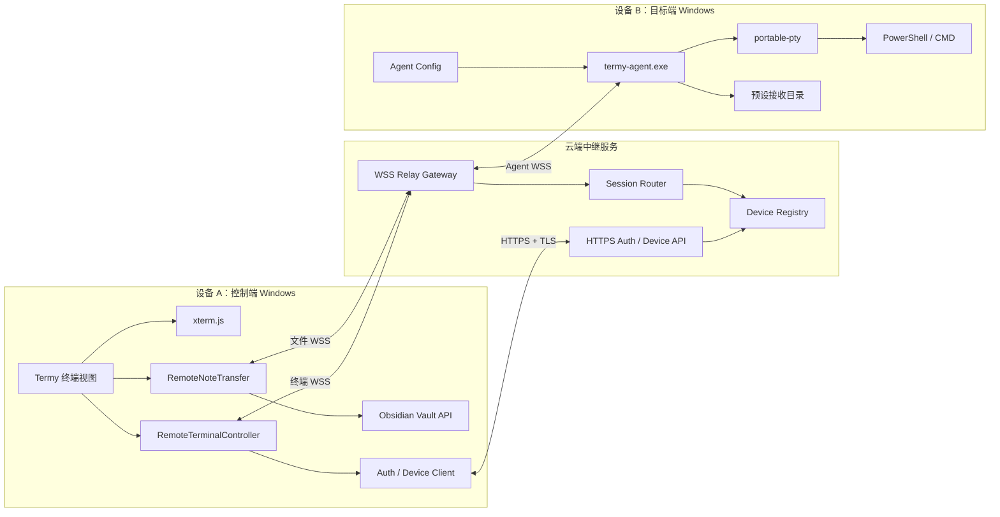
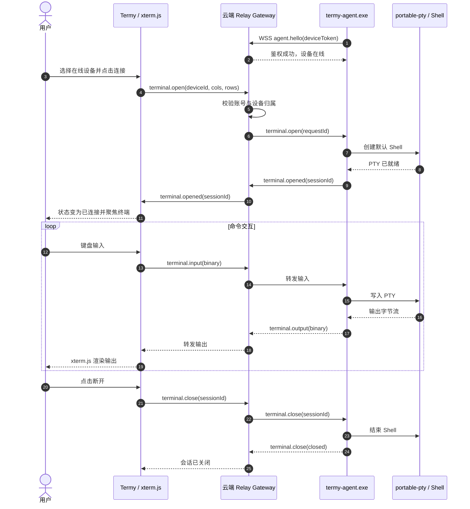
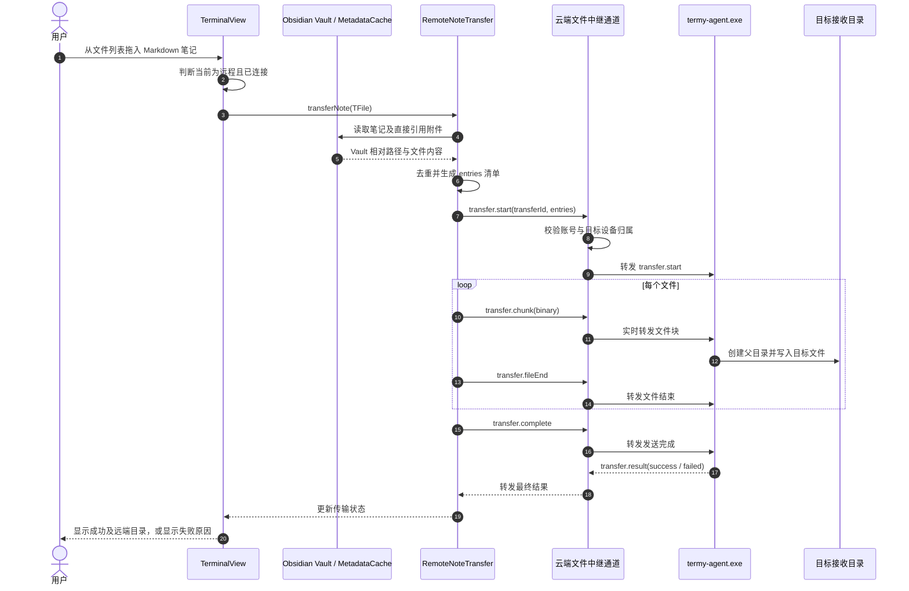
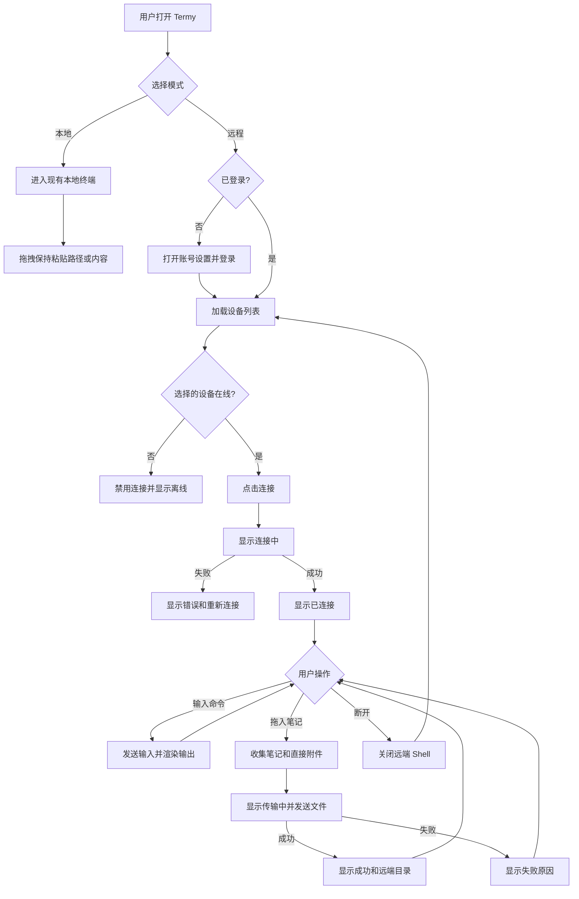
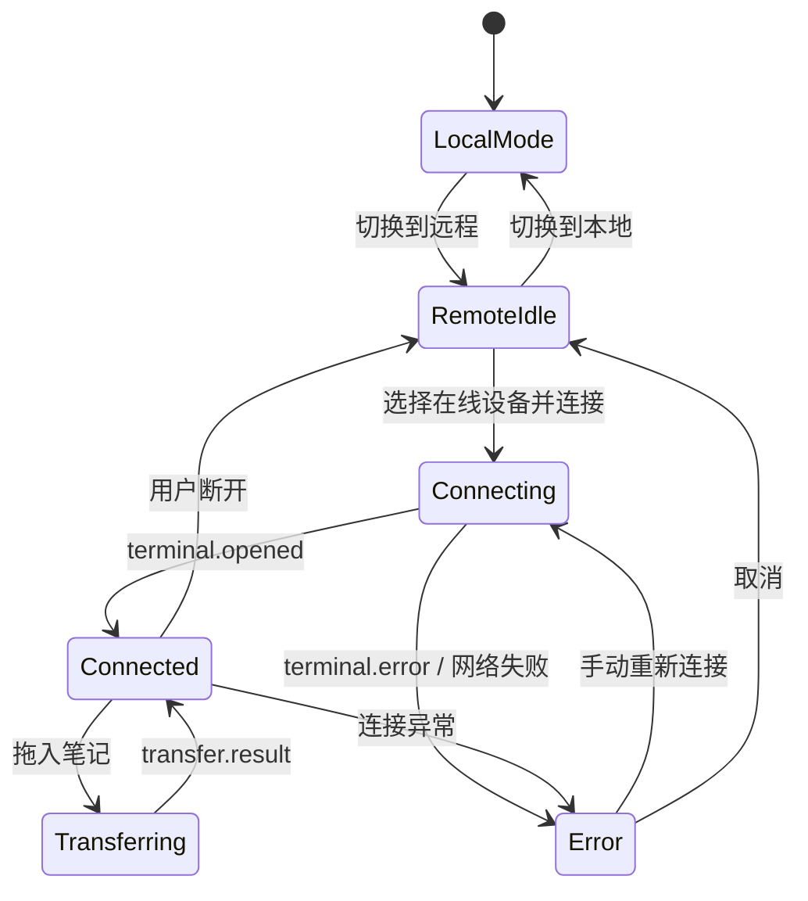

# Termy 远程终端增强功能用户需求采集

  

> [!IMPORTANT]

> 本文件是需求采集与方案形成阶段的合并基线，保留用于追溯，不再作为开发和验收的唯一执行口径。当前维护文档已按受众拆分：

>

> - [Termy 远程终端增强需求文档（用户版）](Termy远程增强-用户版.md)

> - [Termy 远程终端增强需求文档（开发版）](Termy远程增强-开发版.md)

> - [Termy 远程终端增强迭代计划](Termy远程增强-迭代计划.md)

>

> 用户可见行为以用户版为准，工程实现以开发版为准，版本归属以迭代计划版为准。若三者存在冲突，应先完成变更评审并同步修订，不能回退到本合并文档自行选择口径。

>

> **平台变更记录（2026-07-28）**：当前 V1 控制端为 Windows Obsidian Desktop，目标端支持 Windows 或无桌面的 Ubuntu Server。Ubuntu 目标端只运行命令行 Agent，不要求安装 Obsidian。本文件正文中的“仅 Windows”“Ubuntu 控制端”及“三平台后续适配”描述属于拆分前历史口径。

  

## 1. 文档信息

  

| 项目 | 内容 |

| --- | --- |

| 功能名称 | Termy 远程终端与 Obsidian 笔记传输增强 |

| 需求阶段 | 用户需求基线与迭代计划 |

| 采集方法 | 用户故事地图、5W2H、场景穿越 |

| 采集日期 | 2026-07-28 |

| 参考项目 | https://github.com/ZyphrZero/Termy |

  

## 2. 背景与核心价值

  

用户拥有多台电脑，希望直接在设备 A 的 Obsidian Termy 面板中控制设备 B 的终端，不必切换远程桌面或离开当前笔记环境。除实时输入终端命令外，用户还需要把 Obsidian 笔记及其直接引用的本地附件拖入远程终端，使文件落到设备 B，并能被设备 B 上的终端命令读取和处理。

  

产品首期面向同一用户拥有的多台电脑。远程模式是对 Termy 的增量增强，现有本地终端的入口、交互和行为不得受到影响。

  

## 3. 第一步：用户故事地图

  

### 3.1 用户目标

  

1. 在 Obsidian 内随时连接并操作本人另一台电脑上的交互式终端。

2. 将当前笔记及其附件快速带到远端电脑，供远端终端命令读取和处理。

3. 在不改变 Termy 本地终端使用习惯的前提下，在本地与远程终端之间明确切换。

  

### 3.2 用户任务与用户活动

  

| 用户任务 | 用户活动 | 页面反馈/结果 |

| --- | --- | --- |

| 登录账号 | 在增强版插件中登录；加载当前账号名下的设备 | 登录成功后显示设备；失效时要求重新登录 |

| 准备被控设备 | 安装增强版插件和后台常驻程序；登录同一账号；设置默认接收目录 | 设备向服务器登记并显示在线状态 |

| 进入远程模式 | 打开 Termy 面板；从本地/远程模式控件切换到远程 | 面板显示设备下拉框、连接状态和连接操作 |

| 建立终端连接 | 选择在线设备；点击连接；等待远端创建 Shell | 状态依次显示连接中、已连接或连接失败 |

| 操作远程终端 | 输入命令；接收实时输出；使用 Termy 常规复制、粘贴、搜索等终端能力 | 正常网络下命令反馈目标约 1 秒内 |

| 传输笔记 | 从 Obsidian 文件列表拖动一篇笔记到已连接的远程终端 | 插件识别笔记并准备文件，不把本地路径粘贴到远端 Shell |

| 收集附件 | 解析该笔记直接引用的本地附件；计算文件数和总大小；校验跨平台路径 | 校验不通过时不上传并明确列出原因 |

| 上传并落盘 | 经服务器中转文件；目标端先写临时区；完整校验后原子覆盖默认接收目录 | 只向用户反馈整次成功或失败，不展示逐文件进度 |

| 读取远端文件 | 在远程终端中使用命令访问接收目录内的笔记和附件 | 保持 Vault 相对目录结构，原 Markdown 引用可继续使用 |

| 结束连接 | 用户手动断开或关闭远程终端 | 远端 Shell 随连接结束并释放资源 |

  

### 3.3 核心用户故事

  

1. 作为拥有多台电脑的 Obsidian 用户，我希望在 Termy 中选择自己的在线设备并建立远程终端，以便不离开笔记环境就能操作另一台电脑。

2. 作为正在阅读笔记的用户，我希望把文件列表中的笔记拖入远程终端，并自动携带其直接引用附件，以便远端命令能够读取完整资料。

3. 作为同时使用本地和远程终端的用户，我希望两种模式有清晰的状态和不同的拖拽行为，以免误把本地路径发送到远端或破坏现有本地工作流。

  

## 4. 第二步：5W2H

  

### 4.1 What：做什么

  

1. 在现有 Termy 面板增加本地/远程模式切换、远程设备选择和连接状态。

2. 通过云端服务器发现同账号设备并双向转发终端输入、输出。

3. 支持从 Obsidian 文件列表拖拽单篇 Markdown 笔记到远程终端。

4. 自动收集该笔记直接引用的本地附件，经服务器中转到远端预设目录。

5. 在目标端保持 Vault 相对目录结构，使 Markdown 中的附件引用保持有效。

6. 目标端后台程序负责无人值守在线、创建本地 PTY、接收文件和写入目录；目标端打开增强版 Obsidian 插件时也能查看和配置状态。

  

### 4.2 Why：为什么需要

  

1. 减少在 Obsidian、远程桌面和独立终端工具之间切换造成的上下文中断。

2. 让笔记内容及相关资料能直接进入远端命令行工作流，而不是手工同步、查找和修正路径。

3. 延续 Termy 已有的“终端与笔记上下文结合”价值，并将其从本机扩展到用户自己的其他设备。

  

### 4.3 Who：谁使用及权限

  

1. 首期用户为同一账号下、由同一用户拥有的多台设备，不包含多人共享控制。

2. 用户只能发现和连接当前账号名下已登记且在线的设备。

3. 不属于当前账号、已解绑或凭据失效的设备必须拒绝连接，不得暴露终端内容；界面应提供重新登录或重新绑定入口。

4. 目标端 Shell 继承后台程序运行账号的系统权限，首期版本不请求系统提权。

  

### 4.4 When：何时触发

  

1. 用户切换到远程模式并选择在线设备后，手动发起连接。

2. 连接成功时创建一个新的远端 Shell；用户断开时销毁，不做跨连接会话恢复。

3. 用户把笔记从 Obsidian 文件列表拖入已连接的远程终端时触发文件校验与传输。

4. 网络中断时立即进入断线状态并自动重连，最长尝试 30 秒。

  

### 4.5 Where：页面与位置

  

1. 核心入口沿用 Termy 终端面板，不新增独立远程终端主页面。

2. Termy 面板顶部或现有工具栏区域增加本地/远程模式控件、设备下拉框、连接/断开操作和状态标识。

3. 每台设备的默认接收目录在插件设置中配置。

4. 登录、设备绑定和后台程序状态在插件设置中管理。

  

### 4.6 How：交互与实现边界

  

1. 正常流程为：登录账号 -> 选择在线设备 -> 连接 -> 输入命令或拖拽笔记 -> 查看结果 -> 手动断开。

2. 服务器负责用户认证与授权、设备在线与发现、终端流量转发、文件中转。

3. 终端和文件链路必须使用 TLS。服务器可在业务层处理转发内容，但文件在目标端确认完整接收后必须立即删除，不作为云盘长期保存。

4. 文件先进入目标端临时区，完整性校验成功后再原子替换到正式目录，避免出现半份文件集。

5. 同名文件由本次传输自动覆盖，不逐项询问。

6. 用户反馈采用轻量方式：显示连接状态；文件传输只通知整次成功或失败，不提供逐文件进度面板。

  

### 4.7 How much：规模与性能

  

1. 单次传输上限为 20 个文件且总大小不超过 100 MB。

2. 超过任一上限时，在上传前拦截并显示实际文件数、总大小及限制。

3. 正常网络下，终端输入到可见反馈的目标时间约为 1 秒内。

4. 产品目标服务规模先按个人验证设计：同时在线设备不超过 10 台，活跃终端会话不超过 5 个；该指标不阻塞 V1。

5. 暂不要求大型文件分片、断点续传、高可用集群或水平扩展。

  

## 5. 第三步：场景穿越验证

  

本章记录完整目标态场景，用于防止后续迭代遗漏异常处理。V1 只实现第 7.2 节定义的核心路径，自动重连、原子传输和完整边界处理按后续迭代交付。

  

### 5.1 正常终端流程

  

**前置条件**：设备 A、B 均安装增强版；B 的后台程序运行；两端登录同一账号；B 已配置可写接收目录并显示在线。

  

1. 用户在 A 打开 Termy，切换到远程模式。

2. 页面显示账号名下设备及在线状态，用户选择 B。

3. 用户点击连接，页面显示“连接中”。

4. 服务器校验账号和设备归属，通知 B 创建新 Shell，并建立双向流。

5. 页面显示“已连接”，终端获得输入焦点。

6. 用户输入命令，B 执行命令，输出实时返回 A。

7. 用户点击断开，B 销毁 Shell，页面显示“已断开”。

  

**验收结果**：用户无需离开 Obsidian 即可完成远端命令交互；本地终端能力和已有会话不受影响。

  

### 5.2 正常笔记传输流程

  

1. 用户在 A 的 Obsidian 文件列表中，将一篇笔记拖到已连接的远程终端。

2. 插件解析笔记直接引用的本地附件，保留笔记及附件的 Vault 相对路径。

3. 插件校验文件数量、总大小、目标系统文件名合法性和大小写冲突。

4. 文件通过 TLS 上传到服务器，再转发给 B；服务器仅临时持有数据。

5. B 在临时区接收并校验完整性。

6. 全部文件完整后，B 原子覆盖预设接收目录中的同名文件。

7. B 确认接收，服务器删除中转文件，A 显示传输成功。

8. 用户在远程终端通过命令读取笔记和附件。

  

**验收结果**：远端文件内容完整，目录结构和 Markdown 引用有效；远程模式不会把 A 的本地绝对路径粘贴进 B 的终端。

  

### 5.3 网络错误

  

#### 终端会话中断

  

1. 页面立即显示“连接中断，正在重连”，并禁用命令输入。

2. 系统在 30 秒内自动尝试恢复连接，不缓存用户离线期间的输入。

3. 30 秒内恢复时继续当前会话；超时后销毁远端 Shell，页面显示重连失败并允许新建连接。

  

#### 文件传输中断

  

1. 本次传输标记为失败，不自动断点续传。

2. B 清理本次传输的临时文件，正式目录保持原状。

3. 服务器清理中转数据，A 提示用户网络恢复后重新拖拽。

  

### 5.4 权限不足

  

#### 账号或设备权限不足

  

1. 当设备不属于当前账号、已解绑或访问令牌失效时，服务器拒绝连接。

2. 页面不得展示终端历史或设备敏感信息。

3. 页面显示可理解的原因，并提供重新登录或重新绑定入口。

  

#### 文件系统权限不足

  

1. 当预设接收目录不存在或不可写时，不自动切换到其他目录，也不请求系统提权。

2. 本次传输失败并清理临时文件。

3. 页面提示失败原因，并提供进入该设备接收目录设置的入口。

  

### 5.5 极端数据与边界情况

  

| 场景 | 预期处理 |

| --- | --- |

| 超过 20 个文件或 100 MB | 上传前整体拦截，显示实际值和限制，不做部分传输 |

| 源文件名在目标系统不合法 | 上传前整体拦截并列出问题文件，不自动改名 |

| 目标系统存在大小写路径冲突 | 上传前整体拦截并列出冲突路径 |

| 目标端磁盘空间不足 | 整次失败并清理临时文件，保持正式目录旧文件不变；提示所需与可用空间 |

| 远端已有同名文件 | 文件集完整校验后自动覆盖，不弹出逐文件确认 |

| 笔记没有附件 | 仅传输笔记并保留其 Vault 相对路径 |

| 空文件或零字节附件 | 作为合法文件传输，仍参与完整性校验 |

| 设备离线 | 设备显示离线且不可发起连接，文件拖拽不开始上传 |

  

## 6. 前端需求

  

### 6.1 用户看到什么

  

1. 本地/远程分段模式控件，默认行为不得改变现有本地模式。

2. 远程模式下显示设备下拉框、设备在线状态、连接/断开操作。

3. 连接状态至少包括：未连接、连接中、已连接、重连中、已断开、连接失败。

4. 终端区域继续使用 Termy 现有 xterm.js 交互和视觉风格。

5. 拖拽时显示与模式一致的提示：本地模式提示粘贴路径或内容，远程模式提示传输笔记及附件。

  

### 6.2 用户如何操作

  

1. 在模式控件中切换本地或远程。

2. 在设备下拉框选择一台本人账号下的在线设备并连接。

3. 连接后直接在终端区域输入命令。

4. 从 Obsidian 文件列表拖动笔记到终端区域发起传输。

5. 点击断开结束远端 Shell；设置错误时从错误提示进入对应设置。

  

### 6.3 交互反馈

  

1. 连接、重连和失败状态必须可见，不能仅依赖终端日志。

2. 断线期间禁用输入，避免用户误以为命令已发送。

3. 文件传输仅显示处理中状态及最终成功/失败通知。

4. 失败通知应说明主要原因；目录权限错误提供设置入口；超限和路径错误列出关键问题数据。

5. 自动覆盖同名文件不二次确认，但成功结果应明确远端保存位置。

  

### 6.4 页面跳转逻辑

  

1. 本地/远程切换在同一 Termy 面板内完成，不离开当前工作区。

2. 登录失效跳转到插件账号设置。

3. 设备未绑定跳转到设备绑定设置。

4. 接收目录无效跳转到对应设备的目录设置。

5. 其他网络错误留在当前终端面板，提供重试或重新连接操作。

  

### 6.5 数据展示和更新

  

1. 设备列表由服务器在线状态更新，至少区分在线和离线。

2. 当前连接设备和连接状态应持续显示，防止用户误操作其他电脑。

3. 传输结果显示文件数量、总大小、远端根目录及成功/失败状态。

4. 服务器送达后删除中转文件，界面不提供云端历史文件列表。

  

## 7. 迭代计划

  

### 7.1 迭代原则

  

1. 第一版只验证两个核心价值：用户能在 Obsidian 中操作另一台电脑的终端；用户能把笔记和直接引用附件发送到该电脑。

2. 优先完成端到端闭环，再完善弱网、文件事务、跨平台、性能、监控和高级安全能力。

3. 远程命令执行的最低安全底线不能后移：第一版仍必须具备账号鉴权、设备归属校验和 TLS，禁止以公网明文或匿名方式开放终端。

4. 每个迭代必须在上一个版本可独立使用的基础上增量交付，不得破坏 Termy 现有本地终端。

  

### 7.2 V1：核心闭环

  

**版本目标**：在两台 Windows 电脑之间跑通可实际使用的远程终端和笔记传输流程。

  

**范围内**：

  

1. 发送端和目标端均安装增强版 Termy；目标端运行后台 Agent。

2. 两端登录同一账号，服务器展示该账号名下设备的在线或离线状态。

3. Termy 面板提供本地/远程模式切换、设备选择、连接和断开操作。

4. 用户可连接一台在线设备，创建单个远端 Shell，实时发送命令并查看输出。

5. 连接断开时结束远端 Shell；网络错误仅提示失败并允许用户手动重连。

6. 用户可从 Obsidian 文件列表拖入一篇 Markdown 笔记。

7. 插件自动收集该笔记直接引用的本地附件，并将文件单向发送到目标端预设目录。

8. 目标端保留 Vault 相对目录结构；同名文件直接覆盖。

9. 页面显示连接状态以及文件传输成功或失败结果。

10. 账号、设备发现、终端和文件链路通过 TLS 通信，并校验账号与设备归属。

  

**V1 明确不做**：

  

1. macOS、Linux 适配和跨系统文件名兼容处理。

2. 自动重连、会话恢复、离线输入缓存和多终端会话。

3. 临时区接收、完整性校验、原子覆盖、断点续传和自动重试。

4. 文件回传、双向同步、冲突合并和云端文件历史。

5. 递归关联笔记、整个附件目录传输和附件选择清单。

6. 逐文件进度、传输任务中心和复杂错误修复入口。

7. 大规模并发、服务高可用、限流、监控、审计和容量压测。

8. 端到端加密、多人授权、协作控制、系统提权和移动端支持。

  

### 7.3 V1.1：可靠性与文件安全

  

**版本目标**：解决网络波动和文件传输失败可能造成的会话中断、半成品或旧文件损坏问题。

  

1. 终端断线后自动重连 30 秒，重连期间禁用输入，超时后销毁会话。

2. 文件先写入临时区，完成完整性校验后原子覆盖正式目录。

3. 传输失败时清理目标端和服务器临时文件，保持正式目录旧文件不变。

4. 增加文件数量、总大小、磁盘空间、目录权限和非法路径校验。

5. 落实单次不超过 20 个文件、总大小不超过 100 MB 的限制。

6. 增加失败原因展示，以及接收目录设置入口。

  

### 7.4 V1.2：跨平台与体验完善

  

**版本目标**：扩展到 Termy 已支持的桌面系统，并补齐常用操作体验。

  

1. 支持 Windows、macOS、Linux 之间的远程终端连接。

2. 处理路径分隔符、非法字符、保留名称和大小写冲突。

3. 完善设备绑定、解绑、重命名、默认设备和接收目录管理。

4. 优化连接状态、拖拽提示、传输结果和错误恢复交互。

5. 评估并逐项兼容 Termy 现有分屏、工作流和 AI 上下文能力。

  

### 7.5 V2：生产化与高级能力

  

**版本目标**：面向长期稳定使用和更复杂的协作、传输场景。

  

1. 服务限流、可用性监控、故障告警、审计事件和容量压测。

2. 令牌刷新、凭据吊销、风险控制和可选端到端加密。

3. 大文件分片、断点续传、后台传输任务和文件回传。

4. 多会话、多目标设备管理，以及按需求评估多人授权和协作控制。

5. 高可用部署和水平扩展；容量目标根据 V1、V1.1 的真实数据确定。

  

## 8. 与 Termy 现有功能的冲突及约束

  

1. **拖拽语义冲突**：Termy 现有能力会把文本、文件和目录解析为内容或本地路径并粘贴到终端。远程模式必须改为传输笔记和附件；本地模式必须保留原行为。两种模式的拖拽提示和处理链路必须严格隔离。

2. **网络政策冲突**：Termy 当前声明无遥测，并把对外网络访问限制在特定下载和可选更新检查用途。账号登录、设备发现、终端转发和文件中转属于新增外网用途，必须更新 README、隐私说明、设置文案和 Obsidian 社区插件审查材料。

3. **服务命名冲突**：现有 `ServerManager` 管理本机 Rust PTY server。新增云端服务器后，产品文案和代码命名必须明确区分“本地 PTY 后端”“目标端 Agent”“云端中继服务”，避免把三者统称为 server。

4. **本地能力兼容**：现有本地 Shell、多会话、分屏、工作流、复制粘贴、搜索、提示符导航、文件链接等能力不得因远程功能发生行为回归。

5. **平台能力复用**：现有 xterm.js 前端和跨平台 Rust PTY 后端可作为远程终端的显示层与目标端执行层；远程连接不应重复实现终端模拟器或 Shell 解析。

6. **桌面端限制**：Termy 依赖原生 PTY，增强功能仍限 Obsidian Desktop，不承诺移动端。

  

当前没有已知的历史否决方案。后续若补充历史决策文档，应在技术方案冻结前重新执行冲突检查。

  

## 9. 非功能需求

  

本章记录完整的非功能目标。除 V1 所必需的账号鉴权、设备归属校验、TLS 和本地模式兼容外，其余要求按第 7 章计划在 V1.1、V1.2 或 V2 实现，不作为 V1 首发阻塞项。

  

### 9.1 安全与隐私

  

1. 所有公网 API、终端流量和文件流量必须使用 TLS。

2. 服务端必须对每次设备发现、终端连接和文件传输校验账号与设备归属。

3. 访问令牌不得写入终端输出或普通日志。

4. 中转文件在目标端确认完整接收后立即删除；失败或超时也必须清理。

5. 日志不得记录终端命令正文、终端输出正文、笔记正文或附件内容。

6. 本方案暂不要求端到端加密，服务端在业务层可访问被转发内容，因此隐私政策必须明确披露。

  

### 9.2 可靠性

  

1. 文件必须经过完整性校验后才能从临时区进入正式目录。

2. 任一文件失败时整次传输失败，不允许留下部分更新后的正式文件集。

3. 网络中断、进程退出、磁盘不足或权限错误时必须清理本次临时数据。

4. 终端断线期间不得静默丢弃或延迟执行用户输入。

  

### 9.3 兼容性

  

1. 支持 Windows、macOS、Linux 的 Obsidian Desktop。

2. 路径分隔符、非法字符、保留名称、大小写敏感性必须按目标系统校验。

3. 本地模式保持当前 Termy 行为及配置兼容性。

  

## 10. V1 验收标准

  

1. 两台 Windows 电脑登录同一账号后，发送端能看到目标端在线或离线状态；其他账号不能发现或连接该设备。

2. 用户可在 Termy 同一面板内切换本地和远程模式，现有本地终端仍能正常创建和使用。

3. 用户选择在线设备后可创建一个远端 Shell，能够输入命令并持续看到远端输出。

4. 用户可主动断开连接，目标端 Shell 随之结束；异常断线后页面提示失败并允许手动重新连接。

5. 用户从文件列表拖入一篇笔记后，系统传输该笔记及其直接引用的本地附件，不把发送端本地绝对路径粘贴到远端 Shell。

6. 文件保存到目标设备预设目录，并保留 Vault 相对目录结构；远端终端命令能够读取笔记和附件。

7. 远端存在同名文件时可由本次传输覆盖；页面能明确显示整次成功或失败。

8. 账号 API、终端流量和文件流量均使用 TLS，每次连接和传输均校验账号与设备归属。

9. 本地模式与远程模式的拖拽处理相互隔离，本地模式保持 Termy 原有粘贴路径或内容的行为。

  

以下原需求不纳入 V1 验收：1 秒响应指标、30 秒自动重连、原子覆盖、失败临时文件清理、20 个文件/100 MB 限制、三平台组合验证、服务规模与高可用指标。

  

## 11. V1 核心闭环实现方案

  

### 11.1 方案目标与技术决策

  

V1 采用“Obsidian 插件 + 目标端 Agent + 云端中继服务”三段式架构。发送端插件负责 UI、终端显示和笔记收集；目标端 Agent 负责创建 PTY、执行命令和写入文件；云端服务负责账号鉴权、设备在线状态和实时数据路由。

  

关键技术决策如下：

  

1. 复用 Termy 现有 xterm.js、终端视图和本地终端能力，不重新实现终端模拟器。

2. 现有本地 Rust PTY server 保持不变；新增独立的 `termy-agent.exe`，避免改变本地终端生命周期。

3. `termy-agent.exe` 与现有 Rust PTY server 共享 `portable-pty` 相关 Rust 模块，但二者是不同进程和产品角色。

4. Agent 主动通过 WSS 连接云端，不要求用户配置公网 IP、路由器端口映射或入站防火墙规则。

5. 终端控制和文件传输使用两条独立逻辑通道，避免传输附件时阻塞终端输出。

6. V1 仅支持 Windows 到 Windows，远端默认 Shell 使用目标设备在 Termy 中配置的默认 Shell；没有配置时使用 PowerShell。

7. 云端服务只实时转发终端和文件数据，不提供文件列表、历史下载或长期存储。

8. V1 文件直接写入正式目录并覆盖同名文件；临时区、校验和原子替换在 V1.1 实现。

  

### 11.2 整体架构图

  



  

### 11.3 组件职责

  

| 组件 | V1 职责 | 明确不负责 |

| --- | --- | --- |

| `TerminalView` | 渲染本地/远程切换、设备选择、连接状态；把 xterm 输入输出绑定到当前传输层 | 账号鉴权、云端路由、PTY 创建 |

| `RemoteTerminalController` | 获取设备、创建/关闭远程会话、转发输入输出和窗口尺寸、维护连接状态 | 自动重连、会话恢复、多会话 |

| `RemoteNoteTransfer` | 识别拖入的 Markdown、收集直接引用附件、构建清单、发送文件、展示最终结果 | 递归笔记、断点续传、进度中心 |

| `AuthClient` | 登录、保存访问令牌、退出登录 | 完整账号注册和找回流程 |

| `DeviceClient` | 获取同账号设备在线状态 | 多人共享、设备分组 |

| 云端 Auth API | 验证账号，签发访问令牌，验证设备令牌 | 端到端加密密钥托管 |

| Device Registry | 保存设备归属、名称、在线连接 ID 和最后在线时间 | 设备性能监控、历史轨迹 |

| Relay Gateway | 接收控制端和 Agent 的 WSS，鉴权后转发终端消息及文件块 | 解析终端命令、保存终端正文 |

| Session Router | 建立控制端连接与目标 Agent 的临时映射 | 高可用跨节点路由 |

| `termy-agent.exe` | 上线登记、接收会话请求、创建 PTY、转发输入输出、接收并落盘文件 | UI、系统提权、自动升级 |

  

### 11.4 部署拓扑与进程生命周期

  

1. 控制端插件随 Obsidian 启动，用户切换远程模式时才连接云端终端通道。

2. 目标端 Agent 以当前 Windows 用户身份运行，V1 由用户启动或加入“启动应用”列表，不安装系统服务。

3. Agent 启动后读取 `%APPDATA%/TermyAgent/config.json`，使用设备令牌建立长期 WSS 连接并发送心跳。

4. Agent 断开 WSS 后，服务器立即把该设备标记为离线。

5. 用户发起终端连接时 Agent 创建一个 PTY；用户断开、插件关闭或连接异常时 Agent 结束该 PTY。

6. V1 每个 Agent 同时只允许一个远程 PTY，会话占用时新的连接请求返回 `DEVICE_BUSY`。

  

### 11.5 账号与设备绑定

  

V1 复用用户现有服务器账号体系。若现有服务器接口名称不同，可通过适配层映射到以下最小契约，不改变前端业务模型。

  

1. 用户在目标端增强版 Termy 中登录账号。

2. 插件生成随机 `deviceId` 和一次性设备凭据，通过本机回环接口写入 Agent 配置。

3. Agent 使用设备凭据调用云端注册接口，服务端把设备绑定到当前账号。

4. Agent 后续只保存设备令牌，不保存用户密码。

5. 控制端插件使用用户访问令牌获取设备列表和创建远程会话。

  

最小 HTTPS API：

  

| 方法与路径 | 用途 | 关键返回值 |

| --- | --- | --- |

| `POST /v1/auth/login` | 用户登录 | `accessToken`、`expiresAt` |

| `POST /v1/devices/register` | Agent 注册或刷新设备 | `deviceId`、`deviceToken` |

| `GET /v1/devices` | 获取当前账号设备 | `id`、`name`、`online`、`platform` |

| `POST /v1/terminal/sessions` | 请求目标端创建会话 | `requestId`，最终结果经 WSS 返回 |

| `DELETE /v1/terminal/sessions/{id}` | 主动关闭会话 | 关闭结果 |

  

### 11.6 WSS 消息协议

  

所有 JSON 控制消息使用统一信封：

  

```json

{

    "type": "terminal.open",

    "requestId": "uuid",

    "sessionId": "uuid-or-null",

    "deviceId": "target-device-uuid",

    "payload": {}

}

```

  

V1 消息类型：

  

| 消息 | 方向 | 关键字段 | 作用 |

| --- | --- | --- | --- |

| `agent.hello` | Agent -> 云端 | `deviceId`、`deviceToken`、`version` | Agent 鉴权并上线 |

| `agent.heartbeat` | Agent -> 云端 | `deviceId` | 保持在线状态 |

| `terminal.open` | 插件 -> Agent | `requestId`、`cols`、`rows` | 请求创建默认 Shell |

| `terminal.opened` | Agent -> 插件 | `requestId`、`sessionId` | 返回会话创建成功 |

| `terminal.input` | 插件 -> Agent | `sessionId`、`data` | 发送 UTF-8 输入 |

| `terminal.output` | Agent -> 插件 | `sessionId`、`data` | 返回 PTY 原始输出 |

| `terminal.resize` | 插件 -> Agent | `sessionId`、`cols`、`rows` | 同步 xterm 尺寸 |

| `terminal.close` | 双向 | `sessionId`、`reason` | 主动或异常结束会话 |

| `terminal.error` | Agent/云端 -> 插件 | `requestId`、`code`、`message` | 返回设备忙、离线或启动失败 |

| `transfer.start` | 插件 -> Agent | `transferId`、`rootNote`、`entries` | 声明本次文件清单 |

| `transfer.chunk` | 插件 -> Agent | 二进制头、文件序号、偏移、数据 | 分块实时转发文件内容 |

| `transfer.fileEnd` | 插件 -> Agent | `transferId`、`fileIndex` | 结束单个文件 |

| `transfer.complete` | 插件 -> Agent | `transferId` | 声明发送完成 |

| `transfer.result` | Agent -> 插件 | `transferId`、`success`、`message` | 返回整次最终结果 |

  

终端输入输出优先使用 WSS 二进制帧，帧头包含消息类型和 `sessionId`，避免对 PTY 字节流反复 Base64 编解码。JSON 示例用于控制消息和调试，不用于承载大段终端输出或文件正文。

  

### 11.7 远程终端数据流图

  



  

### 11.8 笔记与附件数据流图

  



  

### 11.9 文件清单与落盘规则

  

`transfer.start` 的最小载荷：

  

```json

{

    "transferId": "uuid",

    "targetDeviceId": "uuid",

    "rootNote": "projects/demo/readme.md",

    "entries": [

        {

            "index": 0,

            "relativePath": "projects/demo/readme.md",

            "size": 2048

        },

        {

            "index": 1,

            "relativePath": "assets/diagram.png",

            "size": 16384

        }

    ]

}

```

  

V1 落盘规则：

  

1. 插件只接受单个 `TFile` 且扩展名为 `.md` 的拖拽入口。

2. 直接附件优先通过 Obsidian `MetadataCache` 的已解析链接获得，再通过 Vault API 读取，禁止依赖本机绝对路径拼接。

3. 清单包含根笔记和该笔记直接引用的本地文件，按 Vault 相对路径去重。

4. Agent 使用 `receiveRoot + relativePath` 生成目标路径，必须拒绝绝对路径、盘符、`..` 路径穿越和解析后逃逸出 `receiveRoot` 的路径。

5. Agent 创建缺失的父目录，以覆盖模式写入同名文件。

6. V1 发生中途失败时允许已完成文件保留或已写文件不完整，页面必须明确显示失败；V1.1 再改为临时区和原子替换。

7. 即使 V1 不做完整性校验，云端也不得把文件正文写入日志或业务数据库。

  

### 11.10 交互图

  



  

### 11.11 前端状态机

  

远程终端状态限定为：

  



  

状态对应界面规则：

  

| 状态 | 设备选择 | 终端输入 | 拖拽传输 | 主操作 |

| --- | --- | --- | --- | --- |

| `LocalMode` | 隐藏 | 可用 | 现有本地行为 | 无远程操作 |

| `RemoteIdle` | 可用 | 禁用 | 禁用 | 连接 |

| `Connecting` | 禁用 | 禁用 | 禁用 | 取消 |

| `Connected` | 禁用 | 可用 | 可用 | 断开 |

| `Transferring` | 禁用 | 可用 | 禁止再次拖入 | 断开 |

| `Error` | 可用 | 禁用 | 禁用 | 重新连接 |

  

### 11.12 Termy 代码改造建议

  

为保持本地能力稳定，改造围绕接口隔离进行：

  

1. 在 `src/services/terminal/` 增加 `TerminalTransport` 接口，统一 `open`、`write`、`resize`、`close`、`onData`、`onExit`。

2. 用 `LocalTerminalTransport` 适配现有 `TerminalService` 和本地 Rust PTY，保持现有行为不变。

3. 新增 `RemoteTerminalTransport`，只负责 WSS 消息和远端会话状态，不直接访问本机 Shell。

4. `TerminalView` 根据模式选择传输层，xterm.js 始终只绑定当前 `TerminalTransport`。

5. `TerminalView.handleDrop` 在入口处按模式分流：本地模式进入现有 `buildDroppedInput`；远程模式只接受 Markdown `TFile` 并调用 `RemoteNoteTransfer`。

6. 在 `src/services/remote/` 增加 `authClient.ts`、`deviceClient.ts`、`relayClient.ts`、`remoteTerminalController.ts` 和 `remoteNoteTransfer.ts`。

7. 在 `src/settings/` 增加云端地址、账号状态、设备名称和目标端接收目录；访问令牌使用 Obsidian 提供的持久化能力保存，日志中统一脱敏。

8. 在 `rust-servers/` 工作区新增 Agent 二进制 crate，共享 PTY 封装，但不修改现有 `termy-server` 的本地 WebSocket 协议。

9. 云端中继按现有服务器技术栈实现 `Auth API`、`Device Registry` 和 `Relay Gateway`，插件不依赖云端具体语言或框架。

  

建议的新增目录结构：

  

```text

src/

    services/

        remote/

            authClient.ts

            deviceClient.ts

            relayClient.ts

            remoteTerminalController.ts

            remoteNoteTransfer.ts

            protocol.ts

        terminal/

            terminalTransport.ts

            localTerminalTransport.ts

            remoteTerminalTransport.ts

    ui/

        terminal/

            remoteToolbar.ts

rust-servers/

    termy-agent/

        src/

            main.rs

            relay.rs

            terminal.rs

            transfer.rs

```

  

### 11.13 开发任务拆分

  

按以下顺序实施，每个阶段都应产生可单独验证的结果：

  

#### 阶段 A：协议与 Agent 骨架

  

1. 冻结 HTTPS API、WSS 消息信封、错误码和版本字段。

2. 创建 Agent，完成配置读取、设备鉴权、WSS 上线、心跳和离线状态。

3. 云端实现设备注册、设备列表和单节点内存路由。

  

**退出条件**：设备 B 启动 Agent 后，设备 A 能看到 B 在线；关闭 Agent 后显示离线。

  

#### 阶段 B：远程终端闭环

  

1. Agent 接入 `portable-pty`，实现 `open/input/output/resize/close`。

2. 插件实现 `RemoteTerminalTransport` 和远程状态机。

3. Termy 工具栏增加模式、设备、连接和状态控件。

4. 增加本地/远程传输层分流，验证本地终端无回归。

  

**退出条件**：设备 A 能连接 B 的 PowerShell，连续执行命令、调整窗口尺寸并主动断开。

  

#### 阶段 C：笔记与附件传输

  

1. 插件通过 Vault API 和 MetadataCache 收集根笔记及直接附件。

2. 实现文件清单、二进制分块和独立文件通道。

3. Agent 校验相对路径、创建目录并覆盖写入文件。

4. UI 增加传输中、成功和失败反馈。

  

**退出条件**：拖入含图片附件的笔记后，设备 B 可在预设目录读取笔记和图片，Markdown 引用路径保持有效。

  

#### 阶段 D：V1 收口

  

1. 覆盖账号越权、设备离线、设备忙、Shell 启动失败和目录不可写错误。

2. 更新 README、隐私说明和远程命令执行风险提示。

3. 完成安装包、Agent 启动说明和双机验收测试。

  

**退出条件**：第 10 章全部验收标准通过，且 Termy 本地模式回归测试通过。

  

### 11.14 错误码与用户反馈

  

| 错误码 | 用户提示 | V1 处理 |

| --- | --- | --- |

| `AUTH_EXPIRED` | 登录已失效，请重新登录 | 跳转账号设置 |

| `DEVICE_FORBIDDEN` | 无权访问该设备 | 清除当前设备选择 |

| `DEVICE_OFFLINE` | 设备离线 | 返回设备列表，允许刷新 |

| `DEVICE_BUSY` | 设备已有远程终端会话 | 保持未连接状态 |

| `SHELL_START_FAILED` | 远程终端启动失败 | 显示 Agent 返回的脱敏原因 |

| `RELAY_DISCONNECTED` | 连接已中断，请重新连接 | 关闭当前 UI 会话，允许手动重连 |

| `INVALID_DROP` | 仅支持拖入单篇 Markdown 笔记 | 不发起传输 |

| `INVALID_PATH` | 笔记包含不安全的文件路径 | 整次不发送 |

| `WRITE_FAILED` | 无法写入远端接收目录 | 显示失败，不自动换目录 |

| `TRANSFER_FAILED` | 文件传输失败，部分文件可能已写入 | 允许重新拖拽覆盖 |

  

### 11.15 V1 测试方案

  

| 测试层级 | 核心用例 |

| --- | --- |

| TypeScript 单元测试 | 模式分流、设备状态转换、直接附件收集、Vault 相对路径去重、不安全路径拒绝 |

| Rust 单元测试 | PTY 创建/关闭、路径安全拼接、父目录创建、同名覆盖、单会话限制 |

| 云端服务测试 | 账号隔离、设备归属校验、在线状态、会话路由、断开清理 |

| 协议集成测试 | `terminal.open/input/output/resize/close` 与 `transfer.start/chunk/result` 全链路 |

| 插件回归测试 | 本地终端创建、输入输出、复制粘贴、搜索和本地拖拽行为不变 |

| Windows 双机验收 | 在线发现、PowerShell 交互、主动断开、手动重连、笔记加图片附件传输、同名覆盖 |

| 安全检查 | TLS 生效、其他账号越权失败、路径穿越失败、令牌与正文不进入日志 |

  

### 11.16 V1 完成定义

  

V1 只有同时满足以下条件才视为完成：

  

1. 第 10 章 9 项验收标准全部通过并保留测试记录。

2. 设备 A、B 在非同一局域网条件下通过云端服务完成终端和文件闭环。

3. 其他账号无法发现、连接或传输文件到设备 B。

4. 本地终端和本地拖拽的现有行为无回归。

5. 目标端 Agent 可独立启动并稳定保持在线，退出后设备状态能更新。

6. README 和隐私说明明确披露远程终端、文件中转、服务端可访问转发内容以及 V1 文件失败可能留下部分文件。

  

## 12. 后续待确认事项

  

以下事项不阻塞本实现方案进入原型开发，但必须在对应迭代开始前确认：

  

1. 现有服务器账号接口与第 11.5 节最小契约的字段映射。

2. V1 正式发布时 Agent 采用手动启动、Windows 启动应用还是安装器注册自启动。

3. V1.1 的文件完整性算法、事务清单、临时目录和清理时限。

4. V1.2 对 Termy 分屏、多会话、工作流和 AI 上下文能力的兼容优先级。

5. V2 的服务限流、审计、监控、高可用、令牌吊销和端到端加密方案。

6. Obsidian 社区插件审查对远程命令执行、外网连接和文件中转的具体材料要求。