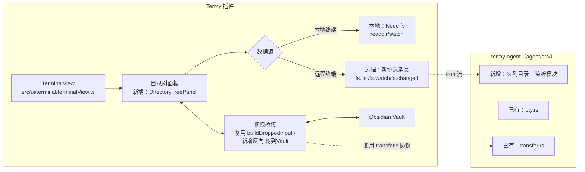

# Termy 终端目录树与双向文件传输 技术方案（草案）

## 1. 文档定位

| 项目 | 内容 |
| --- | --- |
| 输入依据 | [需求文档 - 候选 - 目录树与双向文件传输](../需求/需求文档%20-%20候选%20-%20目录树与双向文件传输.md) |
| 前序技术基线 | [实现方案 - 开发版 v2.0](实现方案%20-%20开发版%20v2.0.md)（远程传输层直接复用其协议与传输结论） |
| 实现目标 | 阶段一：本地终端目录树 + 与 Obsidian 双向拖拽，不依赖任何新协议；阶段二：把同一套前端组件接到 v2.0 远程 Agent 的新增文件系统协议上 |
| 版本归属 | v2.1（与 v2.0 §7.3 并行的独立工作项） |
| 文档日期 | 2026-08-12 |

本文档只覆盖"目录树 + 双向传输"这一新增能力；v2.0 已落地的连接码配对、点对点传输、cwd 跟踪等不重复展开，直接引用 [实现方案 - 开发版 v2.0](实现方案%20-%20开发版%20v2.0.md) 对应章节。

> **实现状态（2026-08-12）**：
> - **阶段一（本地）：已实现。** `src/services/terminal/directoryTreeSource.ts`（本地数据源）、`directoryTreeDrop.ts`（vault↔fs 拷贝）、`directoryTreeVaultNaming.ts`（回传冲突命名）、`src/ui/terminal/directoryTreePanel.ts`（面板）均已落地并接入 `terminalView.ts`/`main.ts`；对应单测通过。
> - **阶段二 A（远程列出/监听）：已实现，但设计上对本文档第 4 节决策 6 做了修正**——实现时发现 `agent/src/p2p.rs` 的 `ControllerGate` 是按*连接*而非按*peer* admit 的（"一个连接协商一个 ALPN，所以 transfer 需要自己的连接"，这也是 `ALPN_TRANSFER` 至今仍是 Phase C 占位的原因之一）：新开一个 `termy/fs/1` ALPN 会与已admit 的终端连接互相冲突（要么绕过 gate 造成漏洞，要么被当成"第二个控制端"直接拒绝）。改为**不新开 ALPN，让 `fsList`/`fsListResult`/`fsChanged` 作为新的帧类型搭载在既有 `termy/terminal/1` 连接的 bi-stream 上**（一条流以 `fsList` 而非 `open` 开头即可区分），`agent/src/serve.rs` 的 `accept_bi` 循环按首帧类型分发。第 5 节的协议表内容不变，仅"独立 ALPN"这一归属方式作废。代码：`agent/src/termstream.rs`（帧扩展）、`agent/src/fs_browse.rs`（列目录 + 轮询式 watch，2 秒间隔）、`agent/src/serve.rs`（`serve_bi_stream`/`serve_fs_stream`）、TS 侧 `terminalStreamFrame.ts`（帧镜像）、`remoteDirectoryTreeSource.ts`（`DirectoryTreeSource` 的远程实现，基于既有 `ByteStream`/`openStream` seam）。均含单测，Rust 侧含真实 loopback QUIC 集成测试。
> - **v2.0 自身的 `ALPN_TRANSFER`（Phase C）：已补齐**——`agent/src/serve.rs` 的 `ALPN_TRANSFER` 分支此前无条件以 `PROTOCOL_ERROR` 关闭连接；已实现的 `TransferSession`（`transfer.rs`）业务逻辑此前完全没有接到任何流分发上。补齐方式延续第 4 节决策 6 同一条推理：`transferManifest`/`transferAccepted`/`transferChunk`/`transferFileEnd`/`transferCredit`/`transferComplete`/`transferResult` 作为新帧类型搭载在既有 `termy/terminal/1` 连接上（一条流以 `transferManifest` 开头），**不使用文档 §8.3 设想的 `iroh-blobs` 内容寻址方案**——`iroh-blobs` 当前不是 agent 的依赖，dev plan 自己的风险登记里"集成本身可在阶段 B 后期预研"这一项也从未真正做过；改为直接给 `TransferSession` 已经写好、测试过的分块+信用窗口协议接上线。代码：`agent/src/termstream.rs`（帧扩展）、`agent/src/serve.rs`（`serve_transfer_stream`，含 doc §7.6 的 `sessionId → lastKnownCwd` 落盘目标解析）、TS 侧 `terminalStreamFrame.ts` + 新增 `transferStreamSender.ts`（复用 V1 `creditWindow.ts` 的纯逻辑）。均含单测，Rust 侧含真实 loopback QUIC 集成测试（含一条"同连接上传输流与终端流共存"的用例）。
> - **阶段二 B（远程"复制到 Vault"）：已实现。** 新增反向的 `transferPullRequest`/`transferPullManifest` 帧（复用 `transferChunk`/`transferFileEnd`/`transferCredit`/`transferResult`，只是方向相反——agent 变成发送方、信用窗口由客户端授予）。代码：`agent/src/fs_browse.rs`（`walk_for_pull`，复用 `transfer::MAX_FILES` 等上限，符号链接不跟随）、`agent/src/serve.rs`（`serve_transfer_pull_stream`，agent 侧自建的信用等待循环）、TS 侧新增 `transferStreamPuller.ts`（累积分块、按 `fileEnd` 核对字节数、按 `CREDIT_STEP` 同款公式续约信用）、`directoryTreeDrop.ts` 新增 `writePulledFilesToVault`。均含单测，Rust 侧含真实 loopback QUIC 集成测试（含一条信用窗口跨多次授予的用例）。
> - **`DeviceConnectionManager` 已具备 `createDirectoryTreeSource`/`createTransferSender`/`createTransferPuller` 三个入口**（`src/services/remote/deviceConnections.ts`），全部复用与 `createTerminalTransport` 相同的 `terminalStreamFactory` 打开新 bi-stream——这是 v2.0 真正的 iroh 连接管理器，非 V1 遗留，均含单测。
> - **但尚未接入 `TerminalView` 的"远程模式"UI**，原因不是"还没写"，而是二者当前根本不是同一套栈：`terminalView.ts` 现有的模式/设备下拉框走的是 `RemoteService`（V1 账号 + Relay 遗留代码，见 `relayClient.ts`），`DeviceConnectionManager`/`TerminalStreamTransport`（真正的 v2.0 iroh 栈）目前完全没有接到任何 UI 或命令面板上（`docs/开发/README.md`"当前状态"表原话："尚未接入任何 UI/命令面板"）。要让"远程终端能打开目录树、能复制文件到 Vault"在应用里真正可点，需要先把 v2.0 自己缺失的设备列表/添加设备 UI 补上——这是一项独立于本需求、体量相当的既有 v2.0 待办。

> **代码现状核实（2026-08-12，依据 `docs/开发/README.md`"当前状态"表与直接阅读源码）**：
> - `protocol/schema/messages/`（JSON schema）、`src/protocol/generated/`、`src/services/remote/relayClient.ts` 是 **V1（账号 + 云端 Relay）遗留代码**，v2.0 的 `agent/` 已不再连接它；不要把这套 JSON 消息族当成 v2.0 的实际协议基准。
> - v2.0 真正的线上协议是**按 ALPN 划分的二进制帧协议**：`agent/src/p2p.rs` 定义 `ALPN_TERMINAL = "termy/terminal/1"`、`ALPN_TRANSFER = "termy/transfer/1"` 两个 ALPN；`termy/terminal/1` 的帧格式由 `agent/src/termstream.rs`（Rust）与 `src/services/remote/terminalStreamFrame.ts`（TS，两端字节级对齐）实现，对应 [实现方案 - 开发版 v2.0 §8.2](实现方案%20-%20开发版%20v2.0.md#82-终端流协议)。**没有任何目录列出/监听相关的 ALPN 或帧类型**——这是本需求相对现有协议的新增面，新增方式应遵循同一套"按 ALPN 划分 + 双端字节对齐的帧编解码模块"惯例，而不是复用 V1 的 JSON schema 生成模式（见第 5 节）。
> - **`termy/transfer/1` 尚未接入**：`agent/src/serve.rs` 对 `ALPN_TRANSFER` 的分支目前直接以 `PROTOCOL_ERROR` 关闭连接（代码注释标注"Phase C"）；接收端落盘逻辑已经写在 `agent/src/transfer.rs`（`MAX_FILES`/`MAX_FILE_BYTES` 等常量已定义），但还没有接到 QUIC 流分发上。本文档阶段二的"反向拖拽复用 transfer 通道"因此存在一个前置依赖：v2.0 自己的 Phase C 必须先完成、`ALPN_TRANSFER` 真正跑通之后，本需求才能在其上叠加反向语义。
> - 插件侧远程 UI 目前是 `terminalView.ts` 里一个最小的模式/设备下拉框 + 连接按钮（`renderRemoteToolbar()`，约 653 行起），不是需求文档 v2.0 §6 描述的"已配对设备列表 + 每设备多终端标签"完整 UI；本需求的目录树入口要挂在这个还在演进中的 remoteToolbar 旁边，UI 位置随其演进可能需要调整。

## 2. 范围

### 2.1 阶段一（本地终端）必须实现

1. `TerminalView` 顶部新增【目录树】入口，展开/收起一个目录树面板。
2. 面板默认折叠根节点以下的子节点，点击展开时才读取该目录内容（懒加载）；打开面板时自动展开到该终端当前工作目录的路径链路。
3. 面板可从悬浮态拖拽停靠到终端区域左侧或右侧，形成分屏；可拖回悬浮/关闭。
4. 双击目录节点：向该终端写入 `cd <path>` 等价操作（本地终端直接调用现有 PTY 写入）。
5. Obsidian 拖入目录树节点：复用现有 `buildDroppedInput` 的路径解析逻辑，但落点从"终端当前目录"改为"用户拖放到的具体树节点路径"。
6. 目录树节点拖到 Obsidian：新增反向能力（当前代码库完全没有），把选中文件/目录写入 vault。
7. 目录结构随本机文件系统变化自动刷新（新建/删除/重命名），基于 Node `fs.watch`，仅在面板打开且节点已展开时监听，关闭或折叠时释放监听器。

### 2.2 阶段二（v2.0 远程终端）必须实现

> **前置依赖**：本阶段的"树 → vault"回传需要 `ALPN_TRANSFER` 已经跑通（v2.0 自身 Phase C），不能在其之前独立完成；"目录列出/监听"部分（新 ALPN）不依赖 Phase C，可以并行开发。

1. 新增一个专用 ALPN（`termy/fs/1`，见 5.1）承载 `list`/`watch`/`unwatch`/`changed` 帧（见第 5 节），仿照 `termy/terminal/1` 的"按 ALPN 划分 + 双端字节对齐帧编解码"模式，不复用 V1 遗留的 JSON schema 生成机制。
2. `termy-agent`（`agent/src/`）新增目录列出与监听模块，权限校验复用 `agent/src/pty.rs`/`transfer.rs`/`paths.rs` 已有的路径安全模式（沿用 [实现方案 - 开发版 v2.0 §10.3](实现方案%20-%20开发版%20v2.0.md#103-路径安全) 的校验规则，不重新发明）。
3. 阶段一的前端目录树组件改为可插拔数据源：本地用 Node `fs`，远程用新 ALPN 帧协议，UI 与交互层不重写。
4. 双向拖拽（vault ↔ 树）复用 `ALPN_TRANSFER` 通道（`agent/src/transfer.rs` 的落盘逻辑、插件侧 `transferSender.ts` 的发送逻辑），新增的是"树 → vault"这个此前完全不存在、且方向与现有实现相反的回传路径——依赖上述前置条件先完成。

### 2.3 明确不实现

- 文件内容级持续双向同步与冲突合并（[需求文档候选 §6.1](../需求/需求文档%20-%20候选%20-%20目录树与双向文件传输.md)）。
- 目录树内直接重命名/删除/新建等文件管理操作（只读浏览 + 拖拽传输，不做文件管理器）。
- 远程目录浏览的路径级权限隔离（沿用 v2.0 现有"持有连接码=完全信任"模型）。
- 通过 `rust-servers/`（本机 PTY server，`ModuleType::Pty` 单一变体）扩展文件系统能力——本地目录树直接用 Node `fs`，不新增 Rust 侧本地模块，避免和 v2.0 已经在关注的"服务命名/职责边界"问题（[需求文档 v2.0 §8.4](../需求/需求文档%20v2.0.md)）再添一个交叉点。

## 3. 总体架构

## 4. 核心技术决策

1. **本地目录树不新增 Rust 侧模块**：`TerminalView` 构造函数已经通过 `window.require('fs'|'path')` 直接持有 Node `fs`（`terminalView.ts:87-88`），本地目录列出/监听直接用 `fs.readdir`（懒加载子节点）+ `fs.watch`（结构级变化）实现，不走 `rust-servers` 的 WebSocket IPC（其 `router.rs` 目前只有 `ModuleType::Pty` 一个变体，为此新增一个 `Fs` 变体属于不必要的复杂度）。这也是"阶段一不依赖任何新协议"能够成立的关键。
2. **入口位置：新命令 + 挂在 remoteToolbar 旁的新增小容器**，不引入 Obsidian `addAction()` 头部图标模式（现有代码库完全没有用这个模式，`split`/`font size` 等能力都是 `main.ts` 里的 `addCommand`，见 `main.ts:1263-1300` 的 `terminal-split-horizontal` 等例子）。目录树入口沿用这个约定：`main.ts` 新增一条 `terminal-toggle-directory-tree` 命令，`terminalView.ts` 的 `onOpen()`（现有三段式：`terminal-search-container` / `terminal-remote-toolbar` / `terminal-container`，约 150 行起）新增第四段 `terminal-directory-tree-container`，默认 `display: none`，命令与面板内按钮共同控制其显隐。
3. **分屏为自绘可拖拽侧栏，不复用 Obsidian 原生窗格拆分**（沿用需求文档候选 §6.3 的决策），实现上是 `terminal-directory-tree-container` 与 `terminal-container` 的父容器切换 `flex-direction`/宽度，配合一个可拖拽分隔条，属于纯前端布局问题，不涉及 Obsidian `WorkspaceLeaf` API。
4. **正向拖拽（vault → 树）复用现有解析链路，只替换落点**：现有 `handleDrop`（`terminalView.ts:516`，实现 `terminalView.ts:585`）→ `buildDroppedInput`（`terminalView.ts:734`）→ `extractDroppedNativePaths` / `dropTextPayload.ts` 的路径解析逻辑保持不变；目录树场景下唯一的差异是"目标路径"不再固定为终端当前 cwd，而是用户在树上拖放到的具体节点路径。这部分应重构为一个接受"目标路径参数"的函数，供"拖到终端本体"（cwd）和"拖到树的某节点"两个调用点共用，而不是复制一份逻辑。
5. **反向拖拽（树 → vault）是全新代码**：当前代码库没有任何"终端/文件系统 → Obsidian"方向的实现（已核实，`grep` 不到相关路径）。本地场景下直接用 Node `fs` 读取内容后经 Obsidian `Vault.createBinary`/`Vault.create` 写入；远程场景复用 `transfer.*` 协议但反转数据流方向（Agent 变成发送方，插件变成接收方——现有 `transfer.start/accepted/fileEnd/complete` 消息族的方向性假设需要检查是否天然支持反向，还是需要新增 `transfer.pull` 语义，留待详细设计时确认，见第 8 节待确认事项）。
6. **远程目录列出/监听走独立的新 ALPN `termy/fs/1`，不复用 `termy/terminal/1` 流**：`list`/`watch` 是请求-响应/订阅语义，与终端流的字节流语义不同，混进 `terminal/1` 流会污染其简单的帧协议（`kind` 前缀仅设计了 `open`/`data`/`resize`/`shellEvent`/`close`/`opened`/`error` 几种，见 `agent/src/termstream.rs`）。沿用 `agent/src/p2p.rs` 里 `ALPN_TERMINAL`/`ALPN_TRANSFER` 的定义方式新增 `ALPN_FS = b"termy/fs/1"`，`agent/src/serve.rs` 的 ALPN 分发（`match alpn { ... }`，约 81-98 行）相应新增一个分支。

## 5. 新增 ALPN 与帧协议（草案）

新增 `termy/fs/1`（`ALPN_FS`），仿照 `termy/terminal/1` 的实现结构而非 V1 的 JSON schema 生成机制：Rust 侧新增 `agent/src/fsstream.rs`（对照 `termstream.rs`），TS 侧新增 `src/services/remote/fsStreamFrame.ts`（对照 `terminalStreamFrame.ts`），两端手写字节级对齐的帧编解码，并在 `protocol/fixtures/` 下补充等价的共享测试向量（沿用 `frameCodec.ts` 头部注释描述的"多份实现对同一组 fixtures"防漂移做法）。

帧类型（`kind` 前缀，草案，接在 `termstream.rs` 已用到的 `0x00`~`0x06` 之后编号，避免混淆）：

| 帧 | 方向 | payload（草案） | 用途 |
| --- | --- | --- | --- |
| `list` | 插件 → Agent | `{ path }` | 请求列出某目录的直接子项（不递归） |
| `listResult` | Agent → 插件 | `{ path, entries: [{ name, isDir, size? }] }` | 返回子项 |
| `listError` | Agent → 插件 | `{ path, code, message }` | 路径校验或读取失败 |
| `watch` | 插件 → Agent | `{ path }` | 订阅某目录的结构变化 |
| `unwatch` | 插件 → Agent | `{ path }` | 取消订阅 |
| `changed` | Agent → 插件 | `{ path, kind: "created"\|"deleted"\|"renamed" }` | 结构变化通知，插件收到后对该路径重新发 `list` |

- 一条 `termy/fs/1` 流对应一个终端会话（流本身已经由 QUIC 连接 + Agent 单会话/单控制端模型隐式绑定到具体会话，不需要像 V1 JSON 消息那样在 payload 里重复携带 `sessionId`，这与 [实现方案 - 开发版 v2.0 §8.1](实现方案%20-%20开发版%20v2.0.md#81-alpn-划分) "连接/流本身已唯一定位，无需重复携带定位字段" 的结论一致）。
- 路径校验规则沿用 [实现方案 - 开发版 v2.0 §10.3](实现方案%20-%20开发版%20v2.0.md#103-路径安全)（拒绝 `..`、符号链接逃逸等），但**不设逃逸检测的根目录限制**——与需求文档候选 §6.5 的决策一致：目录树可浏览范围等于该会话本身可执行命令触达的范围，不额外收窄。
- Agent 侧新增业务模块建议命名 `agent/src/fs_browse.rs`（与现有 `pty.rs`、`transfer.rs` 平级，`fsstream.rs` 只管帧编解码、`fs_browse.rs` 管实际读目录/监听），复用 `paths.rs` 的路径处理工具。
- 错误码新增 `FS_LIST_FAILED`、`FS_PATH_DENIED`，纳入 [实现方案 - 开发版 v2.0 §13](实现方案%20-%20开发版%20v2.0.md#13-错误码) 的错误码表统一维护，不单独另起一张表。

## 6. 前端组件设计（草案）

新增目录建议：`src/ui/terminal/directoryTree/`

| 文件 | 职责 |
| --- | --- |
| `directoryTreePanel.ts` | 面板容器：折叠/展开状态、懒加载调度、当前目录路径链路自动展开、拖拽分屏交互 |
| `directoryTreeDataSource.ts` | 接口 `DirectoryTreeSource { list(path): Promise<Entry[]>; watch(path, onChange): Disposable }`，与 `TerminalTransport`（`src/services/remote/transport.ts`）的"本地/远程二选一"思路保持一致 |
| `localDirectoryTreeSource.ts` | 本地实现：`fs.readdir` + `fs.watch`（阶段一） |
| `remoteDirectoryTreeSource.ts` | 远程实现：基于第 5 节新增 `termy/fs/1` 帧协议（阶段二） |
| `directoryTreeDrop.ts` | 拖拽桥接：正向复用 `buildDroppedInput` 的路径解析部分（见 4.4 的重构点），反向新增"树节点 → Vault"写入逻辑 |

`TerminalView` 只需持有一个 `DirectoryTreePanel` 实例，按当前会话是本地还是远程（`isRemoteSession` 之类的既有判断，与 `LocalTerminalTransport`/`RemoteTerminalTransport` 的二选一逻辑同源）注入对应的 `DirectoryTreeSource` 实现，UI 层不感知数据来源差异——这与需求文档候选 §4.8"两阶段共享同一套前端组件"的决策直接对应。

## 7. 实施顺序

### 阶段一：本地目录树（不依赖新协议）

1. `directoryTreeDataSource.ts` 接口 + `localDirectoryTreeSource.ts` 实现，单测覆盖懒加载与 `fs.watch` 的启停。
2. `directoryTreePanel.ts` UI：折叠/展开、当前目录自动展开、双击 `cd`（本地终端直接写 PTY）。
3. 分屏交互：拖拽停靠、宽度调整、悬浮/关闭切换。
4. 拖拽桥接：重构 `buildDroppedInput` 的落点参数化（4.4），接入正向拖拽；实现反向"树 → Vault"写入（新代码，4.5）。

**退出条件**：本地终端可打开目录树、双击切换目录、双向拖拽均可用；本机执行 `mkdir`/`rm` 后已展开节点能自动刷新。

### 阶段二 A：目录列出与监听（不依赖 `ALPN_TRANSFER`，可与 v2.0 Phase C 并行）

1. `agent/src/p2p.rs` 新增 `ALPN_FS`；`agent/src/fsstream.rs` 帧编解码（对照 `termstream.rs`）；`agent/src/fs_browse.rs` 实现 `list`/`watch`/`unwatch` 处理与 `changed` 推送，复用 `paths.rs`。
2. `agent/src/serve.rs` 的 ALPN 分发新增 `ALPN_FS` 分支。
3. `src/services/remote/fsStreamFrame.ts`（对照 `terminalStreamFrame.ts`）+ `remoteDirectoryTreeSource.ts`：基于新帧协议实现与 `localDirectoryTreeSource.ts` 相同的 `DirectoryTreeSource` 接口。

**退出条件**：远程终端可打开目录树、懒加载子目录、双击触发 `cd` 并等待 shell 集成上报确认；远端执行 `mkdir`/`rm` 后已展开节点能收到 `changed` 通知并刷新；断线时目录树标注"未同步"而非报错或显示陈旧数据。

### 阶段二 B：反向拖拽（树 → vault）——依赖 v2.0 自身 `ALPN_TRANSFER` 先跑通

1. 确认 v2.0 Phase C（`agent/src/serve.rs` 的 `ALPN_TRANSFER` 分支已从"Phase C 占位"改为真正处理连接）已完成。
2. 在此基础上实现反向语义（需先解决第 8 节"是否需要新增 `transfer.pull` 帧类型"）。
3. 接入阶段一已实现的"树 → vault"写入逻辑（`directoryTreeDrop.ts`），仅替换数据来源为远程。

**退出条件**：远程终端下，目录树中的文件/目录可拖到 Obsidian 并按需求文档候选 §6.4 的规则落盘（同名冲突不静默覆盖）。

## 8. 待详细设计确认事项

1. **反向传输的协议语义**：`agent/src/transfer.rs` 目前的落盘逻辑（`MAX_FILES`/`MAX_FILE_BYTES` 等）是围绕"Agent 接收、插件发送"这一固定方向写的（doc 8.4/10.3/10.4 场景是笔记发到设备）；反向（Agent 是内容持有方、插件是接收方）大概率需要新的帧类型而不是直接复用现有消息族并反转调用顺序，具体方案要等 v2.0 Phase C 把 `ALPN_TRANSFER` 实际跑通、行为坐实之后再设计，本文档不预设结论（对应 7 阶段二 B 的前置依赖）。
2. **`watch` 的资源上限**：一个终端会话可以同时对多少个目录保持监听（对应用户展开多层目录树的场景），Agent 侧和插件侧是否都需要上限与超限提示，留待压测后给出具体数字。
3. **`termy/fs/1` 与 iroh 单连接多流的吞吐关系**：一个会话同时开终端流、传输流、多个 fs 监听流时是否有可感知的相互影响，需要在阶段二 A 联调时实测，目前按"QUIC 多路复用互不阻塞"的既有假设（[实现方案 - 开发版 v2.0 §4 决策 4](实现方案%20-%20开发版%20v2.0.md#4-核心技术决策)）处理，出现问题再调整。

## 9. 测试矩阵（草案）

| 层级 | 必测内容 |
| --- | --- |
| 本地目录树单测 | 懒加载正确性、`fs.watch` 启停不泄漏句柄、路径解析边界（含符号链接） |
| 拖拽桥接单测 | 正向落点参数化后原有"落到 cwd"行为无回归；反向写入 vault 的路径映射与同名冲突提示 |
| Agent `fs_browse` 单测 | 路径校验、`changed` 推送时机、监听句柄随流关闭而释放 |
| 远程集成测试 | `list`/`watch`/`unwatch`/`changed` 帧全链路、断线时目录树状态标注 |
| 回归 | 本地终端拖拽落到 cwd 的既有行为、v2.0 笔记传输（`transfer.*`）既有行为均无回归 |
