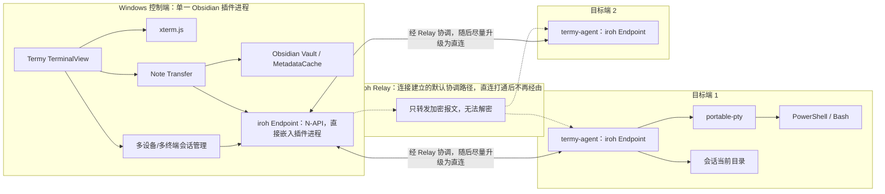
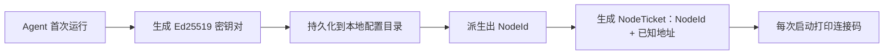
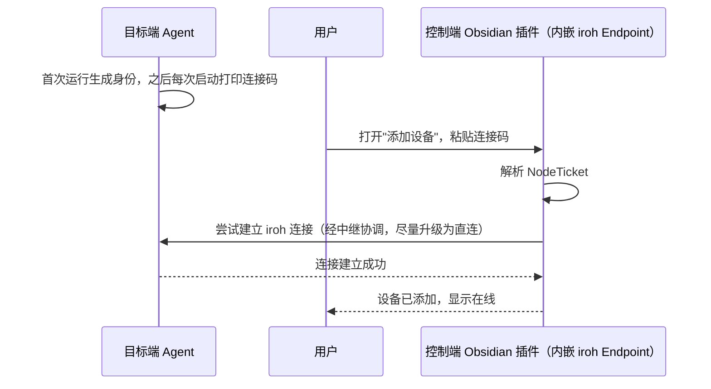
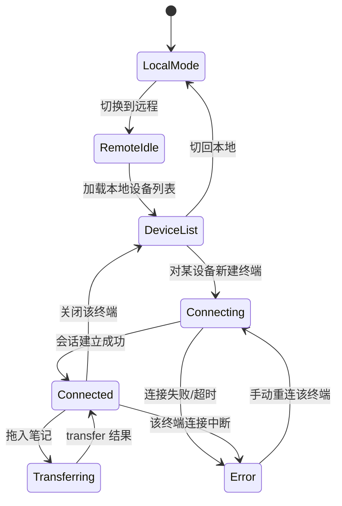
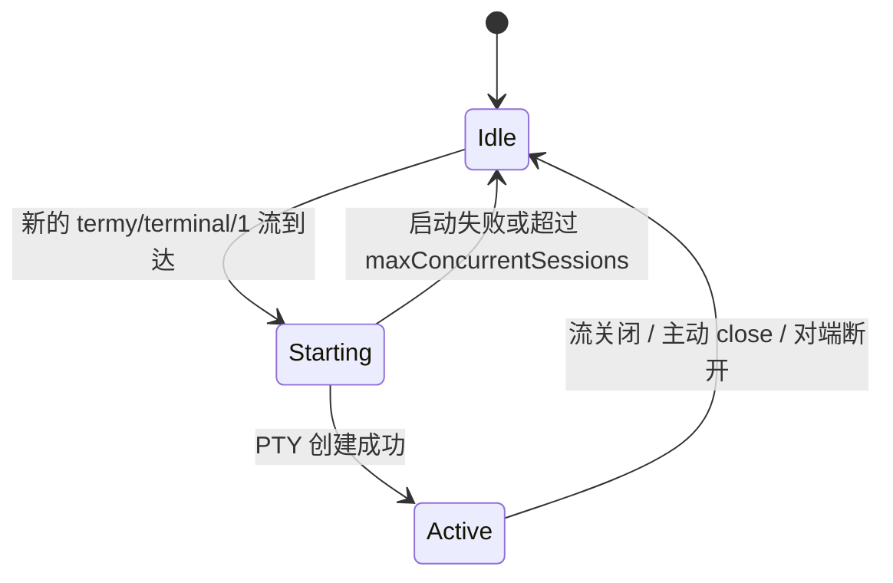
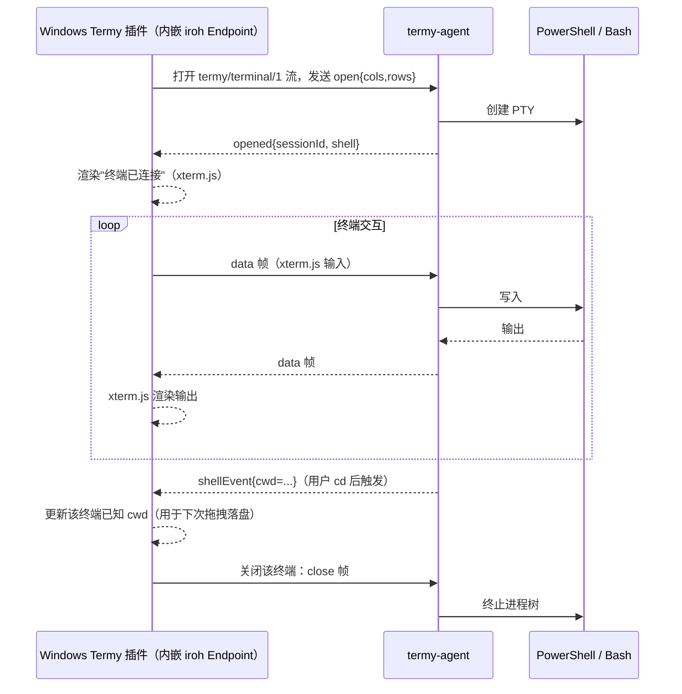
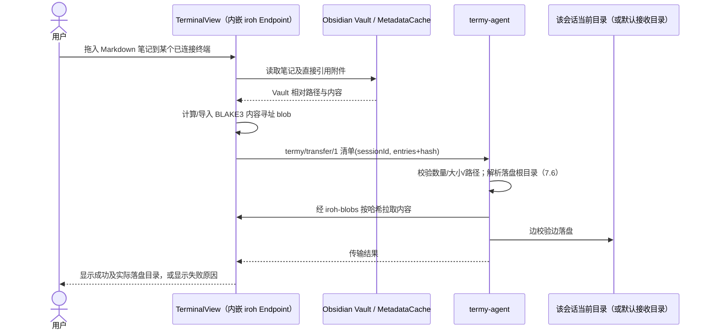

# Termy 远程终端增强 v2.0 技术方案

## 1. 文档定位

| 项目 | 内容 |
| --- | --- |
| 输入依据 | [需求文档 v2.0](../需求/需求文档 v2.0.md)、[需求文档 - 用户版 v2.0](../需求/需求文档 - 用户版 v2.0.md) |
| 前序技术基线 | [实现方案 - 开发版（V1/MVP）](实现方案 - 开发版.md) |
| 实现目标 | 在 V1/MVP 已验证的本地终端复用、Vault 附件收集等基础上，替换账号与云端中继架构，落地免账号连接码配对、点对点优先传输、多设备多终端并发、拖拽落到当前目录 |
| 控制端 | Windows + Obsidian Desktop + 增强版 Termy |
| 目标端 | Windows Agent 或无桌面 Ubuntu Server Agent |
| 文档日期 | 2026-07-30 |

本文档是 v2.0 的技术实现口径。凡本文档未覆盖、且未被 v2.0 明确废弃的内容（如本地终端行为、Vault 附件收集的基本规则、Windows/Ubuntu 双端支持范围），沿用 V1 开发版的既有结论，不重复展开。

> **关于新增依赖的核实状态**：本文档引入的 `iroh` / `iroh-blobs` 相关结论基于 2026-07-30 的公开文档核实（网络搜索 + npm 官方注册表发布记录），用于确认方向性可行（QUIC 端到端加密、Relay 不可解密、支持多路复用流）。官方 JS/TS 绑定 `@number0/iroh` 曾在 2025-06 至 2026-06 期间暂停发布，已于 2026-06-15 恢复并发布 1.0.0 正式版（2026-07-16 发布 1.1.0），maintainers 为 n0-computer 核心团队成员。据此本文档将"插件直接集成官方 iroh JS 绑定"作为 v2.0 的默认架构（见第 6.2 节），不再默认引入独立的 `termy-bridge` 进程；该绑定基于 N-API 且已提供 Windows 预编译产物，Electron 兼容性风险较低，但仍需在阶段 A0（见第 14 节）实测确认后才能定案，未通过则退回 `termy-bridge` 兜底方案。**具体版本号、API 细节和 MSRV 必须在阶段 A0/A 开工时重新对照 npm / crates.io / docs.rs 实测锁定**，本文档中出现的版本号仅作为起点参考，不作为最终锁定依据；这与 V1 文档 1.1 节"精确锁定依赖"的要求一致。

## 2. v2.0 范围

### 2.1 必须实现

1. 目标端 Agent 首次运行生成本机设备身份（Ed25519 密钥对），并在每次启动时打印可复制的连接码（iroh NodeTicket）。
2. 控制端插件粘贴连接码即可添加设备，全程不经过任何账号注册、登录或云端设备绑定接口。
3. 控制端与目标端基于 iroh 建立 QUIC 连接：优先点对点直连（含 NAT 打洞），失败时经中继转发；无论哪条路径，数据都是端到端加密，中继不具备解密能力。
4. 控制端可同时对多台已配对且在线的设备建立连接，不设控制端并发设备数上限；对同一台设备可创建多个并发终端会话，各自独立的输入、输出、resize、关闭。同一台目标设备同一时刻只接受一个控制端的连接，第二个控制端的连接请求会被拒绝（见 7.7）。
5. 目标端 Agent 持续跟踪每个终端会话最近一次通过 shell 集成上报的当前工作目录（cwd）。
6. 从 Obsidian 文件列表拖入一篇 Markdown 笔记到某个已连接终端时，收集其直接引用的本地附件，将文件集发送到该终端最近已知的 cwd；若该终端尚无已知 cwd，回退到该设备配置的默认接收目录。
7. 文件传输采用内容寻址 + 分块校验（iroh-blobs / BLAKE3 verified streaming），接收端边接收边校验完整性。
8. 目标端设备身份可被用户主动"重新生成”，执行后旧连接码立即失效，不可再用于建立新连接。
9. 控制端插件本地维护"已配对设备"列表（名称、NodeTicket 摘要、最近连接状态），不依赖任何云端账号数据。
10. 本地终端和本地拖拽行为不变；每设备并发终端数有可配置软上限（`maxConcurrentSessions`），控制端可同时连接的设备数不设上限。
11. Ubuntu Agent 退出 SSH 后继续运行，Agent 与 Shell 不使用 root（沿用 V1 7.4 的实现，无变化）。

### 2.2 明确不实现

- 账号体系、云端用户数据库、云端设备归属校验（v2.0 默认路径不再需要）；
- 多人共享、协作控制、系统提权；
- 连接码的细粒度权限（只读终端、只允许传输等，列入 v2.1+ 待确认）；
- 终端断线自动重连（按终端粒度手动重连）；
- 文件传输失败后的临时区、原子替换、自动重试与断点续传（校验粒度已细化到分块，但落盘覆盖策略与 V1 一致，仍可能留下部分文件）；
- 多篇笔记、目录传输、递归关联笔记；
- Windows 控制端以外的控制端、Windows/Ubuntu Server 以外的目标端（沿用 V1 范围）；
- 自建中继的正式运维方案（默认使用 iroh 官方托管中继，自建列入待确认）；
- 高可用、大规模并发压测、完整审计。

## 3. 总体架构



### 3.1 进程边界

| 进程 | 职责 | 与 V1 的关系 |
| --- | --- | --- |
| Obsidian 插件（TypeScript） | UI、xterm.js 绑定、多设备/多终端状态管理、笔记收集，**直接持有 iroh Endpoint**（`@number0/iroh`，N-API） | 沿用 V1 UI 层；替代 V1 中"插件直接持有 WSS 客户端连云端"的角色，网络层从 WSS 改为 iroh，仍在插件进程内，不新增进程 |
| `termy-agent`（Rust，Windows/Ubuntu） | 内嵌 iroh Endpoint，管理多会话 PTY 生命周期、跟踪各会话 cwd、接收文件并落盘 | 沿用 V1 Agent 定位，网络层从"WSS 连云端"改为"iroh 直连/受中继" |
| 云端账号/Relay/API（V1） | 已废弃 | 见第 18 节迁移说明 |

v2.0 默认不引入独立的本地伴生进程：官方 iroh JS/TS 绑定 `@number0/iroh` 已于 2026-06 恢复维护并发布 1.0/1.1 正式版（见文首核实说明），插件可直接依赖它管理 iroh Endpoint。该结论依赖阶段 A0（见第 14 节）在 Electron 环境下的实测验证；若验证失败，退回第 6.2 节描述的 `termy-bridge` 独立进程方案作为兜底。

## 4. 核心技术决策

1. 用 iroh 提供的 QUIC 端点（`Endpoint`）替代 V1 的"账号 + 云端 Relay/API”：控制端与每台目标设备之间建立独立的 iroh 连接，不存在需要我们自行维护的"设备归属数据库”。
2. 连接码 = iroh 的节点票据（`NodeTicket`），编码了目标设备的 `NodeId` 及已知的直连/中继地址；控制端解析票据后直接对该 `NodeId` 发起连接，不需要任何服务端参与配对握手的业务逻辑（服务端如果被用到，只是 iroh 中继，纯网络层转发）。
3. 目标端设备身份 = 一枚持久化的 Ed25519 密钥对；`NodeId` 由公钥派生。"重新生成身份"即重新生成该密钥对，旧 `NodeId` 随之失效，等价于旧连接码永久失效，不需要服务端参与撤销。
4. 单个 iroh 连接原生支持任意数量的并发 QUIC 流且互不产生队头阻塞；据此设计：**一条到某设备的连接可以承载该设备下的全部并发终端会话**，新建终端 = 在既有连接上开一条新流，天然满足"单设备多终端”；控制端持有多条到不同 `NodeId` 的连接，天然满足"多设备并发”。Agent 侧限制同一时刻只接受一个控制端的连接（见 7.7）：新的控制端连接到达时，若已存在活跃控制端连接，Agent 拒绝新连接并返回 `CONTROLLER_ALREADY_CONNECTED`，不做多控制端并发接入。
5. 协议按 ALPN 区分用途（`termy/terminal/1`、`termy/transfer/1`），复用 iroh 的按 ALPN 路由分发能力，不再需要 V1 中"信封 + `requestId`/`sessionId` 路由表"的复杂路由层。
6. 文件与附件传输复用 `iroh-blobs`：内容寻址、BLAKE3 树状增量校验、边传边验；比 V1 自研的"分块 + 应用层信用窗口"协议更简单，且天然获得 V1.1 才计划实现的完整性校验能力。
7. Agent 侧解除 V1"每 Agent 同时只允许一个远程 PTY"的限制，改为维护会话表，每会话独立生命周期，受软上限约束（见 7.5）。
8. Agent 复用其已经具备的 shell 集成能力（`osc_scanner.rs` 产出的 `cwd` 信息，V1 §7.1）作为"当前目录"的数据来源，不新增探测机制；只是新增"把该值用于文件落盘目标解析"这一使用场景。
9. v2.0 默认使用 iroh 官方托管中继，作为连接建立过程默认的协调路径（而非仅在打洞失败时才使用，见第 11 节）；直连打通后中继不再承载数据。是否自建中继列入待确认事项（见[需求文档 v2.0](../需求/需求文档 v2.0.md)第 12 节）。
10. 连接始终端到端加密（QUIC/TLS 1.3 内建），无论走直连还是中继；不新增独立的应用层加密，避免重复实现。
11. 重连依赖 iroh 的全局节点发现（DNS/Pkarr）：即使连接码内嵌的直连地址过期（如目标设备更换网络），只要 Agent 保持在线并持续向发现网络重新发布记录，控制端仍可能通过 `NodeId` 重新找到并连接目标设备。这是一个主动选择：换取"连接码长期有效"的可用性，代价是每次重连时，iroh 官方的发现基础设施能够观察到"谁在查询哪个 NodeId"这一元数据（不涉及内容）；该取舍需要在产品披露文案中说明（见第 12 节）。

## 5. 身份、连接码与配对

### 5.1 设备身份与连接码



- 密钥对文件权限与 V1 的设备令牌要求一致（Ubuntu 不宽于 `0600`，Windows 仅当前用户可读写），不得通过命令行参数传入或写入普通日志。
- 连接码本质是 `NodeTicket` 的字符串编码，包含 `NodeId` 与该 Agent 已知的网络地址信息（直连地址与中继地址），供控制端离线解析后直接发起连接；具体编码格式随 iroh 版本而定，不由本项目自定义。
- 连接码在设备身份不变的前提下保持稳定有效，不设过期时间；这是继承 V1"配对码没有过期时间，靠一次性消费/撤销控制风险"的思路，但把"消费"换成了"持有即可连接"的能力凭证模型（不再有一次性消费语义，因为不再有服务端参与配对握手）。

### 5.2 配对与连接流程



- 连接过程不涉及任何服务端参与的"注册/绑定"业务调用；控制端与 `Agent` 直接互相验证 QUIC/TLS 层身份（对端 `NodeId` 是否与票据一致），无需额外应用层鉴权握手。
- 插件本地设备列表条目：`{ name, ticket, nodeId, lastConnectedAt, lastKnownOnline }`，其中 `ticket` 是完整的 `NodeTicket` 字符串（用于重连时的地址提示，配合第 4 节决策 11 的发现网络兜底）——重连必须能拿到可拨号的 `NodeId`/地址信息，仅存不可逆的摘要无法满足这一点。该文件与身份密钥文件同等敏感，权限要求见第 12 节，不落库到任何服务端。

### 5.3 身份撤销（rotate）

- 目标端执行 `termy-agent rotate-identity` 生成新密钥对，旧 `NodeId` 立即不再被本进程响应；控制端此前保存的旧票据将无法再连接到该设备。
- Agent 侧应在 `rotate-identity` 成功后终止所有当前活跃会话（防止"新旧身份并存"的窗口期内旧连接码仍可操作现有会话）。
- rotate 后用户需要在目标端重新展示连接码，并在每个需要保留访问权限的控制端重新执行"添加设备”。

## 6. 控制端实现

### 6.1 技术栈与代码边界

| 类别 | 选型 | 说明 |
| --- | --- | --- |
| 插件语言/构建 | TypeScript、esbuild、pnpm（沿用 V1 版本基线，开工前重新核对） | 不引入新前端框架 |
| 宿主 API | Obsidian API（沿用 V1 版本基线） | Vault、MetadataCache、TFile、设置、视图 |
| 终端 UI | `@xterm/xterm` 及其 addon（沿用 V1） | 复用现有终端显示、输入、搜索、resize |
| 网络层 | `@number0/iroh`（N-API，见 6.2） | 新增依赖，直接嵌入插件进程；替代 V1 的 `ws` 连云端 WSS 客户端，不再需要本机进程间通信 |

插件侧原有的 `src/services/remote/authClient.ts`、`deviceClient.ts`、`relayClient.ts` 在 v2.0 中废弃：不再需要账号登录与云端设备查询；替换为新的 `irohClient.ts`（或等价模块），直接封装 `@number0/iroh` 的 Endpoint 创建、连接、流读写。

### 6.2 iroh 集成方式：直接嵌入插件进程（默认），`termy-bridge` 作为兜底

**默认方案**：插件直接依赖官方 `@number0/iroh`（N-API 绑定，随 iroh 1.0 一起于 2026-06-15 恢复为正式发布，2026-07-16 发布 1.1.0，maintainers 为 n0-computer 核心团队成员）。N-API 绑定的 ABI 稳定性目标本身就包含"跨 Node 版本、通常也跨 Electron 免重新编译"，且该包已提供 Windows（`win32-x64-msvc`/`win32-arm64-msvc`）等平台的预编译产物，理论上可以在 Obsidian 桌面端（Electron）的插件进程里直接加载，不需要额外的本机伴生进程、不需要本机回环通道、也不需要该通道的身份校验。

插件进程职责因此扩展为：

1. 持有一个 iroh `Endpoint`，代表控制端在 iroh 网络中的身份（持久化，避免每次启动 Obsidian 都被目标端当作新客户端）。
2. 管理"已配对设备"列表的本地持久化（JSON 文件，权限限制为仅当前用户可读写，内容为完整 `NodeTicket`，见 5.2）。
3. 把"添加设备”“新建终端”“终端输入输出”“发起传输”等 UI 操作，直接转换为对相应 `Agent NodeId` 的 iroh 流操作，无需经过任何进程间通信。

**验证门槛（阶段 A0，见第 14 节）**：上述方案的前提——N-API 原生模块能在 Obsidian 的 Electron 运行时里正常加载并稳定工作——此前未经实测，必须在阶段 A0 用一个最小可行示例验证（加载模块、创建 Endpoint、完成一次真实的点对点连接）。

**兜底方案**：若阶段 A0 验证失败（例如 Electron 的 Node ABI 与预编译产物不兼容、或运行时崩溃），退回引入独立本地伴生进程 `termy-bridge`（Rust，原生依赖 `iroh`/`iroh-blobs`，复用 Termy 现有 `ServerManager` 管理本地 PTY server（`termy-server`）的成熟模式），职责与上面三条一致，额外需要：向插件暴露一个本机回环控制通道（建议沿用 `ws`，监听 `127.0.0.1` 随机端口，端口和一次性握手令牌通过插件启动进程时的标准输入/命令行参数传递，与现有本地 PTY server 的自保护方式一致），并对该通道做最小身份校验。选择兜底方案时，第 3/3.1/6.3/6.4/6.5/9/10 节涉及"直接嵌入"的表述相应替换为"经 `termy-bridge` 转发"，协议、错误码、安全底线内容不变。

### 6.3 传输层与多终端会话模型

延续 V1 的 `TerminalTransport` 接口隔离思路（`open/write/resize/close/onData/onExit/onError/onShellEvent`），但语义从"一个 Transport 绑定一个远程会话"扩展为"插件持有一个 Transport 实例池，按 `(deviceId, sessionId)` 索引”：

```ts
interface RemoteSessionHandle {
    deviceId: string;   // 对应目标设备 NodeId 摘要
    sessionId: string;  // 插件本地分配的会话标识（iroh 流建立后生成）
    transport: TerminalTransport;
}
```

- `TerminalView` 需要从"当前唯一远程 Transport"改造为"当前激活的会话 + 会话列表”，与 Termy 现有本地多会话/分屏能力共用同一套多标签基础设施。
- 每个 `RemoteSessionHandle` 独立维护自己的连接状态，不再有 V1 中"整条控制连接"的单一状态。

### 6.4 UI 状态



状态按 `(deviceId, sessionId)` 独立维护；一台设备的一个终端进入 `Error` 不影响同设备其他终端或其他设备。

### 6.5 拖拽分流（落到当前目录）

```text
本地模式             -> 现有 buildDroppedInput
远程且目标终端已连接 -> 校验单个 Markdown TFile -> 收集附件 -> 预检清单 -> 发往该 (deviceId, sessionId) 对应的传输通道
其他远程状态         -> 拒绝并显示原因
```

与 V1 的关键差异：`transfer.start`（或等价的传输发起消息）新增/强调 `sessionId` 字段，用于告知 Agent"这次传输要落到哪个会话当前已知的 cwd”，而不是像 V1 那样只携带 `targetDeviceId` 落到设备级别的固定目录。

## 7. Agent 实现

### 7.1 技术栈与代码边界

| 类别 | 选型 | 与 V1 的差异 |
| --- | --- | --- |
| 语言/异步 | Rust、Tokio（沿用） | 无变化 |
| 网络 | `iroh`、`iroh-blobs`（新增） | 替换 V1 的 `tokio-tungstenite` + `rustls` + `webpki-roots`（连云端 WSS 的部分）；PTY 相关的 `portable-pty` 不变 |
| PTY | `portable-pty`（沿用） | 无变化，V1 §7.5 的进程树终止手段（Windows Job Object / Ubuntu 进程组信号）继续适用，且现在要按会话表批量管理 |
| CLI | `clap`（沿用，命令集调整） | 新增 `bind`（粘贴/展示连接码的另一种表达，视 UX 决定保留哪个命名）、`rotate-identity`；移除 `bind --code`（不再消费服务端配对码，改为本地生成身份并打印票据） |
| 数据 | `serde`/`serde_json`（沿用） | Schema 覆盖面显著收窄，见第 8 节 |

明确可以原样复用的模块（沿用 V1 §7.1 表述，未受本次改动影响）：`src/pty/osc_scanner.rs`、`src/pty/shell.rs` 的探测逻辑、`src/pty/session.rs`/`src/pty/mod.rs` 的读写循环参考。

### 7.2 CLI

```text
termy-agent run
termy-agent status
termy-agent rotate-identity
termy-agent config set-receive-root <absolute-path>
termy-agent config set-shell <program> [args...]
termy-agent config set-max-sessions <n>
```

- `run` 启动后立即（若为首次运行则先生成身份，再）打印连接码；后续每次 `run` 也重新打印一次，方便用户随时获取。
- `status` 打印：当前 `NodeId` 摘要、当前连接码、活跃会话数、各会话的对端摘要与已知 cwd。
- `rotate-identity` 执行确认提示（存在活跃会话时需要用户二次确认，因为会一并终止它们）。

### 7.3 配置与状态文件

配置新增/变更字段（其余沿用 V1 §7.3）：

```json
{
    "identityKeyPath": "~/.config/termy-agent/identity.key",
    "receiveRoot": "/home/user/TermyReceive",
    "maxConcurrentSessions": 8,
    "shell": { "program": "/bin/bash", "args": [] }
}
```

- 移除 `deviceId`/`deviceToken`/`relayUrl`（V1 云端专用字段）。
- `maxConcurrentSessions` 即 7.5 节的软上限，超出时新建请求返回 `SESSION_LIMIT_REACHED`。
- 状态文件新增每会话的 `sessionId`、`peerNodeId摘要`、`lastKnownCwd`，替代 V1 状态文件里"单一 `sessionActive` 布尔值"的表达。

### 7.4 Ubuntu 后台运行

沿用 V1 §7.4：用户级 `systemd` + lingering，Agent 与 Shell 全程非 root，安装时一次性 sudo 执行 `enable-linger`。本节无实质变化，仅去掉与云端令牌相关的凭据加载描述（身份密钥文件权限要求见 5.1、7.3）。

### 7.5 多会话 PTY 生命周期



- 每条到达的 `termy/terminal/1` 流对应一个独立会话，Agent 用会话表 `HashMap<SessionId, SessionHandle>` 管理，替代 V1"同时只允许一个 Active 会话"的限制。
- 进程树终止手段沿用 V1 §7.5（Windows Job Object、Ubuntu 进程组信号），按会话逐个执行，互不影响。
- Agent 同一时刻只维持一条到控制端的连接（见 7.7 的单控制端限制）；该连接整体断开时，其下所有会话一并终止。

### 7.6 cwd 跟踪与文件落盘目标解析

Agent 已经通过移植的 `osc_scanner.rs` 为每个会话产出 shell 集成事件（含 `cwd` 字段，用于 V1 的 `terminal.shellEvent` 转发）。v2.0 新增：Agent 为每个 `SessionHandle` 维护 `lastKnownCwd: Option<PathBuf>`，每次收到携带 `cwd` 的 shell 事件即更新。

文件落盘目标解析规则：

1. 若本次传输指定的 `sessionId` 对应一个存活会话且 `lastKnownCwd` 非空，落盘根目录 = 该 `lastKnownCwd`。
2. 否则落盘根目录 = 配置的 `receiveRoot`（与 V1 行为一致，作为兜底）。
3. 路径安全校验规则沿用 V1 §10.3（拒绝盘符、`..`、符号链接逃逸等），只是"逃逸检测的根目录"从固定的 `receiveRoot` 换成上面解析出的实际根目录。

### 7.7 重连、单控制端限制与网络行为

- Agent 长期运行，等待入站 iroh 连接（作为 iroh 的"可被连接方”），同时其 `Endpoint` 会主动向 home relay 保持在线心跳、持续向发现网络（DNS/Pkarr）重新发布地址记录，确保控制端在目标设备网络地址变化后仍能通过 `NodeId` 重新发现并连接（见第 4 节决策 11）。
- **Agent 同一时刻只接受一个控制端的连接**：已存在活跃控制端连接时，新的连接请求被拒绝，Agent 返回 `CONTROLLER_ALREADY_CONNECTED`，不建立第二条控制端连接、不影响已有连接下的会话。当前活跃连接断开后，才能接受新的控制端连接（无论是同一个控制端重连，还是另一个控制端首次连接）。
- 与当前控制端的连接断开后，Agent 不主动重连（应由控制端发起重连），沿用 V1"断开即终止会话，重连不恢复会话"的取舍。
- Agent 需要单实例锁（沿用 V1 §7.6 的 `flock`/命名互斥量机制），避免同一身份密钥被多个进程同时使用导致的连接冲突。

## 8. 共享协议

### 8.1 ALPN 划分

| ALPN | 用途 | 承载 |
| --- | --- | --- |
| `termy/terminal/1` | 终端会话 | 每条流 = 一个终端会话，见 8.2 |
| `termy/transfer/1` | 传输握手与结果 | 轻量 JSON 控制消息，见 8.3 |
| iroh-blobs 内建 ALPN | 文件内容拉取 | 由 `iroh-blobs` 库自身定义，Agent 作为请求方向控制端（作为提供方）拉取内容 |

不再需要 V1 中"单一控制信封 + `requestId`/`deviceId`/`sessionId` 三段式路由"的设计：连接本身已经唯一定位到对端设备，流本身已经唯一定位到会话或传输，无需在每条消息里重复携带这些定位字段。

### 8.2 终端流协议

每个 `termy/terminal/1` 流开启后：

1. 控制端先发送一帧 `open` 请求：`{ cols, rows }`。
2. Agent 创建 PTY 成功后回复 `opened`：`{ sessionId, shell }`；失败则回复 `error` 并关闭流。
3. 此后该流上的数据帧分两类，用 1 字节 `kind` 前缀区分：`0x01 data`（终端原始字节，双向）、`0x02 resize`（`{cols, rows}`）、`0x03 shellEvent`（Agent -> 控制端，转发 shell 集成事件，含 `cwd`）、`0x04 close`（双向，携带 `reason`）。
4. 帧格式为 `kind(1 byte) + length(varint) + payload`；不需要 V1 二进制帧头中的 `magic`/`version`/`streamId`/`offset` 字段，因为流的身份和顺序性由 QUIC 保证。

### 8.3 传输握手（`termy/transfer/1`）

```json
{
    "sessionId": "uuid",
    "entries": [
        { "index": 0, "relativePath": "projects/demo/readme.md", "size": 2048, "blake3": "hex-hash" },
        { "index": 1, "relativePath": "assets/diagram.png", "size": 16384, "blake3": "hex-hash" }
    ]
}
```

流程：

1. 控制端把待发送文件通过 `iroh-blobs` 在插件进程内计算/导入为内容寻址的 blob（得到 BLAKE3 哈希）。
2. 控制端在 `termy/transfer/1` 流上发送上表清单（含 `sessionId`，用于 7.6 的落盘目标解析）。
3. Agent 校验清单（数量、大小、路径合法性，规则沿用 V1 §10.3），通过后作为请求方经 `iroh-blobs` 从控制端拉取每个 blob 内容，边拉取边做 BLAKE3 增量校验。
4. 全部 blob 落盘完成后，Agent 在同一流上回复 `{ "success": true }` 或 `{ "success": false, "code": "...", "message": "..." }`。

相比 V1 的"分块 + 应用层信用窗口"协议，复杂度大幅降低：内容寻址传输本身自带流控、去重（同一次传输中重复内容只需拉取一次）与增量校验，不需要我们自己实现信用窗口和偏移连续性检查。

### 8.4 控制消息与错误语义

未知 ALPN、协议字段缺失或哈希校验失败一律视为 `PROTOCOL_ERROR`，关闭对应流并附带脱敏错误信息（错误码表见第 13 节）。

## 9. 远程终端数据流



多台设备、多个终端的数据流彼此独立，均为上图的并发实例，互不共享状态（除插件进程内 iroh Endpoint 的连接复用）。

## 10. 笔记与附件传输

### 10.1 收集规则

沿用 V1 §10.1 的收集与去重规则（直接引用的 Vault 内非 Markdown 附件、未解析链接的忽略与失败边界、按 Vault 相对路径去重），v2.0 不改变"收集什么”，只改变"发给谁、落到哪”。

### 10.2 数据流



### 10.3 路径安全

沿用 V1 §10.3 的全部规则（拒绝盘符、UNC 根、Unix 根、`..`、符号链接逃逸；Windows 非法字符/保留名/大小写冲突处理），仅将"逃逸检测基准目录"由固定 `receiveRoot` 改为 7.6 解析出的实际根目录。

## 11. 中继、节点发现与网络穿透

- 连接建立的默认路径是先经 iroh 官方托管中继完成协调（home relay），随后尽量升级为直连（打洞）；直连打通后中继不再承载数据。这与"仅在打洞失败时才使用中继"的直觉描述不同——中继在几乎每次连接建立时都会短暂参与协调，只是持续参与的时间因直连是否成功而不同。中继只依据 `NodeId` 转发已加密的 QUIC 报文，不具备解密能力（基于 iroh 官方文档确认，见文首核实说明）。
- 长期重连能力依赖 iroh 的全局节点发现（DNS/Pkarr）：Agent 需持续在线并向发现网络重新发布地址记录，控制端才能在目标设备网络地址变化后仍通过 `NodeId` 重新找到它（对应第 4 节决策 11 的取舍：换取连接码长期有效，代价是重连时刻对 iroh 官方发现基础设施可见"谁在查询哪个 NodeId"这一元数据）。产品文案需要向用户披露这一点。
- 是否需要自建 `iroh-relay`（供无法访问公共中继的网络环境，或希望完全自主可控网络路径的用户）列入待确认事项，不阻塞 v2.0 首个可用版本；自建中继不改变上述发现机制对公共 DNS/Pkarr 的依赖，除非同时自建发现服务，这本身也列入待确认事项。
- 控制端与目标端在建立连接时会各自尝试直连候选地址与经中继协调两条路径，采用 iroh 内建行为，本项目不需要自行实现该逻辑。

## 12. 安全底线

1. 所有终端与文件流量必须端到端加密，无论直连还是经中继，中继不得具备解密能力（QUIC/TLS 1.3 内建，本项目不重复造轮子）。
2. 设备身份密钥、连接码不得写入普通日志。
3. 连接码是能力凭证：持有即可连接，因此必须提供"重新生成身份"以便撤销；产品文案必须明确披露这一点，提示用户像对待密码一样谨慎分发连接码。
4. Agent 不以管理员或 root 身份运行，不提供远程提权（沿用 V1）。
5. 日志不得记录终端命令正文、终端输出正文、笔记正文或附件内容（沿用 V1）。
6. 插件本地持久化的"已配对设备"列表（含完整 `NodeTicket`，见 5.2）与身份密钥文件同等敏感，权限限制为仅当前用户可读写；若阶段 A0 验证失败、退回 `termy-bridge` 兜底方案，其本机回环控制通道必须做最小身份校验（如一次性握手令牌），避免同机其他进程冒充插件操纵已建立的远程连接。
7. Agent 执行路径校验，结果为最终依据（沿用 V1 §13）；若引入 `termy-bridge` 兜底方案，Agent 与 `termy-bridge` 都执行路径校验，Agent 校验结果为最终依据。
8. 重连依赖公共 DNS/Pkarr 发现网络（见第 11 节）；产品文案需披露"重连时，iroh 官方发现基础设施可能观察到你在查询哪个设备"这一元数据可见性，不属于内容泄露但需要告知用户。
9. Agent 同一时刻只接受一个控制端连接（见 7.7），降低连接码泄露后与合法控制端"悄悄共存"的风险——未授权的第二个控制端会被直接拒绝，而不是静默地并发操作同一设备。

## 13. 错误码

| 错误码 | 触发条件 | UI 行为 |
| --- | --- | --- |
| `TICKET_INVALID` | 连接码格式错误或指向的 `NodeId` 无法解析 | 提示连接码无效，停留在添加设备输入框 |
| `DEVICE_UNREACHABLE` | 直连与中继均无法建立连接 | 提示网络不可达，允许重试 |
| `CONTROLLER_ALREADY_CONNECTED` | 目标设备已有一个活跃控制端连接 | 提示设备正被其他控制端占用，稍后重试或先在占用方断开 |
| `SESSION_LIMIT_REACHED` | 超过该设备 `maxConcurrentSessions` | 提示已达上限，建议关闭空闲终端 |
| `SHELL_START_FAILED` | PTY 创建失败 | 显示脱敏原因 |
| `PEER_DISCONNECTED` | 连接或流意外中断 | 该终端标记为已中断，允许手动重连，不影响其他终端 |
| `INVALID_DROP` | 不是单个 Markdown | 不发起传输 |
| `INVALID_PATH` | 路径不安全或无法落盘 | 拒绝整次传输 |
| `WRITE_FAILED` | 落盘目录不可写 | 显示失败与目录信息 |
| `HASH_MISMATCH` | 内容拉取后 BLAKE3 校验失败 | 提示传输失败，可能存在部分文件 |
| `TRANSFER_FAILED` | 传输中断、超时或被中止 | 提示可能存在部分文件 |
| `IDENTITY_ROTATED` | 使用了已被 `rotate-identity` 废弃的旧身份/连接码 | 提示连接码已失效，需要新码 |
| `PROTOCOL_ERROR` | ALPN、帧格式或清单不符合协议 | 关闭相关流 |

## 14. 实施顺序

### 阶段 A0：Electron 兼容性 spike（新增，阻塞架构选择）

- 在 Obsidian 插件的实际 Electron 运行时里引入 `@number0/iroh`，完成一个最小可行示例：加载原生模块、创建 iroh `Endpoint`、与一个本地测试用 iroh 节点建立一次真实的点对点连接。
- 验证范围：Windows（主要目标平台）下插件的开发态（`pnpm dev`）与打包态（esbuild 产物随 Obsidian 加载）是否都能正常加载该原生模块。

**通过条件**：连接建立成功，且插件/Obsidian 重启后模块仍能正常加载 → 采用第 6.2 节默认方案（插件直接嵌入 iroh，无 `termy-bridge`），后续阶段按"直接嵌入"路径执行。

**不通过条件**：模块无法加载、ABI 不兼容、或运行时不稳定 → 退回第 6.2 节兜底方案（引入 `termy-bridge`），后续阶段按文档中标注为"兜底"的等价步骤执行（架构差异仅限于第 3/3.1/6/9/10 节标注的"直接嵌入 vs 经 termy-bridge 转发"，协议、错误码、安全底线不变）。

**时间盒**：建议 0.5~1 天，不通过就按兜底方案继续，不阻塞整体排期。

### 阶段 A：身份与直连骨架

- 集成 `iroh`：控制端（插件内嵌，或阶段 A0 不通过时的 `termy-bridge`）与 `termy-agent` 各自生成/持久化身份，完成点对点连接的最小闭环（无终端、无文件，只验证连上）。
- 实现连接码的生成、展示、解析、`rotate-identity`。
- 若阶段 A0 不通过、采用 `termy-bridge` 兜底方案：实现插件 <-> `termy-bridge` 的本机回环通道与最小身份校验。
- 实现 Agent 侧单控制端连接限制（见 7.7）：第二个控制端连接请求返回 `CONTROLLER_ALREADY_CONNECTED`。

**退出条件**：目标端打印连接码，控制端粘贴后能建立 iroh 连接并保持在线；`rotate-identity` 后旧码确认失效。

### 阶段 B：多会话远程终端

- Agent 实现基于 `termy/terminal/1` 的多会话 PTY 生命周期（7.5）。
- 插件实现多设备/多终端的 UI 状态与会话管理（6.3、6.4）。
- 验证同设备多终端、多设备并发互不影响；进程树终止沿用 V1 手段验证有效。

**退出条件**：控制端可同时对两台设备建立连接，其中一台同时开两个终端，均可正常输入输出、独立关闭。

### 阶段 C：笔记传输与当前目录落盘

- Agent 接入 shell 集成事件驱动的 cwd 跟踪（7.6）。
- 实现 `termy/transfer/1` 握手与 `iroh-blobs` 拉取落盘。
- 验证"已 cd 到某目录后拖拽笔记，文件落在该目录”，以及"未知 cwd 回退默认目录”两条路径。

**退出条件**：含图片附件的笔记可以正确落到目标终端当前目录，Markdown 引用路径保持有效；回退路径行为符合预期。

### 阶段 D：v2.0 收口

- 完成错误处理、安全检查（本机回环身份校验、路径校验、日志脱敏）。
- 完成本地 Termy 回归。
- 完成非同一局域网条件下的双机、多设备验收。
- 更新安装、CLI、隐私和 v2.0 限制说明；明确记录第 18 节的迁移影响。

**退出条件**：第 16 节完成定义全部满足。

## 15. 测试矩阵

| 层级 | v2.0 必测内容 |
| --- | --- |
| 插件单元测试（或 `termy-bridge`，视阶段 A0 结果而定） | 连接码解析、设备列表本地持久化、多会话状态管理、拖拽分流、cwd 展示更新 |
| Agent 单元测试 | 身份生成/rotate、会话表并发管理、进程树终止、cwd 跟踪更新、路径安全（含逃逸检测基准目录切换）、BLAKE3 校验失败处理、单控制端连接限制 |
| 协议集成测试 | 终端流开/输入/输出/resize/close 全链路、传输握手与 iroh-blobs 拉取全链路、错误码触发 |
| 多设备/多终端专项 | 同设备多终端互不影响、多设备并发互不影响、达到 `maxConcurrentSessions` 后的拒绝与提示、第二个控制端连接同一设备被 `CONTROLLER_ALREADY_CONNECTED` 拒绝且不影响首个控制端的会话 |
| 网络穿透专项 | 直连成功路径、直连失败降级中继路径、直连和中继都失败的提示、目标设备更换网络后控制端仍能通过发现网络重连 |
| 本地回归 | 本地 Shell、输入输出、复制粘贴、搜索和本地拖拽（沿用 V1） |
| 安全检查 | 端到端加密生效、rotate 后旧连接码确认失效、本机回环身份校验生效、路径穿越失败、日志脱敏 |

## 16. v2.0 完成定义

v2.0 只有同时满足以下条件才视为完成：

1. 目标端启动 Agent 后自动展示连接码；控制端粘贴该码即可完成配对，全程不涉及账号注册或登录。
2. 控制端可同时连接至少两台设备，其中一台可同时打开至少两个终端，均可独立工作、独立断开。
3. 控制端与目标端优先建立点对点连接，必要时可降级为经中继转发，且全程端到端加密，中继无法读取正文。
4. 拖入笔记后文件落在目标终端当前所在目录（已知 cwd 时）或设备默认接收目录（cwd 未知时），Vault 相对路径与引用保持有效。
5. `rotate-identity` 后旧连接码确认无法再用于新建连接。
6. 本地终端和本地拖拽无行为回归。
7. 安全检查（端到端加密、路径防逃逸、已配对设备列表文件权限、日志脱敏；若采用 `termy-bridge` 兜底方案则含本机回环身份校验）通过。
8. 文档齐全：Agent 安装、CLI、连接码使用说明、隐私披露（能力凭证模型的用户须知、重连依赖公共发现网络的元数据可见性）、v2.0 限制说明。
9. Agent 同一时刻只接受一个控制端连接，第二个控制端的连接请求被正确拒绝且不影响已有连接。

## 17. 已知限制

以下行为是 v2.0 有意接受的取舍，必须写入用户文档，验收时不作为缺陷：

1. 连接码是能力凭证：任何持有者都可连接，不再有账号级别的归属校验；用户需自行控制分发范围。
2. 终端会话不做自动恢复：连接中断后需要手动重新连接该终端，其他终端不受影响。
3. 传输失败或中止仍可能在目标端留下已完成文件和一个不完整文件（校验粒度虽已细化到分块，但不做原子替换）。
4. 每设备并发终端数存在可配置软上限（`maxConcurrentSessions`），超出会被拒绝而非排队等待；控制端可同时连接的设备数不设上限。
5. 默认依赖 iroh 官方托管中继作为连接建立的默认协调路径；自建中继暂未纳入 v2.0。
6. 只传根笔记及其直接引用的非 Markdown 附件，不递归其他笔记（沿用 V1）。
7. 重连依赖公共 DNS/Pkarr 发现网络：目标设备长期离线后，发现记录可能过期，此时旧连接码即使未被主动撤销也可能无法直接连上，需要目标设备重新上线一段时间后再试；这不同于"怀疑泄露才重新生成身份"的场景，需要在用户文档里单独说明。
8. 同一时刻一台目标设备只接受一个控制端的连接；第二个控制端（无论是本人另一台电脑，还是持有同一连接码的其他人）尝试连接会被拒绝，需要等当前连接断开后才能连入。

## 18. 从 V1(MVP) 到 v2.0 的迁移说明

| 能力/组件 | V1(MVP) | v2.0 |
| --- | --- | --- |
| 用户身份 | 账号 + 密码登录，JWT 访问令牌 | 无账号；控制端与目标端各自是一个 iroh 网络身份 |
| 设备配对 | 控制端申请配对码，目标端消费配对码完成注册 | 目标端生成身份并展示连接码，控制端粘贴即连接 |
| 云端角色 | 账号鉴权 + 设备注册 + 在线状态 + 终端/文件业务层中转（Axum + SQLite） | 无必需云端；仅在打洞失败时使用 iroh 中继做纯网络层转发 |
| 内容可见性 | 云端在业务层可访问被转发内容（已披露的取舍） | 全程端到端加密，中继不可解密 |
| 并发模型 | 每账号一条控制连接，每 Agent 一个远程 PTY | 控制端多设备并发连接，单设备多终端并发会话（每台目标设备仍只接受一个控制端连接） |
| 文件落盘目标 | 固定 `receiveRoot` | 会话当前 cwd 优先，`receiveRoot` 作为兜底 |
| 文件完整性 | V1 不校验，V1.1 计划补齐临时区+原子替换 | 默认具备分块 BLAKE3 校验（内容寻址传输的自带能力） |
| 撤销机制 | 解绑设备使设备令牌失效 | `rotate-identity` 使旧连接码/`NodeId` 失效 |

对已经按 V1 方案落地的部分，迁移影响主要集中在：移除云端 Auth/Device/Relay 服务及其依赖的 SQLite 数据、移除插件侧账号相关设置项与登录页、Agent 网络层从 WSS 客户端改为 iroh Endpoint、插件网络层从 `ws` 连云端改为直接嵌入 `@number0/iroh`（若阶段 A0 验证失败则改为新增 `termy-bridge` 进程）。PTY 封装、shell 集成事件产出、Vault 附件收集规则、Windows/Ubuntu 双端支持等能力可直接复用，不需要重新实现。
