可以，下面我直接补一版 **给设计师的低保真线框图说明 + Mermaid 交互图**。  
我会尽量偏**设计评审可直接讨论**的格式来写。

---

# 万花筒独立日志插件
## 低保真线框图说明 + 交互图（Mermaid）

---

## 一、设计目标

这个插件前端上主要由 3 个核心组件组成：

1. **悬浮按钮**
2. **Error 横幅**
3. **右侧日志抽屉**

设计上要解决 4 个问题：

- 用户能看到有没有新日志
- 用户遇到 error 时能立即得到提示
- 用户能快速打开面板查看当前会话日志
- 用户能在不打断主操作的情况下完成筛选、复制、导出、打开目录、清空列表

---

# 二、页面结构与低保真线框

---

## 2.1 默认态：仅悬浮按钮

### 布局说明
- 悬浮按钮固定在 **右下角**
- 无新增日志时角标显示 `--`
- 按钮不可拖拽

### 低保真示意

```text
┌──────────────────────────────────────────────────────────────┐
│                                                              │
│                       万花筒主内容区                         │
│                                                              │
│                                                              │
│                                                              │
│                                                              │
│                                                      ┌─────┐ │
│                                                      │🔔 --│ │
│                                                      └─────┘ │
└──────────────────────────────────────────────────────────────┘
```

### 尺寸建议
- 按钮尺寸：`40 x 40` 或 `44 x 44`
- 距右边距：`16px`
- 距下边距：`16px`
- 角标最小宽度：`18px`
- 角标高度：`18px`

---

## 2.2 有 error 时：悬浮按钮 + 横幅

### 布局说明
- 横幅出现在悬浮按钮**左侧**
- 原因：按钮固定右下角，横幅向左展开更稳妥，不容易超出屏幕
- 横幅不提供关闭按钮
- 横幅只展示 **最新 1 条 error**
- 横幅点击后打开抽屉并定位到该条 error

### 低保真示意

```text
┌──────────────────────────────────────────────────────────────┐
│                                                              │
│                       万花筒主内容区                         │
│                                                              │
│                                                              │
│                                                              │
│                                         ┌──────────────────┐ │
│                                         │⚠ 最新error摘要...│ │
│                                         └──────────────────┘ │
│                                                      ┌─────┐ │
│                                                      │🔔  3 │ │
│                                                      └─────┘ │
└──────────────────────────────────────────────────────────────┘
```

### 横幅尺寸建议
- 宽度：`220 ~ 320px`
- 高度：`36 ~ 40px`
- 与悬浮按钮间距：`8px`
- 文本：单行截断，末尾省略号

### 视觉建议
- error 横幅：浅红底 / 红色图标 / 红色文本
- 避免过重遮挡，风格尽量轻量化

---

## 2.3 日志抽屉打开态

### 布局说明
- 从右侧滑出
- 默认覆盖主内容右侧区域
- 不建议全屏
- 打开后不强制关闭主页面其他状态，但用户视觉焦点转移到抽屉内

### 低保真示意

```text
┌───────────────────────────────────────────────┬──────────────────────────────┐
│                                               │ 日志                     [×] │
│                                               ├──────────────────────────────┤
│                                               │ [搜索框__________________]   │
│                                               │ [级别▼] [扩展ID▼]            │
│                                               ├──────────────────────────────┤
│                                               │ [打开目录] [导出▼] [清空列表]│
│                                               ├──────────────────────────────┤
│                                               │ [错误提示横幅区域]           │
│                                               ├──────────────────────────────┤
│               万花筒主内容区                  │ 13:48:10 [ext-a] [info] xxx  │
│                                               │ 13:48:12 [ext-a] [warn] xxx  │
│                                               │ 13:48:15 [ext-b] [error] xxx │
│                                               │ 13:48:18 [ext-c] [info] xxx  │
│                                               │ ...                          │
│                                               │ ... 虚拟列表 / 滚动加载 ...  │
│                                               ├──────────────────────────────┤
│                                               │ hover: 展示完整内容 + 复制   │
└───────────────────────────────────────────────┴──────────────────────────────┘
```

### 抽屉尺寸建议
- 宽度：`420px / 460px / 480px`
- 高度：全高
- 内边距：`16px`
- 头部操作区间距：`12px`

---

## 2.4 抽屉内部信息架构

建议从上到下分 5 层：

### 第一层：标题栏
- 标题：`日志`
- 右侧关闭按钮：`×`

### 第二层：筛选搜索区
- 搜索框
- 级别筛选
- 扩展 ID 筛选

### 第三层：工具操作区
- 打开目录
- 导出
- 清空列表

### 第四层：系统错误提示区
用于显示：
- 导出失败
- 打开目录失败
- 本地写入失败
- 清理失败

### 第五层：日志列表区
- 虚拟滚动
- 单行日志
- 颜色区分级别
- hover 详情 + 复制

---

## 2.5 导出下拉多选态

### 布局说明
- 点击“导出”后，就近展开一个下拉多选面板
- 只展示文件夹名
- 支持多选
- 用户点击“导出”按钮后开始打包
- 打包中仅按钮 loading

### 低保真示意

```text
┌──────────────────────────────┐
│ [打开目录] [导出▼] [清空列表] │
└──────────────────────────────┘

                ↓ 点击导出

┌──────────────────────────────┐
│ □ 20260722093605             │
│ □ 20260722153010             │
│ □ 20260723100508             │
│ □ 20260723192030             │
├──────────────────────────────┤
│                       [导出] │
└──────────────────────────────┘
```

### 尺寸建议
- 下拉面板宽度：`240 ~ 280px`
- 最大高度：`280px`
- 超出后内部滚动
- 单行选项高度：`32 ~ 36px`

---

## 2.6 空状态

### 场景 1：当前会话无日志
```text
┌──────────────────────────────┐
│            空状态             │
│         当前暂无日志          │
└──────────────────────────────┘
```

### 场景 2：搜索/筛选无结果
```text
┌──────────────────────────────┐
│            空状态             │
│         暂无匹配日志          │
└──────────────────────────────┘
```

---

## 2.7 单条日志 hover 态

### 布局说明
- 列表中单行省略
- hover 时显示完整日志
- 同时展示“复制”动作

### 低保真示意

```text
13:48:15 [ext-b] [error] request failed bec...

                ↑ hover 后

┌────────────────────────────────────────────┐
│ 13:48:15.123 [ext-b] [error] request failed│
│ because xxx xxx xxx xxx xxx xxx            │
│                                [复制]      │
└────────────────────────────────────────────┘
```

---

# 三、交互流程图（Mermaid）

---

## 3.1 总体主流程

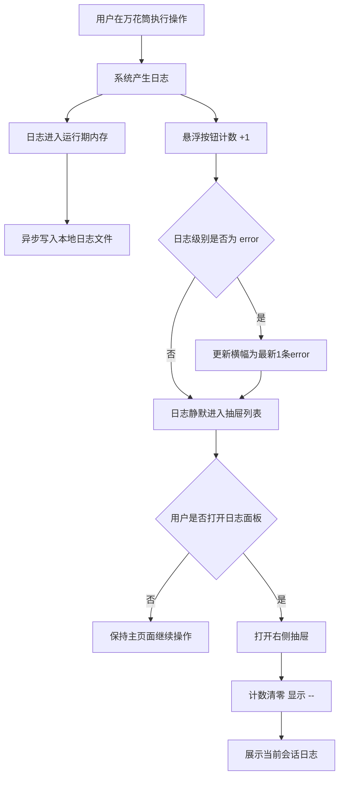

---

## 3.2 点击悬浮按钮流程

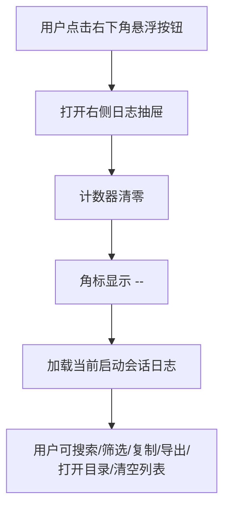

---

## 3.3 点击 error 横幅流程

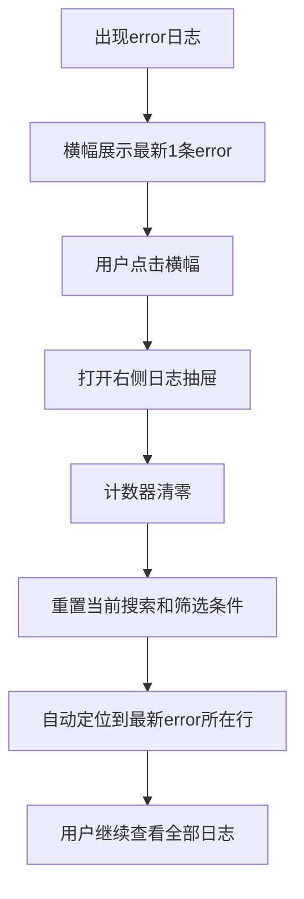

> 这里保留“点击横幅后重置筛选”的口径，避免目标日志被过滤掉。

---

## 3.4 搜索 / 筛选流程

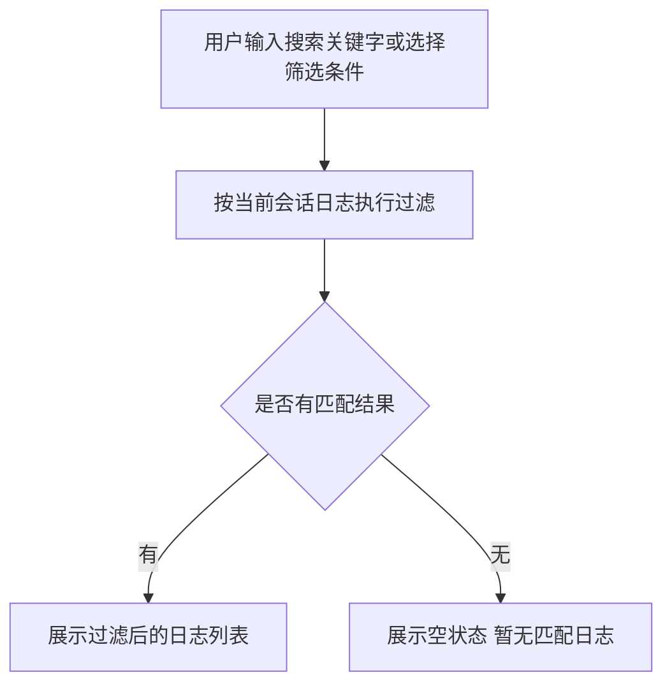

---

## 3.5 三个筛选条件组合逻辑

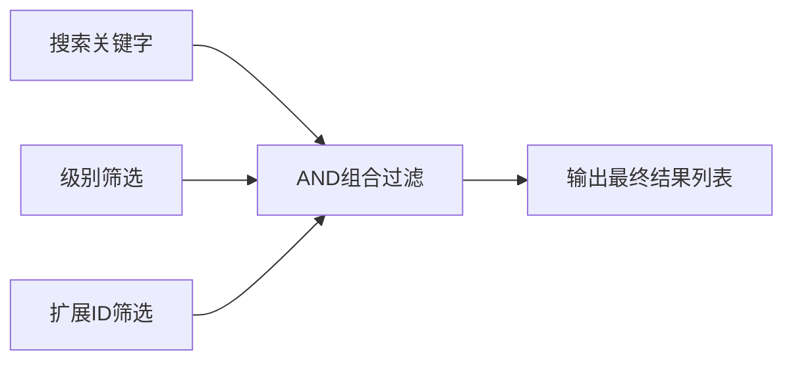

---

## 3.6 实时日志追加流程

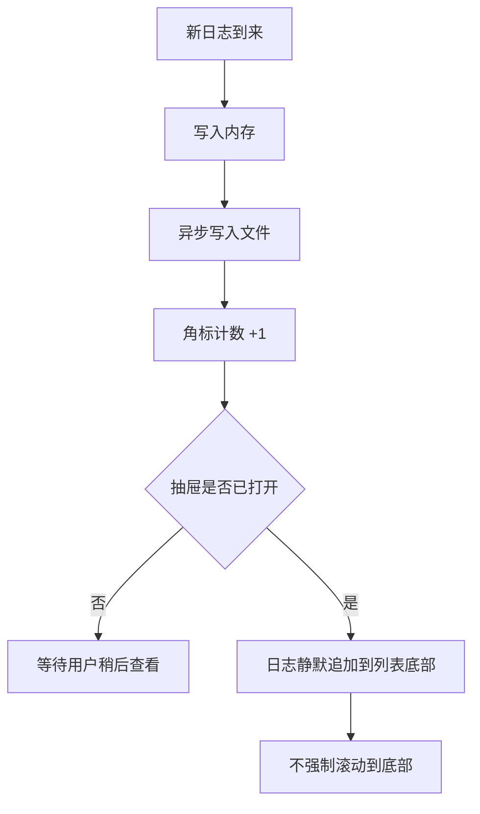

---

## 3.7 单条日志 hover / 复制流程

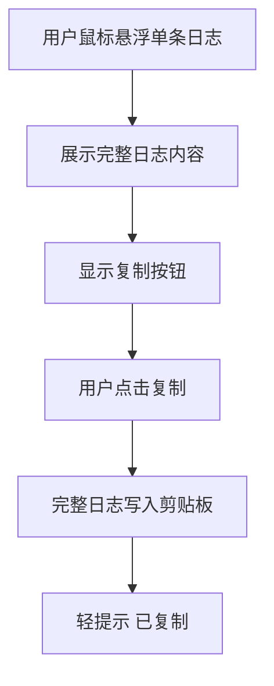

---

## 3.8 导出流程

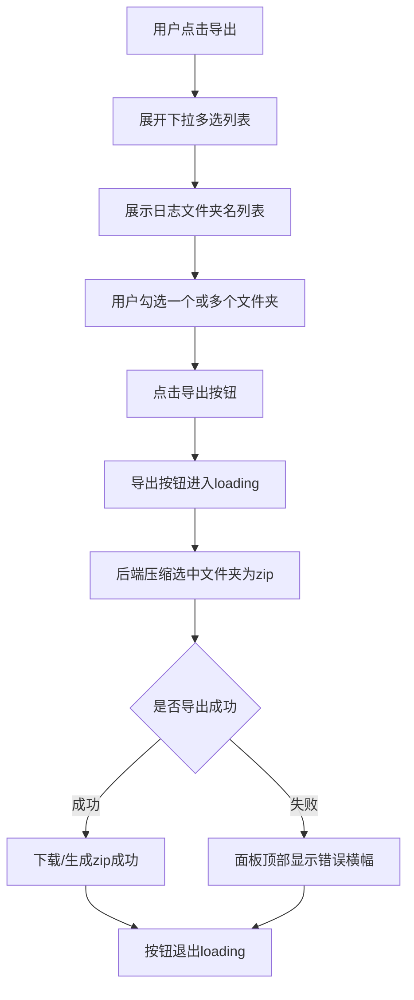

---

## 3.9 打开日志目录流程

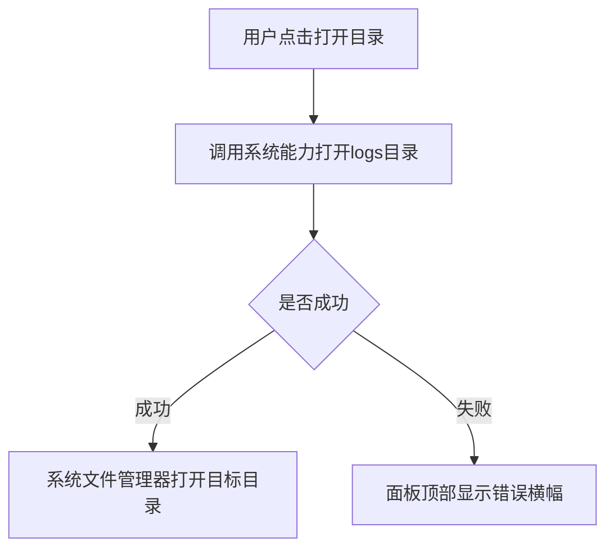

---

## 3.10 清空列表流程

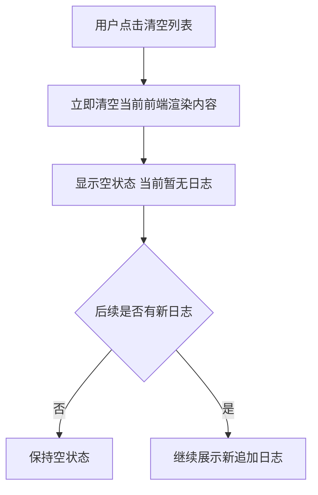

---

## 3.11 面板关闭流程

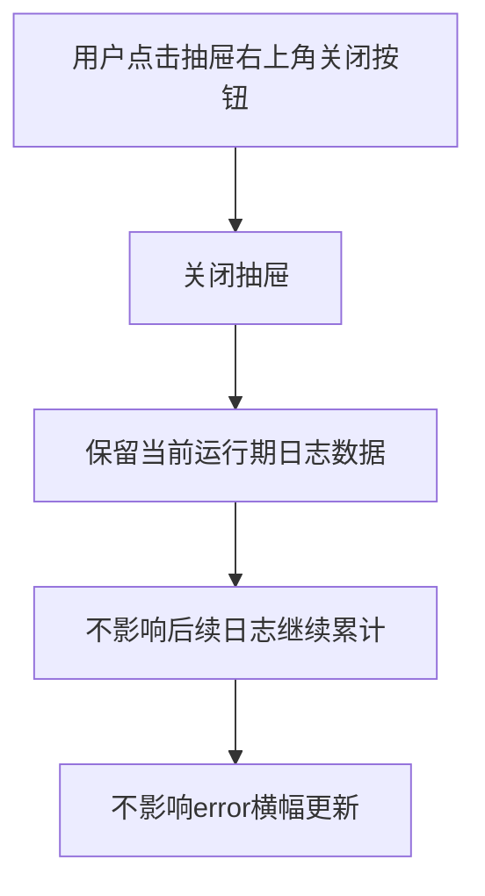

---

## 3.12 异常提示统一流程

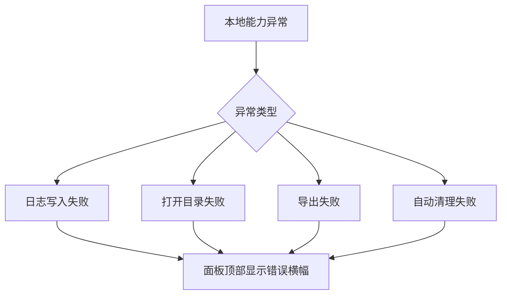

---

# 四、状态图（Mermaid）

---

## 4.1 按钮 / 横幅 / 抽屉状态图

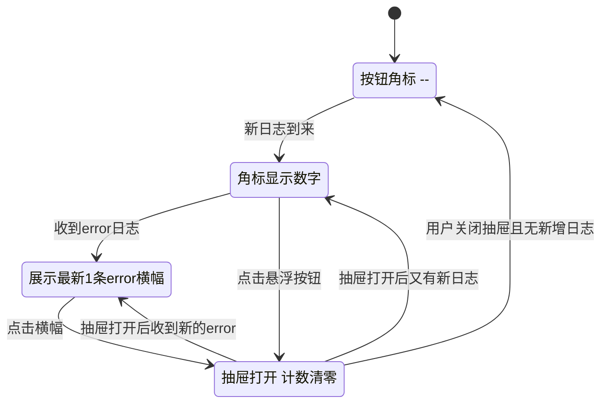

---

## 4.2 导出状态图

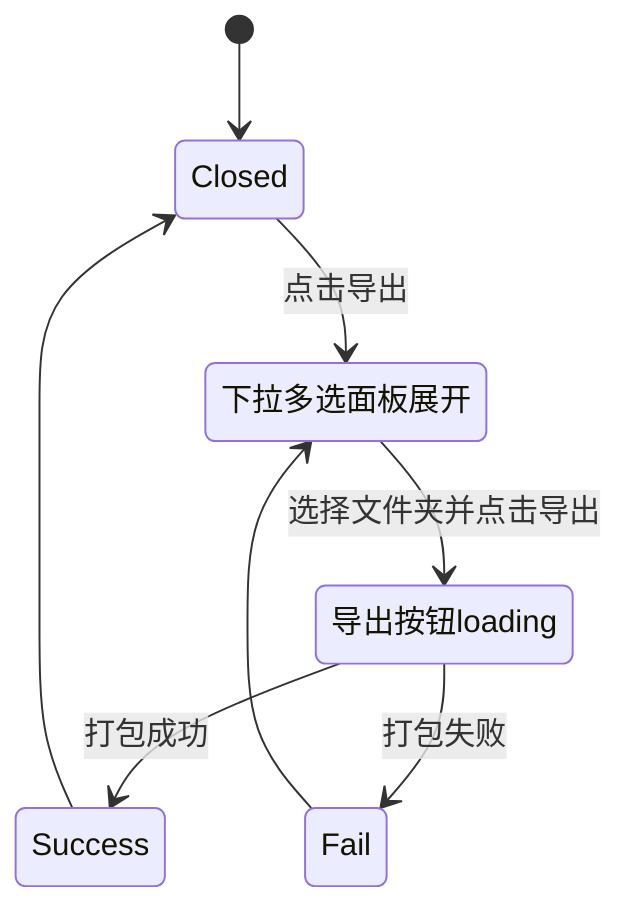

---

# 五、建议的交互细节补充

这些是给设计时建议一起定掉的点。

---

## 5.1 按钮文案与语义
建议避免把“清空”理解成删本地文件，所以 UI 上建议文案用：

- `清空列表`  
而不是  
- `清空日志`

---

## 5.2 横幅文本策略
横幅只展示摘要，建议：

- 最多 1 行
- 超出截断
- hover 可展示完整 error 内容

否则右下角会过于拥挤。

---

## 5.3 列表颜色建议
建议不要大面积高饱和：

- info：中性文本色
- warn：偏黄强调
- error：偏红强调

避免视觉过载，尤其是日志量大时。

---

## 5.4 面板默认打开状态
建议：
- 默认展示最新位置附近内容
- 但如果是从横幅进入，优先定位到那条 error

---

## 5.5 筛选项样式
级别、扩展 ID 推荐都做成轻量下拉：

- 级别：单选
- 扩展 ID：单选或可搜索下拉  
  如果扩展数量未来可能增多，建议做可搜索

---

# 六、设计评审时建议重点确认的点

设计师评审时建议重点看以下 6 个问题：

1. **右下角悬浮按钮会不会挡住现有页面操作**
2. **横幅在右下角展开时，最长宽度控制多少**
3. **抽屉宽度 420 / 460 / 480 哪个最合适**
4. **日志单行信息密度是否过高**
5. **hover 全文 + 复制入口是否足够清晰**
6. **导出下拉多选在抽屉内是否容易被遮挡**